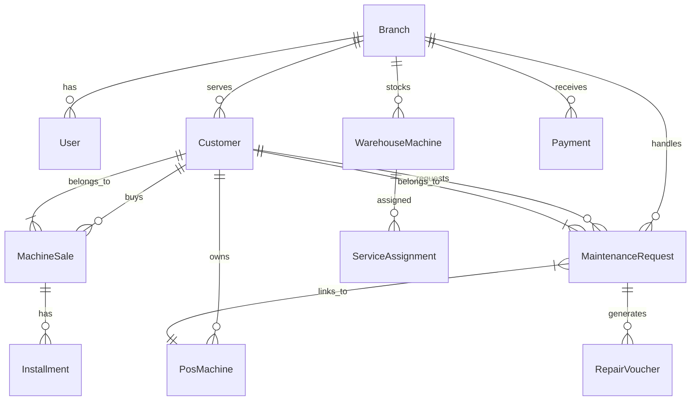

[plugin:vite:esbuild] Transform failed with 1 error:
C:/Users/mkame/OneDrive/Documents/GitHub/Smart-Enterprise-Suite_VS/frontend/src/utils/reports/MaintenanceReport.ts:76:19: ERROR: Expected ";" but found "html"
C:/Users/mkame/OneDrive/Documents/GitHub/Smart-Enterprise-Suite_VS/frontend/src/utils/reports/MaintenanceReport.ts:76:19
Expected ";" but found "html"
74 |  
75 |      return `
76 |          < !DOCTYPE html >
   |                     ^
77 |              <html dir="rtl" lang = "ar" >
78 |                  <head>
    at failureErrorWithLog (C:\Users\mkame\OneDrive\Documents\GitHub\Smart-Enterprise-Suite_VS\frontend\node_modules\esbuild\lib\main.js:1467:15)
    at C:\Users\mkame\OneDrive\Documents\GitHub\Smart-Enterprise-Suite_VS\frontend\node_modules\esbuild\lib\main.js:736:50
    at responseCallbacks.<computed> (C:\Users\mkame\OneDrive\Documents\GitHub\Smart-Enterprise-Suite_VS\frontend\node_modules\esbuild\lib\main.js:603:9)
    at handleIncomingPacket (C:\Users\mkame\OneDrive\Documents\GitHub\Smart-Enterprise-Suite_VS\frontend\node_modules\esbuild\lib\main.js:658:12)
    at Socket.readFromStdout (C:\Users\mkame\OneDrive\Documents\GitHub\Smart-Enterprise-Suite_VS\frontend\node_modules\esbuild\lib\main.js:581:7)
    at Socket.emit (node:events:518:28)
    at addChunk (node:internal/streams/readable:561:12)
    at readableAddChunkPushByteMode (node:internal/streams/readable:512:3)
    at Readable.push (node:internal/streams/readable:392:5)
    at Pipe.onStreamRead (node:internal/stream_base_commons:189:23)
Click outside, press Esc key, or fix the code to dismiss.
You can also disable this overlay by setting server.hmr.overlay to false in vite.config.ts.# Database Schema Documentation

## Overview
- **Database**: PostgreSQL (Production) / SQLite (Development)
- **ORM**: Prisma
- **Encoding**: UTF-8

## Entity Relationships (ERD)

## Tables

### 1. Core Users & Hierarchy

#### `Branch`
Authorized locations or departments.
- `id`: PK, CUID
- `code`: Unique branch code (e.g., 'BR01')
- `name`: Display name
- `type`: 'BRANCH' or 'CENTER'
- `maintenanceCenterId`: ID of the main center it reports to

#### `User`
System users with access roles.
- `id`: PK, CUID
- `email`: Login email (unique)
- `role`: Role (e.g., 'ADMIN', 'TECHNICIAN')
- `branchId`: FK -> Branch (Data isolation scope)

### 2. Customer & Machine Management

#### `Customer`
Clients who own machines.
- `id`: PK, CUID
- `bkcode`: Business Key / Code
- `client_name`: Full name
- `branchId`: FK -> Branch (Owner branch)

#### `PosMachine`
Machines owned by customers.
- `id`: PK, CUID
- `serialNumber`: Unique serial number
- `customerId`: FK -> Customer (Owner)

### 3. Maintenance Workflow

#### `MaintenanceRequest`
Core ticket for repair works.
- `id`: PK, CUID
- `status`: 'Open', 'In Progress', 'Closed', 'Pending Approval'
- `complaint`: Customer reported issue
- `technicianId`: Assigned technician
- `totalCost`: Final cost of repair

#### `ServiceAssignment` (Maintenance Center)
Tracks machines sent to external maintenance centers.
- `machineId`: FK -> WarehouseMachine
- `status`: 'UNDER_INSPECTION', 'WAITING_APPROVAL', 'REPAIRED'
- `originBranchId`: Branch that sent the machine
- `centerBranchId`: Center performing the repair

#### `MaintenanceApproval`
Records approval for high-cost repairs.
- `requestId`: FK -> MaintenanceRequest (1:1)
- `cost`: Approved amount
- `status`: 'APPROVED', 'REJECTED'

### 4. Inventory & Sales

#### `WarehouseMachine`
Machines in stock (New or Used).
- `serialNumber`: Unique ID
- `status`: 'NEW', 'USED', 'DAMAGED'
- `branchId`: FK -> Branch (Current location)

#### `TransferOrder`
Shipments between branches.
- `fromBranchId`: Sender
- `toBranchId`: Receiver
- `status`: 'PENDING', 'SHIPPED', 'RECEIVED'
- `items`: List of serial numbers or products

#### `SparePart` & `InventoryItem`
- `SparePart`: Definition of a part (Name, Model)
- `InventoryItem`: Quantity of a part at a specific `Branch`

### 5. Financials

#### `Payment`
- `amount`: Money received
- `type`: 'CASH', 'VISA', 'BANK_TRANSFER'
- `requestId`: Link to MaintenanceRequest (optional)

#### `Installment`
- `saleId`: Link to MachineSale
- `dueDate`: When payment is expected
- `isPaid`: Status flag

---

## Indexing Strategy
- Foreign Keys: All foreign keys are indexed implicitly by Prisma.
- Status Columns: `status` columns on high-volume tables (`MaintenanceRequest`, `TransferOrder`) should be indexed for filtering.
- Search Fields: `serialNumber`, `client_name`, `bkcode` are targets for free-text search optimization.
