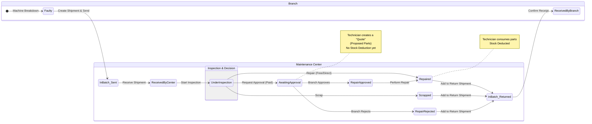

# 🔧 دورة عمل مركز الصيانة - Service Center Workflow

> **التاريخ**: 2025-12-31  
> **الإصدار**: 1.0  
> **الحالة**: معتمد للتنفيذ

---

## 📊 رسم تخطيطي لدورة العمل الكاملة (Complete Workflow Diagram)



---

## 📋 جدول مراحل دورة العمل

| # | المرحلة | الحالة | الموقع | الإجراء | المسؤول | الحالة التالية | الإشعارات |
|---|---------|--------|--------|---------|---------|----------------|-----------|
| 1 | استلام من العميل | `EXTERNAL_REPAIR` | الفرع | استلام ماكينة العميل | موظف الفرع | تحويل للمركز | - |
| 2 | إنشاء إذن تحويل | `IN_TRANSIT` | الفرع | إنشاء إذن + بوليصة | موظف الفرع | استلام بالمركز | 🔔 للمركز: شحنة في الطريق |
| 3 | استلام بالمركز | `RECEIVED_AT_CENTER` | المركز | استلام الشحنة | أي مختص | تعيين | - |
| 4 | تعيين المختص | `ASSIGNED` | المركز | تعيين شخص للماكينة | أي مختص | بدء الصيانة | - |
| 5 | تحت الصيانة | `UNDER_MAINTENANCE` | المركز | العمل على الماكينة | المختص المعين | موافقة/إتمام | - |
| 6 | طلب موافقة | `PENDING_APPROVAL` | المركز→الفرع | إرسال القطع والتكلفة | المختص | انتظار الرد | 🔔 للفرع: طلب موافقة |
| 7 | موافقة/رفض | - | الفرع | اتخاذ القرار | مدير الفرع | إتمام | 🔔 للمركز: نتيجة |
| 8 | إتمام الصيانة | `COMPLETED` | المركز | حفظ النتيجة | المختص | جاهز للإرجاع | - |
| 9 | إرجاع للفرع | `IN_RETURN_TRANSIT` | المركز→الفرع | إذن إرجاع + بوليصة | أي مختص | استلام بالفرع | 🔔 للفرع: شحنة واردة |
| 10 | استلام بالفرع | `READY_FOR_DELIVERY` | الفرع | استلام الماكينات | موظف الفرع | اختيار المسار | - |
| 11 | اختيار مسار الماكينة | - | الفرع | قرار: للعميل أو للمخزن | موظف الفرع | تنفيذ | **ماكينات من الصيانة** |
| 12 | تسليم للعميل | `CLOSED` | الفرع | تسليم الماكينة للعميل | موظف الفرع | مع السداد | - |
| 12ب | نقل للمخزن | `STANDBY` | الفرع | نقل لمخزن الفرع كاحتياطي | موظف الفرع | - | ماكينة جاهزة للبيع |

---

## � إرجاع الماكينات للفرع (مسارين)

بعد استلام الماكينات من المركز، الفرع عنده خيارين:

### **المسار الأول: تسليم للعميل** 👤
```
[استلام من المركز]
    ↓
[READY_FOR_DELIVERY]
    ↓
[تسليم للعميل]
    ↓
[CLOSED]
```
- **يُستخدم عندما**: العميل جاهز لاستلام الماكينة
- **السداد**: إذا كانت الصيانة بمقابل، يتم السداد قبل أو عند التسليم
- **إيصال السداد**: يُدخل في الفرع فقط

### **المسار الثاني: نقل للمخزن** 📦
```
[استلام من المركز]
    ↓
[READY_FOR_DELIVERY]
    ↓
[نقل لمخزن الفرع]
    ↓
[STANDBY] (ماكينة احتياطية)
```
- **يُستخدم عندما**: 
  - العميل رفض الماكينة (تكلفة عالية / لم يعد يريدها)
  - العميل لم يحضر لاستلامها بعد فترة طويلة
  - قرار الفرع بتحويلها لماكينة للبيع
- **الحالة النهائية**: `STANDBY` (جاهزة للبيع كماكينة مستعملة)
- **السداد**: يتم تسوية المستحقات حسب سياسة الفرع

### **💡 ملاحظة مهمة:**
عند استلام إذن الإرجاع من المركز، الماكينات تظهر في قائمة **"ماكينات من الصيانة"** في مخزن الفرع، وموظف الفرع يختار المسار المناسب لكل ماكينة.

---

## �🔔 نظام الإشعارات

| الحدث | الرسالة | المرسل إليه | ملاحظات |
|-------|---------|-------------|---------|
| إرسال شحنة من الفرع | "📦 شحنة في الطريق من فرع [X] - [N] ماكينات" | **كل مستخدمي المركز** | تظهر للجميع |
| طلب موافقة | "⚠️ طلب موافقة صيانة: الماكينة [Serial] للعميل [Name] - القيمة: [Amount] ج.م" | الفرع الأصلي | - |
| موافقة | "✅ تمت الموافقة على صيانة [Serial]" | المركز | - |
| رفض | "❌ تم رفض طلب الموافقة للماكينة [Serial]" | المركز | - |
| إرسال من المركز | "📦 شحنة واردة من مركز الصيانة - [N] ماكينات" | الفرع | - |
| سداد | "💰 تم تسجيل سداد [Amount] ج.م" | المركز | - |

---

## 👁️ متابعة حالة الماكينة (للفرع)

الفرع يستطيع رؤية حالة ماكيناته داخل مركز الصيانة:

| الحالة | المعنى | اللون |
|--------|--------|-------|
| `RECEIVED_AT_CENTER` | تم الاستلام | 🔵 أزرق |
| `ASSIGNED` | معين لمختص | 🟡 أصفر |
| `UNDER_MAINTENANCE` | جاري العمل | 🟠 برتقالي |
| `PENDING_APPROVAL` | بانتظار موافقتك | 🔴 أحمر |
| `COMPLETED` | مكتملة | 🟢 أخضر |
| `IN_RETURN_TRANSIT` | في طريق الإرجاع | 🟣 بنفسجي |

---

## 🔧 واجهة الصيانة (مشابهة للفرع)

المختص في مركز الصيانة يستخدم نفس واجهة إغلاق الشكوى الموجودة في الفرع:

1. **اختيار قطع الغيار** من المخزون المتاح
2. **تحديد كل قطعة**: بمقابل أو بدون مقابل
3. **كتابة الإجراء المتخذ**
4. **إرسال طلب موافقة** (تلقائي إذا كان المجموع > 0)
5. **إتمام الصيانة** (بعد الموافقة أو مباشرة إذا مجاني)

> **ملاحظة**: الفرع لا يمكنه تعديل قطع الغيار - فقط الموافقة أو الرفض على الطلب كما هو.

---

## 📦 نظام قطع الغيار وخصم المخزون

### **السيناريو الأول: صيانة مباشرة (بدون طلب موافقة)**

**الحالات المشمولة:**
- صيانة مجانية (تحت الضمان)
- صيانة مدفوعة تمت بموافقة مسبقة

**تسلسل الأحداث:**

1. **اختيار القطع** 🔧
   - المختص يختار قطع الغيار من مخزون المركز
   - النظام يعرض الرصيد المتاح لكل قطعة

2. **تحديد نوع القطعة** 💰
   - **بدون مقابل**: قطع مجانية (ضمان)
   - **بمقابل**: قطع مدفوعة

3. **الخصم الفوري من المخزون** ⚡
   ```
   عند الضغط على "Complete Maintenance":
   ├─→ خصم القطع من مخزون المركز فوراً
   ├─→ تسجيل الاستهلاك في سجلات المخزون
   ├─→ إنشاء سجل حركة المخزون (Stock Movement)
   └─→ احتساب التكلفة على الفرع (إذا كانت بمقابل)
   ```

4. **الفاتورة/المديونية** 📄
   - إذا كانت القطع "بمقابل" → إنشاء مديونية على الفرع
   - المبلغ = مجموع أسعار القطع المستخدمة
   - الحالة: `PENDING_PAYMENT` (بانتظار السداد)

---

### **السيناريو الثاني: طلب موافقة (عرض سعر أولاً)**

**الحالات المشمولة:**
- صيانة مدفوعة تحتاج موافقة الفرع أولاً
- صيانة بتكلفة عالية تتطلب تأكيد

**تسلسل الأحداث:**

#### **المرحلة أ: إنشاء عرض السعر (Quote) - بدون خصم**

1. **اختيار القطع المطلوبة** 🔍
   - المختص يختار القطع اللازمة للإصلاح
   - النظام يعرض الأسعار لكل قطعة

2. **تحديد القطع كـ "بمقابل"** 💵
   - كل القطع أو بعضها "بمقابل"
   - النظام يحسب التكلفة الإجمالية

3. **إرسال طلب الموافقة** 📤
   ```
   عند الضغط على "Request Approval":
   ├─→ ❌ لا يتم خصم القطع من المخزون (مجرد عرض سعر)
   ├─→ حفظ قائمة القطع المقترحة
   ├─→ حساب التكلفة التقديرية
   ├─→ إرسال الطلب للفرع
   └─→ الحالة: PENDING_APPROVAL
   ```

4. **محتوى طلب الموافقة** 📋
   ```json
   {
     "machineSerial": "ABC123",
     "customerName": "محمد أحمد",
     "proposedParts": [
       {
         "partName": "Motor",
         "quantity": 1,
         "unitPrice": 500,
         "total": 500,
         "inStock": true,
         "availableQty": 5
       },
       {
         "partName": "Belt",
         "quantity": 2,
         "unitPrice": 50,
         "total": 100,
         "inStock": true,
         "availableQty": 12
       }
     ],
     "estimatedTotal": 600,
     "technicianNotes": "يحتاج تغيير الموتور والسير",
     "stockStatus": "✅ جميع القطع متوفرة في المخزون"
   }
   ```

#### **المرحلة ب: رد الفرع على الطلب**

**خيار 1: الموافقة ✅**
```
عند موافقة الفرع:
├─→ إشعار للمركز بالموافقة
├─→ المختص يستكمل الصيانة
└─→ ينتقل للمرحلة التالية (الخصم الفعلي)
```

**خيار 2: الرفض ❌**
```
عند رفض الفرع:
├─→ ❌ لا يتم خصم أي قطع
├─→ إشعار للمركز بالرفض
├─→ المختص يغلق الطلب بدون إصلاح
└─→ إرجاع الماكينة كما هي
```

#### **المرحلة ج: الخصم الفعلي (بعد الموافقة فقط)**

1. **تنفيذ الصيانة** 🔧
   - المختص يقوم بالإصلاح الفعلي
   - استخدام القطع المتفق عليها

2. **الخصم من المخزون** ⚡
   ```
   عند الضغط على "Complete Maintenance" (بعد الموافقة):
   ├─→ ✅ الآن يتم خصم القطع من مخزون المركز
   ├─→ تسجيل الاستهلاك الفعلي
   ├─→ إنشاء سجل حركة المخزون
   ├─→ ربط الحركة بطلب الصيانة
   └─→ إنشاء المديونية على الفرع
   ```

3. **الفاتورة النهائية** 📄
   - المبلغ = نفس المبلغ المتفق عليه في طلب الموافقة
   - الحالة: `PENDING_PAYMENT`
   - مرفق بها تفاصيل القطع المستخدمة فعلياً

---

## 📊 مقارنة السيناريوهين

| العنصر | صيانة مباشرة | طلب موافقة |
|--------|--------------|-----------|
| **خصم القطع** | ✅ فوري عند الإتمام | ❌ لا يتم حتى الموافقة |
| **حالة المخزون** | ينخفض مباشرة | يبقى كما هو حتى الموافقة |
| **إشعار الفرع** | بعد الإتمام | قبل الخصم (للموافقة) |
| **إمكانية التراجع** | صعبة (تحتاج إرجاع) | سهلة (مجرد رفض) |
| **المديونية** | تُنشأ فوراً | تُنشأ بعد الموافقة فقط |
| **وقت الخصم** | عند Complete | عند Complete بعد Approval |
| **نوع السجل** | Actual Consumption | Quote → Consumption |

---

## 🔄 تدفق القطع في السيناريوهين

### **السيناريو الأول (مباشر)**
```
[اختيار القطع] 
    ↓
[تحديد: بمقابل/بدون مقابل]
    ↓
[Complete Maintenance]
    ↓
[✅ خصم فوري من المخزون]
    ↓
[إنشاء المديونية (إذا بمقابل)]
    ↓
[COMPLETED]
```

### **السيناريو الثاني (موافقة)**
```
[اختيار القطع المقترحة]
    ↓
[تحديد: بمقابل]
    ↓
[Request Approval]
    ↓
[❌ بدون خصم - مجرد عرض سعر]
    ↓
[PENDING_APPROVAL]
    ↓
    ├─→ [موافقة ✅]
    │       ↓
    │   [تنفيذ الصيانة]
    │       ↓
    │   [Complete Maintenance]
    │       ↓
    │   [✅ خصم فعلي من المخزون]
    │       ↓
    │   [إنشاء المديونية]
    │       ↓
    │   [COMPLETED]
    │
    └─→ [رفض ❌]
            ↓
        [❌ لا يتم خصم]
            ↓
        [إغلاق بدون إصلاح]
            ↓
        [COMPLETED - No Repair]
```

---

## 💡 ملاحظات مهمة جداً

### **عن المخزون:**
1. ✅ في السيناريو المباشر: القطع تُخصم فوراً → الرصيد ينزل مباشرة
2. ❌ في طلب الموافقة: القطع **لا تُخصم** حتى يوافق الفرع
3. 🔒 النظام يحجز القطع افتراضياً (optional) لتجنب صرفها لطلب آخر
4. ⚠️ إذا نفذت القطعة قبل الموافقة → يتم إشعار المختص

### **عن المديونية:**
1. 📊 المديونية تُنشأ فقط عند الخصم الفعلي من المخزون
2. 💰 المبلغ يُحسب من أسعار القطع المستخدمة فعلياً
3. 📄 في حالة الموافقة: المبلغ يساوي المبلغ المتفق عليه
4. 🧾 كل مديونية مرتبطة بسجل حركة مخزون

### **عن إيصالات السداد:**
1. 🏦 إيصالات السداد تُدخل **في الفرع فقط**
2. ❌ المركز لا يمكنه إدخال إيصالات
3. 🔔 عند السداد: إشعار للمركز بتسجيل الدفع
4. ✅ السداد يُحدّث حالة المديونية من `PENDING` → `PAID`

---

## ❌ قيود مهمة

| القيد | التفسير |
|-------|---------|
| ❌ الفرع لا يعدل القطع | الفرع يوافق أو يرفض فقط، لا يمكنه تعديل الكميات أو الأسعار |
| ❌ لا إيصال في المركز | إدخال إيصالات السداد من الفرع فقط |
| ✅ كل المركز يرى الإشعارات | أي مستخدم في المركز يرى إشعارات الشحنات الواردة |
| ✅ الفرع يرى حالة ماكيناته | متابعة حالة الماكينة في الوقت الفعلي |
| ✅ أي مختص يعمل | ليس فقط "الفني" - أي شخص في المركز يمكنه العمل |

---

## 📊 التقارير المطلوبة

1. **تقرير الماكينات بالمركز**: عدد الماكينات وحالاتها
2. **تقرير المستحقات**: المبالغ المعلقة لكل فرع
3. **تقرير الأداء**: متوسط وقت الصيانة لكل مختص
4. **تقرير قطع الغيار**: الاستهلاك والمتبقي
5. **تقرير الموافقات**: نسبة الموافقة/الرفض لكل فرع
---

## 📝 الخطوات التفصيلية لدورة العمل (مع توضيح قطع الغيار)

### **المرحلة 6️⃣ (محدّثة): الفحص واختيار القطع**
**الموقع**: مركز الصيانة  
**المسؤول**: المختص المعين  

بعد فحص الماكينة، المختص عنده خيارين:

> **💡 ملحوظة مهمة:** نفس شاشة الصيانة في المركز فيها **زرارين واضحين**:  
> - 🔧 **Complete Maintenance** → صيانة مباشرة (خصم فوري)  
> - 📋 **Request Approval** → طلب موافقة أولاً (بدون خصم)  
> المختص يختار الزر حسب نوع الصيانة والسياسة المتبعة.

---

#### **🔧 السيناريو أ: صيانة مباشرة (Direct Repair)**

**متى يُستخدم؟**
- صيانة مجانية (تحت الضمان)
- صيانة بسيطة بموافقة شفهية مسبقة
- قطع رخيصة لا تحتاج موافقة

**الخطوات:**

**1. اختيار القطع من المخزون**
```
┌─────────────────────────────────┐
│ Available Parts in Stock        │
├─────────────────────────────────┤
│ ☑ Motor - Qty: 5 - 500 ج.م      │
│ ☑ Belt - Qty: 12 - 50 ج.م       │
│ ☐ Gear - Qty: 8 - 200 ج.م       │
└─────────────────────────────────┘
```

**2. تحديد كل قطعة:**
- ✅ **بدون مقابل** (مجاني - ضمان)
- 💰 **بمقابل** (مدفوع - خارج الضمان)

**3. كتابة الإجراء المتخذ**
```
مثال: "تم تغيير الموتور والسير - الماكينة تعمل بكفاءة"
```

**4. الضغط على "Complete Maintenance"**

**5. ماذا يحدث فوراً؟ ⚡**
```
[عند الضغط على Complete]
    ↓
[✅ خصم القطع من مخزون المركز فوراً]
Motor: 5 → 4
Belt: 12 → 10
    ↓
[إنشاء سجل حركة المخزون]
Type: STOCK_OUT
Reason: "Maintenance - Serial ABC123"
    ↓
[إذا كانت القطع "بمقابل"]
    ↓
[إنشاء مديونية على الفرع]
Amount: 500 + 100 = 600 ج.م
Status: PENDING_PAYMENT
    ↓
[الحالة: COMPLETED ✅]
```

**6. النتيجة:**
- ✅ الماكينة مُصلحة
- ✅ القطع مخصومة من المخزون
- ✅ المديونية مسجلة (إذا مدفوع)
- ✅ جاهزة للإرجاع للفرع

---

#### **📋 السيناريو ب: طلب موافقة أولاً (Approval Request)**

**متى يُستخدم؟**
- صيانة مكلفة تحتاج موافقة رسمية
- قطع غالية الثمن
- سياسة المركز تتطلب موافقة مسبقة

**الخطوات:**

**1. اختيار القطع المطلوبة (Quote/عرض سعر)**
```
┌─────────────────────────────────┐
│ Proposed Parts (Quote)          │
├─────────────────────────────────┤
│ ☑ Motor - Qty: 1 - 500 ج.م      │
│   └─ 💰 Paid (بمقابل)           │
│ ☑ Belt - Qty: 2 - 50 ج.م        │
│   └─ 💰 Paid (بمقابل)           │
├─────────────────────────────────┤
│ Total: 600 ج.م                  │
└─────────────────────────────────┘
```

**2. تحديد كل القطع كـ "بمقابل"**

**3. كتابة التشخيص والإجراء المقترح**
```
مثال: "الموتور تالف ويحتاج تغيير + السير مهترئ"
```

**4. الضغط على "Request Approval"**

**5. ماذا يحدث؟ (لاحظ الفرق!) ⚠️**
```
[عند الضغط على Request Approval]
    ↓
[❌ لا يتم خصم القطع من المخزون]
Motor: 5 (كما هو)
Belt: 12 (كما هو)
    ↓
[حفظ القطع كـ "مقترحة" (Proposed)]
    ↓
[حساب التكلفة التقديرية]
Estimated Total: 600 ج.م
    ↓
[إرسال طلب للفرع الأصلي]
    ↓
[الحالة: PENDING_APPROVAL ⏳]
    ↓
[🔔 إشعار للفرع]
"⚠️ طلب موافقة صيانة: ABC123 - 600 ج.م"
```

**6. المخزون في هذه المرحلة:**
- ✅ القطع **لا تزال موجودة** في المخزون
- ✅ الرصيد **لم ينخفض**
- ✅ يمكن استخدامها لطلبات أخرى (أو حجزها اختياري)

**7. الفرع يراجع الطلب:**
```
┌─────────────────────────────────────────┐
│ Maintenance Approval Request            │
├─────────────────────────────────────────┤
│ Machine: ABC123                         │
│ Customer: محمد أحمد                     │
│ Branch: القاهرة                         │
│                                         │
│ Proposed Parts:                         │
│ • Motor x1 - 500 ج.م                    │
│ • Belt x2 - 100 ج.م                     │
│                                         │
│ Total Cost: 600 ج.م                     │
│                                         │
│ Technician Notes:                       │
│ "الموتور تالف ويحتاج تغيير + السير مهترئ" │
│                                         │
│ [✅ Approve] [❌ Reject]                 │
└─────────────────────────────────────────┘
```

---

### **المرحلة 7️⃣ (محدّثة): رد الفرع**

#### **الخيار أ: الموافقة ✅**

**الإجراءات:**
1. مدير الفرع يضغط "Approve"
2. **🔔 إشعار للمركز:** "✅ تمت الموافقة على صيانة ABC123"
3. المختص يستلم الموافقة

**المختص الآن يكمل الصيانة:**

**4. تنفيذ الإصلاح الفعلي**
```
┌─────────────────────────────────┐
│ Approved - Ready to Complete    │
├─────────────────────────────────┤
│ ✅ Motor x1 - 500 ج.م            │
│ ✅ Belt x2 - 100 ج.م             │
│                                 │
│ Status: APPROVED                │
│ [Complete Maintenance]          │
└─────────────────────────────────┘
```

**5. الضغط على "Complete Maintenance"**

**6. ماذا يحدث الآن؟ ⚡**
```
[عند Complete بعد الموافقة]
    ↓
[✅ الآن يتم الخصم الفعلي من المخزون]
Motor: 5 → 4
Belt: 12 → 10
    ↓
[إنشاء سجل حركة المخزون]
Type: STOCK_OUT
Reason: "Maintenance - Approved Request #123"
    ↓
[إنشاء المديونية على الفرع]
Amount: 600 ج.م (المبلغ المتفق عليه)
Status: PENDING_PAYMENT
Reference: Approval #123
    ↓
[الحالة: COMPLETED ✅]
```

**7. النتيجة:**
- ✅ الماكينة مُصلحة
- ✅ القطع مخصومة من المخزون (الآن فقط!)
- ✅ المديونية مسجلة بالمبلغ المتفق عليه
- ✅ جاهزة للإرجاع

---

#### **الخيار ب: الرفض ❌**

**الإجراءات:**
1. مدير الفرع يضغط "Reject"
2. يكتب سبب الرفض (اختياري):
   ```
   مثال: "التكلفة مرتفعة - العميل لا يريد الإصلاح"
   ```

**3. ماذا يحدث؟**
```
[عند الرفض]
    ↓
[❌ لا يتم خصم أي قطع من المخزون]
Motor: 5 (كما هو)
Belt: 12 (كما هو)
    ↓
[🔔 إشعار للمركز]
"❌ تم رفض طلب الموافقة - ABC123"
    ↓
[المختص يغلق الطلب]
Notes: "تم الرفض - إرجاع بدون إصلاح"
    ↓
[❌ لا تُنشأ مديونية]
    ↓
[الحالة: COMPLETED (No Repair)]
```

**4. النتيجة:**
- ✅ الماكينة تُرجع كما هي (بدون إصلاح)
- ✅ المخزون لم يتأثر
- ✅ لا مديونية على الفرع
- ✅ جاهزة للإرجاع

---

## 🔄 المقارنة الكاملة بين السيناريوهين

| المرحلة | صيانة مباشرة | طلب موافقة (قبل) | طلب موافقة (بعد) |
|---------|--------------|-----------------|------------------|
| **1. اختيار القطع** | من المخزون | من المخزون | - |
| **2. تحديد النوع** | بمقابل/مجاني | بمقابل (عادة) | - |
| **3. الإجراء** | Complete فوراً | Request Approval | Wait... |
| **4. خصم المخزون** | ✅ فوري | ❌ لا يحدث | - |
| **5. رصيد المخزون** | ينخفض فوراً | يبقى كما هو | - |
| **6. إشعار الفرع** | بعد الإتمام | طلب موافقة | - |
| **7. رد الفرع** | - | ⏳ ينتظر | ✅/❌ موافقة أو رفض |
| **8. بعد الموافقة** | - | - | Complete Maintenance |
| **9. خصم بعد الموافقة** | - | - | ✅ الآن يحدث الخصم |
| **10. المديونية** | تُنشأ فوراً | لا تُنشأ | تُنشأ بعد الموافقة |
| **11. المبلغ** | حسب القطع المستخدمة | - | المبلغ المتفق عليه |

---

## 📊 جدول تدفق الحالات (محدّث مع قطع الغيار)

| المرحلة | الحالة | نوع السيناريو | خصم المخزون؟ | مديونية؟ | ملاحظات |
|---------|--------|---------------|--------------|---------|---------|
| 1. استلام من العميل | `EXTERNAL_REPAIR` | - | ❌ | ❌ | - |
| 2. إرسال للمركز | `IN_TRANSIT` | - | ❌ | ❌ | - |
| 3. استلام بالمركز | `RECEIVED_AT_CENTER` | - | ❌ | ❌ | - |
| 4. تعيين مختص | `ASSIGNED` | - | ❌ | ❌ | - |
| 5. تحت الصيانة | `UNDER_MAINTENANCE` | - | ❌ | ❌ | - |
| **6أ. صيانة مباشرة** | `COMPLETED` | **🔧 Direct** | ✅ **فوري** | ✅ (إذا مدفوع) | خصم مباشر |
| **6ب. طلب موافقة** | `PENDING_APPROVAL` | **📋 Approval** | ❌ **بدون خصم** | ❌ | مجرد عرض سعر |
| 7. موافقة الفرع | `APPROVED` | **📋 Approval** | ❌ **لا يزال** | ❌ | ينتظر الإتمام |
| 8. إتمام (بعد موافقة) | `COMPLETED` | **📋 Approval** | ✅ **الآن يُخصم** | ✅ | الخصم الفعلي |
| 7. رفض الفرع | `REJECTED` → `COMPLETED` | **📋 Approval** | ❌ **لا خصم** | ❌ | إرجاع بدون إصلاح |
| 9. إرجاع للفرع | `IN_RETURN_TRANSIT` | - | - | - | - |
| 10. استلام بالفرع | `READY_FOR_DELIVERY` | - | - | - | - |
| 11. سداد | `PENDING_PAYMENT` → `PAID` | - | - | ✅ تحديث | من الفرع فقط |
| 12. تسليم للعميل | `CLOSED` | - | - | - | ✅ مكتمل |

---

## 🎯 الفرق الجوهري: متى يُخصم المخزون؟

### ✅ **صيانة مباشرة:**
```
[اختيار] → [Complete] → [✅ خصم فوري] → [مديونية] → [Done]
                           ↑
                    هنا مباشرة!
```

### 📋 **طلب موافقة:**
```
[اختيار] → [Request] → [❌ بدون خصم] → [ينتظر موافقة]
                           ↓
                    [موافقة ✅]
                           ↓
                    [Complete] → [✅ خصم الآن] → [مديونية] → [Done]
                                      ↑
                              هنا بعد الموافقة!

                    أو
                    
                    [رفض ❌]
                           ↓
                    [❌ لا خصم نهائياً] → [Done]
```