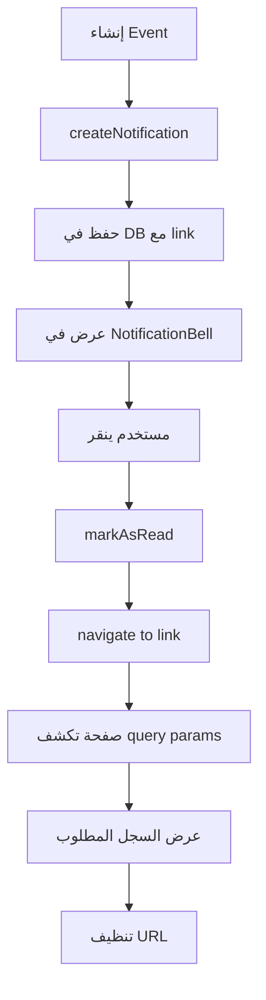

# 🔔 Notification Navigation System

## نظرة عامة

نظام التوجيه من الإشعارات يسمح للمستخدمين بالنقر على الإشعار والانتقال مباشرة إلى الصفحة أو السجل المتعلق بالإشعار.

## الميزات الرئيسية

✅ **توجيه مباشر**: النقر على الإشعار يفتح الصفحة المطلوبة مباشرة  
✅ **سياق كامل**: الصفحة المستهدفة تعرض السجل المطلوب تلقائياً  
✅ **تحديث تلقائي**: تعليم الإشعار كمقروء عند النقر  
✅ **دعم شامل**: يعمل على جميع أنواع الإشعارات في النظام

---

## 📋 جدول الإشعارات والروابط

| نوع الإشعار | الصفحة المستهدفة | الرابط | الوصف |
|-------------|-----------------|--------|-------|
| إذن صرف جديد (وارد) | استلام الإذونات | `/receive-orders?orderId=xxx` | يفتح الإذن تلقائياً في صفحة الاستلام |
| إذن إدخال (صادر) | أذونات التحويل | `/transfer-orders?orderId=xxx` | يعرض الإذن المرسل |
| إذن مرفوض | أذونات التحويل | `/transfer-orders?orderId=xxx` | يعرض الإذن المرفوض |
| تعيين صيانة جديد | شحنات الصيانة | `/maintenance/shipments` | يفتح صفحة الشحنات |
| موافقة على صيانة | شحنات الصيانة | `/maintenance/shipments` | يفتح صفحة الشحنات |
| رفض صيانة | شحنات الصيانة | `/maintenance/shipments` | يفتح صفحة الشحنات |
| طلب موافقة صيانة | موافقات الصيانة | `/maintenance-approvals` | يفتح صفحة الموافقات |
| سداد مستلم | المدفوعات المعلقة | `/pending-payments` | يفتح صفحة المدفوعات |

---

## 🔧 التطبيق التقني

### Backend - إنشاء الإشعار

```javascript
const { createNotification } = require('../routes/notifications');

// مثال: إشعار بإذن صرف جديد
await createNotification({
  branchId: destinationBranchId,      // الفرع المستهدف
  type: 'TRANSFER_ORDER',              // نوع الإشعار
  title: 'إذن صرف جديد',               // العنوان
  message: `تم إرسال إذن صرف رقم ${orderNumber}`,
  data: { orderId: order.id },         // بيانات إضافية
  link: `/receive-orders?orderId=${order.id}`  // 🔗 الرابط المباشر
});
```

### Frontend - معالجة النقر

#### 1. NotificationBell.tsx
```typescript
const handleNotificationClick = (notification: any) => {
  // تعليم كمقروء
  markReadMutation.mutate(notification.id);

  // التوجيه إلى الصفحة
  if (notification.link) {
    navigate(notification.link);  // مثال: /receive-orders?orderId=123
  }

  setIsOpen(false);
};
```

#### 2. ReceiveOrders.tsx - استقبال الرابط
```typescript
const [searchParams, setSearchParams] = useSearchParams();

// كشف orderId من URL
useEffect(() => {
  const orderId = searchParams.get('orderId');
  if (orderId && pendingOrders) {
    const order = pendingOrders.find((o: any) => o.id === orderId);
    if (order) {
      setSelectedOrder(order);  // فتح تفاصيل الإذن
      setActiveTab('pending');
      searchParams.delete('orderId');  // تنظيف URL
      setSearchParams(searchParams);
    }
  }
}, [pendingOrders, searchParams]);
```

#### 3. TransferOrders.tsx - استقبال الرابط
```typescript
// نفس الآلية
useEffect(() => {
  const orderId = searchParams.get('orderId');
  if (orderId && orders) {
    const order = orders.find((o: any) => o.id === orderId);
    if (order) {
      setViewingOrder(order);  // عرض الإذن
      setActiveTab('list');
    }
  }
}, [orders, searchParams]);
```

---

## 📝 إرشادات الاستخدام

### عند إنشاء notification جديد:

1. **حدد الصفحة المستهدفة**: أي صفحة يجب أن يذهب إليها المستخدم؟
2. **أضف context**: استخدم query parameters للإشارة إلى السجل المحدد
3. **اختبر التوجيه**: تأكد أن الصفحة المستهدفة تتعامل مع الـ parameters

### مثال كامل:

```javascript
// Backend: إنشاء إشعار بطلب موافقة
await createNotification({
  branchId: originBranchId,
  type: 'APPROVAL_REQUEST',
  title: '⚠️ طلب موافقة صيانة',
  message: `الماكينة ${serialNumber} تحتاج موافقة بقيمة ${cost} ج.م`,
  data: { assignmentId, cost, serialNumber },
  link: '/maintenance-approvals'  // 🔗 الرابط
});
```

```typescript
// Frontend: الصفحة المستهدفة جاهزة بالفعل
// لا تحتاج query parameter لأن الصفحة تعرض كل الطلبات المعلقة
```

---

## 🎯 Best Practices

### ✅ Do's:
- استخدم query parameters للسجلات المحددة: `?orderId=xxx`
- تأكد أن الصفحة المستهدفة موجودة في Frontend routes
- نظف الـ query parameters بعد الاستخدام
- استخدم روابط نسبية (بدون domain): `/receive-orders`

### ❌ Don'ts:
- لا تستخدم روابط خارجية (external URLs)
- لا تنسى حذف الـ query parameter بعد الاستخدام (تجنب infinite loop)
- لا تعتمد على الـ link فقط - الإشعار يجب أن يكون مفهوم بدونه

---

## 🔄 دورة حياة الإشعار



---

## 📊 التغطية الحالية

| المجال | الحالة | الملاحظات |
|--------|--------|----------|
| Transfer Orders | ✅ مكتمل | دعم كامل للوارد والصادر |
| Maintenance Assignments | ✅ مكتمل | توجيه إلى /maintenance/shipments |
| Maintenance Approvals | ✅ مكتمل | توجيه إلى /maintenance-approvals |
| Pending Payments | ✅ مكتمل | توجيه إلى /pending-payments |
| Service Requests | ⚠️ جزئي | يحتاج إضافة detail view |

---

## 📅 تاريخ التحديثات

- **2026-01-02**: إطلاق النظام الأولي
  - دعم Transfer Orders مع query parameters
  - تحديث جميع الإشعارات لتضمين links
  - إضافة auto-navigation في ReceiveOrders و TransferOrders
  - توثيق كامل

---

*لمزيد من المعلومات، راجع:*
- [SERVICES_REFERENCE.md](./SERVICES_REFERENCE.md) - Notification System section
- [CHANGELOG.md](./CHANGELOG.md) - v3.1.0
- [API_SPEC.md](./API_SPEC.md) - Notifications endpoints
