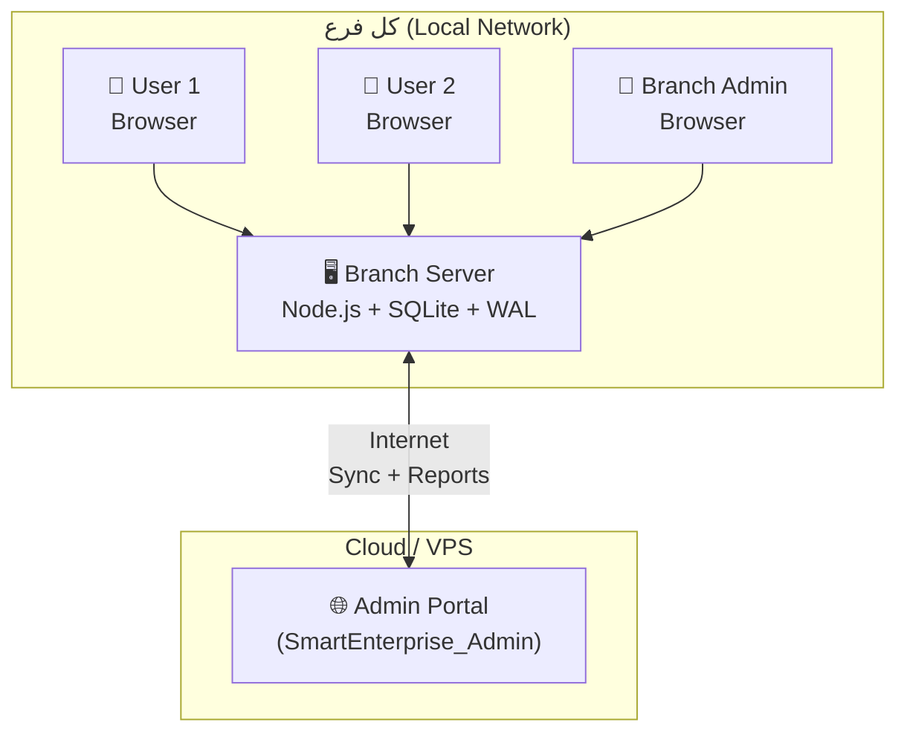

# Smart Enterprise Suite → Branch Edition (SmartEnterprise_BR)

خطة إعادة هيكلة شاملة — **النسخة النهائية بعد اعتماد كل القرارات**

---

## القرارات المعتمدة

| القرار | النتيجة |
|--------|---------|
| Architecture | ✅ **Web App Self-Hosted** — سيرفر واحد في كل فرع + browser access |
| Database | ✅ **SQLite + WAL Mode** |
| الصيانة المركزية | 🔴 **حذف** (Maintenance Center, ServiceAssignment, الشحنات) |
| الصيانة المحلية | ✅ **إبقاء** (طلبات صيانة الفرع، قطع الغيار، WarehouseMachine) |
| الشئون الإدارية | 🔴 **حذف** (AdminStore*) |
| BranchDebt | ✅ **إبقاء** (لمديونيات الأقساط والماكينات فقط) |
| ProductionReports | ✅ **إبقاء** |
| AI Routes | 🔴 **حذف** |
| ExecutiveDashboard | 🔄 **نقل** → Admin Portal (Phase 5) |
| Import/Export | ✅ كل الـ entities |

---

## 1. الأركيتكتشر العام



### مستويان من الأدمن:

| المستوى | الصلاحيات |
|---------|----------|
| **Branch Admin** (في كل فرع) | إضافة/حذف مستخدمين، backup قاعدة البيانات، إعدادات الفرع، التقارير المحلية |
| **Super Admin** (Portal مركزي) | كل parameters الفروع، سحب تقارير مجمّعة، إدارة إصدارات، حالة الفروع |

---

## 2. الموديولات المطلوب حذفها

### 🔴 مركز الصيانة المركزي (حذف كامل)

> [!NOTE]
> نحذف فقط الصيانة **المركزية** (الشحنات، التعيينات للفنيين، الموافقات المركزية). الصيانة **المحلية** (طلبات صيانة الفرع، قطع الغيار) تفضل.

**Backend — حذف:**
- [maintenance-center.js](file:///c:/Users/mkame/OneDrive/Documents/GitHub/Smart-Enterprise-Suite_VS_20260210_20260315/backend/routes/maintenance-center.js) + `maintenance-center-split/`
- [maintenance-approvals.js](file:///c:/Users/mkame/OneDrive/Documents/GitHub/Smart-Enterprise-Suite_VS_20260210_20260315/backend/routes/maintenance-approvals.js)
- [maintenance.js](file:///c:/Users/mkame/OneDrive/Documents/GitHub/Smart-Enterprise-Suite_VS_20260210_20260315/backend/routes/maintenance.js) + `maintenance-split/`
- [maintenance-reports.js](file:///c:/Users/mkame/OneDrive/Documents/GitHub/Smart-Enterprise-Suite_VS_20260210_20260315/backend/routes/maintenance-reports.js)
- [service-assignments.js](file:///c:/Users/mkame/OneDrive/Documents/GitHub/Smart-Enterprise-Suite_VS_20260210_20260315/backend/routes/service-assignments.js)
- [technicians.js](file:///c:/Users/mkame/OneDrive/Documents/GitHub/Smart-Enterprise-Suite_VS_20260210_20260315/backend/routes/technicians.js)
- [track-machines.js](file:///c:/Users/mkame/OneDrive/Documents/GitHub/Smart-Enterprise-Suite_VS_20260210_20260315/backend/routes/track-machines.js)
- [maintenanceCenterService.js](file:///c:/Users/mkame/OneDrive/Documents/GitHub/Smart-Enterprise-Suite_VS_20260210_20260315/backend/services/maintenanceCenterService.js)
- [maintenanceService.js](file:///c:/Users/mkame/OneDrive/Documents/GitHub/Smart-Enterprise-Suite_VS_20260210_20260315/backend/services/maintenanceService.js) (الأجزاء المركزية)
- `maintenance/` (sub-services directory)

**Frontend — حذف:**
- [TechnicianDashboard.tsx](file:///c:/Users/mkame/OneDrive/Documents/GitHub/Smart-Enterprise-Suite_VS_20260210_20260315/frontend/src/pages/TechnicianDashboard.tsx)
- [MaintenanceCenter.tsx](file:///c:/Users/mkame/OneDrive/Documents/GitHub/Smart-Enterprise-Suite_VS_20260210_20260315/frontend/src/pages/MaintenanceCenter.tsx)
- [MaintenanceMachineDetail.tsx](file:///c:/Users/mkame/OneDrive/Documents/GitHub/Smart-Enterprise-Suite_VS_20260210_20260315/frontend/src/pages/MaintenanceMachineDetail.tsx)
- [MaintenanceShipments.tsx](file:///c:/Users/mkame/OneDrive/Documents/GitHub/Smart-Enterprise-Suite_VS_20260210_20260315/frontend/src/pages/MaintenanceShipments.tsx) + [ShipmentDetail.tsx](file:///c:/Users/mkame/OneDrive/Documents/GitHub/Smart-Enterprise-Suite_VS_20260210_20260315/frontend/src/pages/ShipmentDetail.tsx)
- [MaintenanceApprovals.tsx](file:///c:/Users/mkame/OneDrive/Documents/GitHub/Smart-Enterprise-Suite_VS_20260210_20260315/frontend/src/pages/MaintenanceApprovals.tsx)
- [TrackMachines.tsx](file:///c:/Users/mkame/OneDrive/Documents/GitHub/Smart-Enterprise-Suite_VS_20260210_20260315/frontend/src/pages/TrackMachines.tsx)

**Prisma Models — حذف:**
- `ServiceAssignment`, `ServiceAssignmentLog`
- `MaintenanceApprovalRequest`, `MaintenanceApproval`
- `RepairVoucher`

---

### 🔴 الشئون الإدارية (حذف كامل)

**Backend:** [admin-store.js](file:///c:/Users/mkame/OneDrive/Documents/GitHub/Smart-Enterprise-Suite_VS_20260210_20260315/backend/routes/admin-store.js), [adminStoreService.js](file:///c:/Users/mkame/OneDrive/Documents/GitHub/Smart-Enterprise-Suite_VS_20260210_20260315/backend/services/adminStoreService.js)
**Frontend:** [AdminAffairsDashboard.tsx](file:///c:/Users/mkame/OneDrive/Documents/GitHub/Smart-Enterprise-Suite_VS_20260210_20260315/frontend/src/pages/AdminAffairsDashboard.tsx), [AdminStoreInventory.tsx](file:///c:/Users/mkame/OneDrive/Documents/GitHub/Smart-Enterprise-Suite_VS_20260210_20260315/frontend/src/pages/AdminStoreInventory.tsx), [AdminStoreSettings.tsx](file:///c:/Users/mkame/OneDrive/Documents/GitHub/Smart-Enterprise-Suite_VS_20260210_20260315/frontend/src/pages/AdminStoreSettings.tsx)
**Prisma:** `AdminStoreItemType`, `AdminStoreCarton`, `AdminStoreAsset`, `AdminStoreMovement`, `AdminStoreStock`, `AdminStoreStockMovement`

---

### 🔴 حذف إضافي

- [ai.js](file:///c:/Users/mkame/OneDrive/Documents/GitHub/Smart-Enterprise-Suite_VS_20260210_20260315/backend/routes/ai.js) (AI Routes) — backend route + أي خدمات مرتبطة
- [ExecutiveDashboard.tsx](file:///c:/Users/mkame/OneDrive/Documents/GitHub/Smart-Enterprise-Suite_VS_20260210_20260315/frontend/src/pages/ExecutiveDashboard.tsx) + [ExecutiveDashboard.css](file:///c:/Users/mkame/OneDrive/Documents/GitHub/Smart-Enterprise-Suite_VS_20260210_20260315/frontend/src/pages/ExecutiveDashboard.css) — ينتقل للـ Admin Portal
- [executive-dashboard.js](file:///c:/Users/mkame/OneDrive/Documents/GitHub/Smart-Enterprise-Suite_VS_20260210_20260315/backend/routes/executive-dashboard.js) — backend route
- WarehouseMachine: تنظيف fields الصيانة المركزية (`currentAssignmentId`, `currentTechnicianId`, `currentTechnicianName`, `originBranchId`, `proposedParts`, `proposedRepairNotes`, `proposedTotalCost`)

---

## 3. الموديولات المحفوظة (Branch Core)

| الموديول | الملفات | ملاحظات |
|----------|---------|---------|
| **Auth & Users** | auth, users, mfa, permissions, user-preferences | + Branch Admin role |
| **Customers** | customers | |
| **الصيانة المحلية** | requests, payments (linked to requests) | طلبات صيانة الفرع فقط |
| **Machines** | machines, machine-history, machine-workflow, repair-count | |
| **Sales & Installments** | sales, payments, pending-payments, receipts | |
| **Warehouse** | warehouse (spare parts), warehouse-machines, warehouse-sims, inventory | |
| **SimCards** | simcards | |
| **Transfers** | transfer-orders | |
| **BranchDebt** | (في schema) | مديونيات الأقساط/الماكينات |
| **Finance** | finance | |
| **Reports** | reports, reports-split, production-reports | |
| **Dashboard** | dashboard | |
| **Settings** | settings, branches | |
| **Notifications** | notifications, push-notifications | |
| **System** | health, db, db-health, backup, audit-logs | |

---

## 4. الميزات الجديدة

### 4.1 🔄 التحديث التلقائي (Auto-Update via GitHub)

- Backend يتشيك على GitHub Releases API كل ساعة
- Severity 1-10 في كل release
- `severity >= 8` → **Force Update** (البرنامج يرفض يشتغل)
- Frontend يعرض banner تحديث

```
[NEW] backend/services/updateService.js
[NEW] backend/routes/updates.js
[NEW] frontend/src/components/UpdateBanner.tsx
```

---

### 4.2 📥 Import & Export System

كل entity يكون لها import/export + template:

| Entity | الوصف |
|--------|-------|
| Customers | العملاء |
| Machines | PosMachine + WarehouseMachine |
| Installments | الأقساط |
| SimCards | الشرائح |
| Sales | المبيعات |
| SpareParts | قطع الغيار |
| Users | المستخدمين |

```
[NEW] backend/services/importExportService.js
[NEW] backend/routes/import-export.js
[NEW] backend/templates/                       — Excel templates
[NEW] frontend/src/components/ImportExport.tsx
```

---

### 4.3 🌐 بوابة الأدمن المركزية (Central Admin Portal) — Phase 5

**مشروع منفصل** (`SmartEnterprise_Admin`) يشمل:

| الميزة | الوصف |
|--------|-------|
| **إدارة Parameters** | أسعار، إعدادات، خيارات — push لكل الفروع |
| **إدارة الفروع** | إضافة/تعديل، تفعيل/إيقاف، license |
| **Executive Dashboard** | ✅ لوحة الإدارة العليا — هنا مكانها الصح! بيانات مجمّعة من كل الفروع |
| **سحب تقارير** | اختيار فرع (أو كلهم) → سحب ملخص مالي، ماكينات، عملاء، أقساط، مخزون |
| **حالة الفروع** | Dashboard: online/offline + آخر اتصال |
| **إدارة التحديثات** | رفع إصدار + severity + force update |

**الاتصال:**
- كل فرع يعمل **polling كل 5 دقائق** لسحب parameters جديدة
- Admin Portal يسحب تقارير **on-demand** من أي فرع online
- كل فرع عنده `API_KEY` فريد للتأمين

**في الـ Branch App:**
```
[NEW] backend/services/adminSync.js       — Polling for parameter updates
[NEW] backend/routes/remote-access.js     — API endpoints للـ Portal
[NEW] backend/middleware/portalAuth.js     — تأمين اتصال Portal ↔ Branch
```

---

### 4.4 📦 Database: SQLite + WAL Mode

```diff
- provider = "postgresql"
+ provider = "sqlite"
```

- WAL Mode مفعّل بشكل افتراضي عند بدء التشغيل
- حذف PostgreSQL-specific features
- `DATABASE_URL = "file:./data/branch.db"`

---

### 4.5 📦 Windows Installer + Auto Firewall

**الـ Installer يعمل تلقائيًا:**
1. ✅ تثبيت Node.js runtime + app files
2. ✅ إنشاء SQLite database + WAL mode
3. ✅ تسجيل Windows Service (يشتغل في الخلفية)
4. ✅ **فتح Port في Windows Firewall تلقائيًا** (`netsh advfirewall`)
5. ✅ إضافة Inbound Rule للـ port
6. ✅ اختصار على Desktop لفتح البرنامج في المتصفح

**Setup Script (firewall):**
```batch
netsh advfirewall firewall add rule name="SmartEnterprise_BR" ^
  dir=in action=allow protocol=TCP localport=5002 ^
  profile=domain,private description="Smart Enterprise Branch App"
```

**أدوات:**
- **pkg** — Node.js → standalone .exe
- **Inno Setup** — Windows installer
- **node-windows** — Windows Service registration

---

### 4.6 💾 نظام Backup المركزي

> [!NOTE]
> SQLite = الـ database **ملف واحد** (`branch.db`) — الـ backup مجرد نسخ ملف.

**4 طبقات backup:**

| الطبقة | المكان | التوقيت | التفاصيل |
|--------|--------|---------|----------|
| **1. Local** | سيرفر الفرع | **5:30 م يوميًا** (بعد الإغلاق) + يدوي | نسخة `branch.db` → `backups/` مع timestamp |
| **2. Cloud Push** | Admin Portal | بعد الـ local backup تلقائي | رفع نسخة مضغوطة (~1-10 MB) للـ Portal |
| **3. On-Demand** | Admin Portal | بطلب الأدمن | سحب backup فوري من أي فرع online |
| **4. Google Drive** | حساب جوجل | بعد الـ local backup تلقائي | أدمن الفرع يربط حساب Google → backup يترفع تلقائي |

**Google Drive Integration:**
- أدمن الفرع يفتح الإعدادات → يضغط "ربط Google Drive"
- يسجّل دخول بحساب Google → يسمح بالوصول لـ Drive
- البرنامج يعمل مجلد `SmartEnterprise_Backups/BR001/` على الـ Drive
- بعد كل backup محلي → يترفع نسخة تلقائي على Drive
- يحتفظ بآخر 14 نسخة على Drive (أسبوعين)

**التنفيذ:**
```
[MODIFY] backend/services/backupService.js   — تغيير schedule إلى 5:30 م
[NEW]    backend/services/backupUploader.js   — رفع للـ Portal
[NEW]    backend/services/googleDriveBackup.js — Google Drive API integration
[NEW]    backend/routes/backup-settings.js     — إعدادات ربط Google Drive
```

---

## 5. Modular Architecture

```
backend/
├── modules/
│   ├── core/           ← Auth, Users, Settings, Permissions
│   ├── customers/      ← Customer management
│   ├── machines/       ← Machines, history, workflow
│   ├── maintenance/    ← Branch-level maintenance requests
│   ├── sales/          ← Sales, Installments, BranchDebt
│   ├── warehouse/      ← Spare parts, machines, sims
│   ├── transfers/      ← Transfer orders
│   ├── finance/        ← Payments, reports, production
│   ├── import-export/  ← Generic import/export engine
│   ├── updates/        ← Auto-update system
│   └── admin-sync/     ← Portal communication
├── shared/             ← Middleware, utils, error handling
└── server.js           ← Module loader
```

---

## 6. خطوات التنفيذ (Phases)

### Phase 1: التنظيف و التجهيز
1. [ ] Push clean code to `SmartEnterprise_BR` repo
2. [ ] حذف modules الصيانة المركزية والشئون الإدارية و AI
3. [ ] تنظيف schema.prisma + تنظيف WarehouseMachine fields
4. [ ] تحديث server.js و App.tsx و Layout.tsx
5. [ ] ترحيل PostgreSQL → SQLite + WAL mode

### Phase 2: Modular Architecture
6. [ ] إعادة هيكلة الكود في modules/
7. [ ] إنشاء module loader

### Phase 3: الميزات الجديدة (Branch App)
8. [ ] نظام Import/Export + templates
9. [ ] نظام التحديث التلقائي
10. [ ] Admin Sync endpoints (remote-access API + portalAuth)

### Phase 4: التغليف والنشر
11. [ ] إنشاء Windows Installer + firewall auto-config
12. [ ] اختبار التثبيت على سيرفر جديد

### Phase 5: بوابة الأدمن المركزية (مشروع منفصل)
13. [ ] إنشاء `SmartEnterprise_Admin` repo + scaffold
14. [ ] Backend: parameters + branches + releases + reportAggregator
15. [ ] Frontend: Admin Dashboard + Executive Dashboard
16. [ ] تأمين الاتصال + نشر على VPS/Cloud

---

## Verification Plan

### Automated Tests
- `cd backend && npm run test`
- `cd frontend && npm run build`
- `curl http://localhost:5002/health`

### Manual Verification
- Login + sidebar فيها بس الموديولات المطلوبة
- Branch Admin يقدر يضيف/يحذف مستخدمين + backup
- Import/Export شغال لكل entity
- Auto-update يعرض notification
- Phase 4: تثبيت installer على جهاز جديد + firewall rule تتضاف تلقائي
- Phase 5: Admin Portal يسحب تقارير من فرع online
