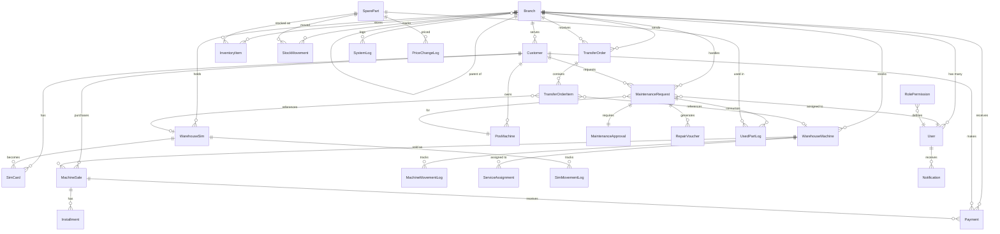
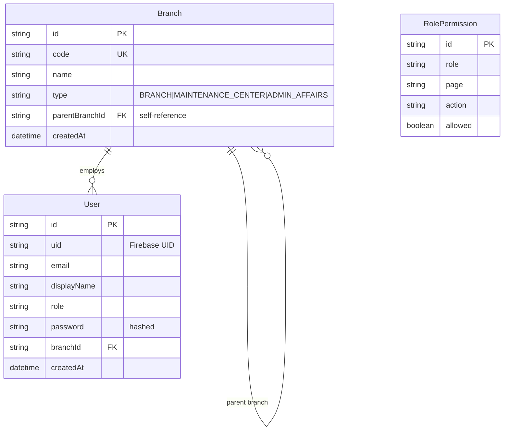
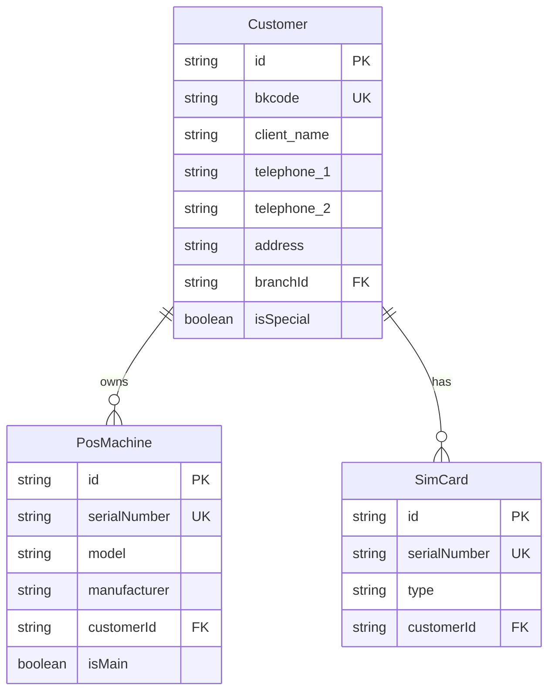
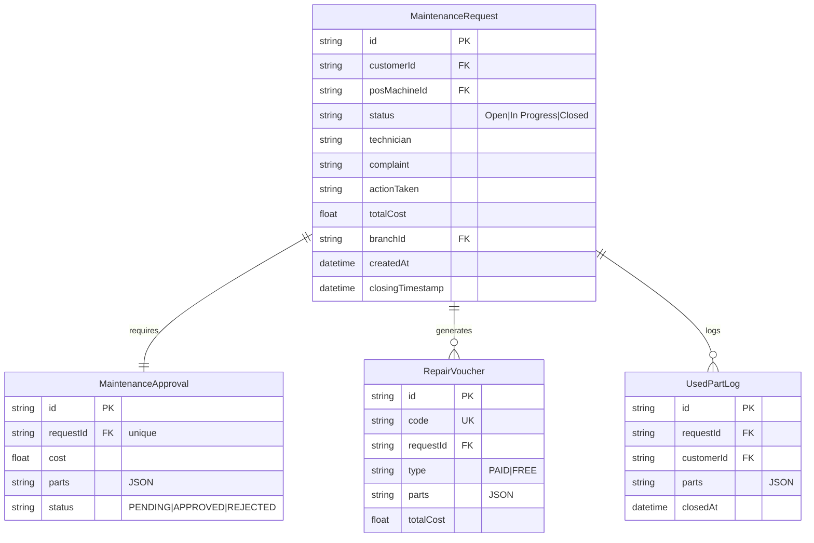
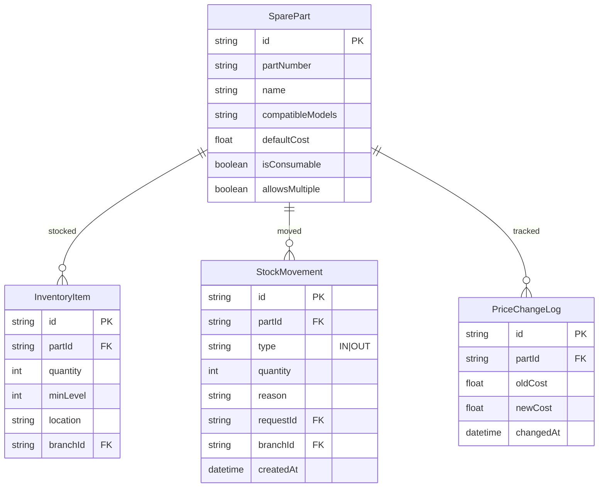
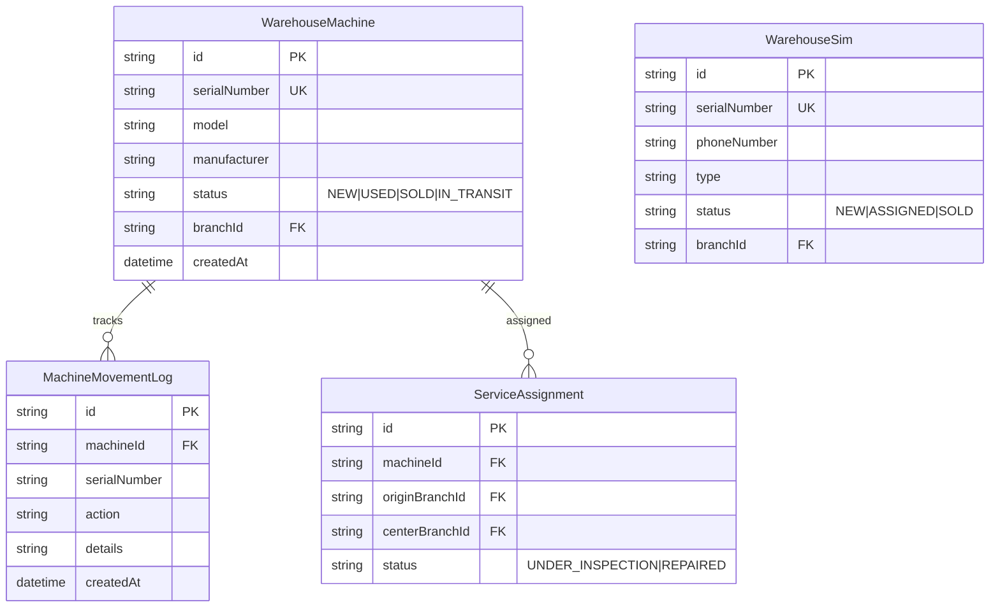
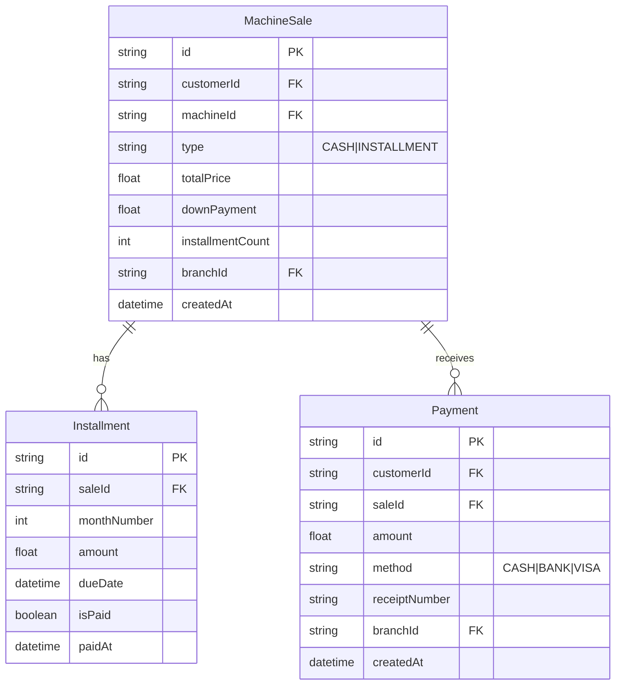

# Database Entity Relationship Diagram

**System:** Smart Enterprise Suite  
**Version:** 3.2.0  
**Last Updated:** January 30, 2026

---

## Complete Database Schema Overview

The Smart Enterprise Suite database consists of **27 interconnected models** designed to support multi-branch maintenance management operations with strict data isolation and comprehensive audit trails.

---

## Entity Relationship Diagram



---

## Core Entity Groups

### 1. Organization & Users



### 2. Customer & Assets



### 3. Maintenance Workflow



### 4. Inventory Management



### 5. Warehouse & Assets



### 6. Sales & Financials



### 7. Transfer System

```mermaid
erDiagram
    TransferOrder {
        string id PK
        string orderNumber UK
        string fromBranchId FK
        string toBranchId FK
        string status "PENDING|PARTIAL|RECEIVED"
       
