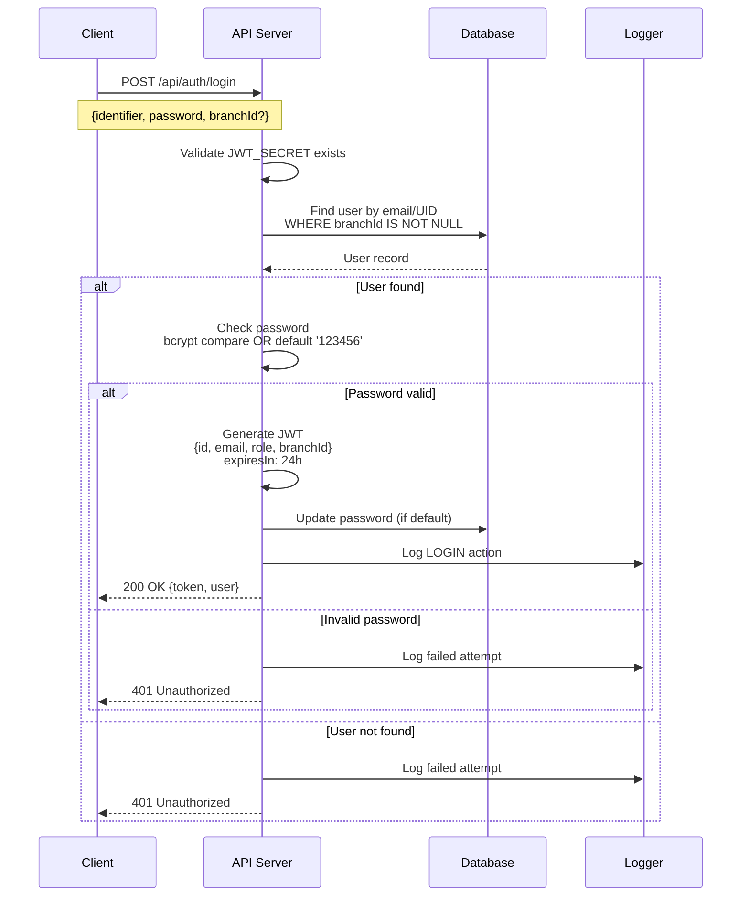
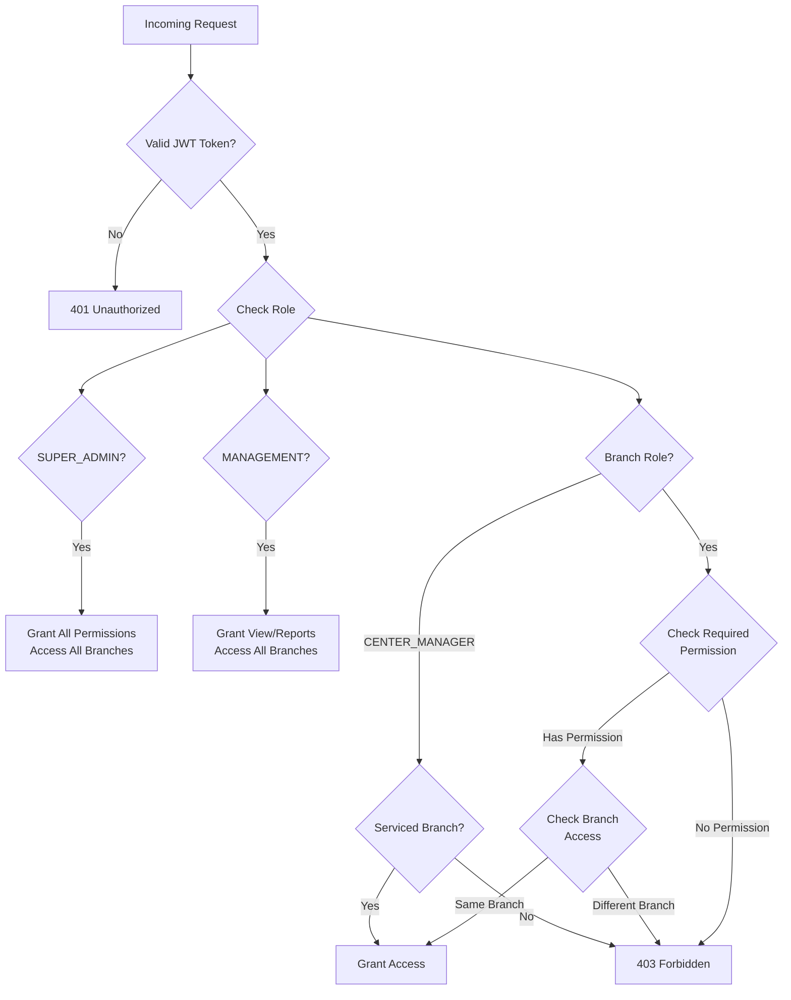
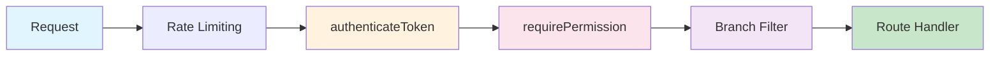
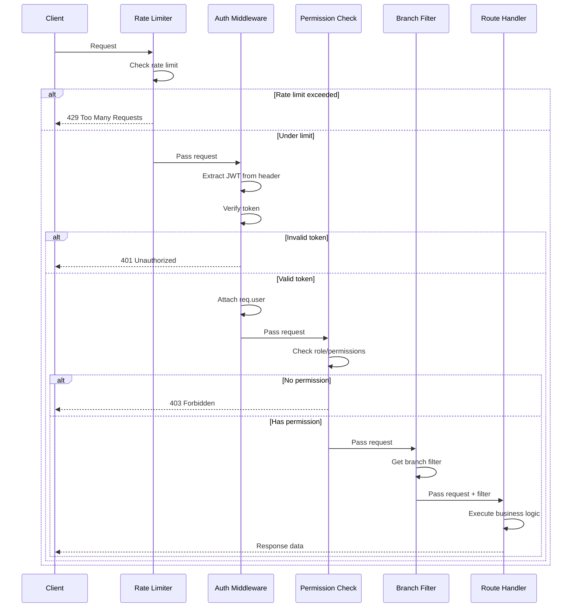

# Smart Enterprise Suite - API Authentication & Authorization Guide

**Version:** 1.0  
**Last Updated:** 2026-01-30  
**Scope:** Backend API Security

---

## Table of Contents

1. [Overview](#overview)
2. [Authentication Flow](#authentication-flow)
3. [Authorization Layers](#authorization-layers)
4. [Role Hierarchy](#role-hierarchy)
5. [Security Middleware](#security-middleware)
6. [Implementation Examples](#implementation-examples)
7. [Error Handling](#error-handling)

---

## Overview

The Smart Enterprise Suite implements a comprehensive security model combining **JWT-based authentication**, **Role-Based Access Control (RBAC)**, and **branch-level data isolation**. This guide documents the security architecture and provides implementation patterns for protected APIs.

### Security Architecture

```
┌─────────────────────────────────────────────────────────────┐
│                    Security Architecture                      │
├─────────────────────────────────────────────────────────────┤
│                                                              │
│   ┌──────────┐    ┌──────────┐    ┌──────────┐             │
│   │  Client  │───▶│  Express │───▶│   JWT    │             │
│   │  Request │    │  Server  │    │ Validate │             │
│   └──────────┘    └──────────┘    └──────────┘             │
│                                        │                    │
│                                        ▼                    │
│                              ┌──────────────────┐          │
│                              │ Role/Permission  │          │
│                              │    Validation    │          │
│                              └──────────────────┘          │
│                                        │                    │
│                                        ▼                    │
│                              ┌──────────────────┐          │
│                              │  Branch Filter   │          │
│                              │   Enforcement    │          │
│                              └──────────────────┘          │
│                                        │                    │
│                                        ▼                    │
│                              ┌──────────────────┐          │
│                              │  Service/Handler │          │
│                              └──────────────────┘          │
│                                                              │
└─────────────────────────────────────────────────────────────┘
```

---

## Authentication Flow

### JWT Token Generation and Validation

#### Token Structure

```javascript
// JWT Payload Structure
{
  "id": "user-uuid",
  "displayName": "John Doe",
  "email": "john@example.com",
  "role": "BRANCH_MANAGER",
  "branchId": "branch-uuid",
  "permissions": ["customers:view:branch", "maintenance:view:branch"],
  "iat": 1738245600,
  "exp": 1738332000
}
```

#### Token Generation

**Location:** `backend/services/authService.js:103`

```javascript
const token = jwt.sign(
  {
    id: user.id,
    email: user.email,
    role: user.role,
    displayName: user.displayName,
    branchId: sessionBranchId
  },
  JWT_SECRET,
  { expiresIn: '24h' }
);
```

#### Environment Configuration

```bash
# Required environment variables
JWT_SECRET=your-minimum-32-character-secret-key-here
JWT_EXPIRY=24h
```

**Security Requirements:**
- JWT_SECRET must be ≥32 characters
- Application exits if secret is missing or too short
- Default expiry: 24 hours

### Login Process

**Location:** `backend/services/authService.js:68-120`

```javascript
// Login endpoint flow
async function login({ identifier, password, branchId: requestedBranchId }) {
  // 1. Validate JWT secret is configured
  if (!JWT_SECRET) throw ApiError('JWT secret not configured', 500);

  // 2. Find user by email or UID (with branch filter)
  const user = await db.user.findFirst({
    where: {
      OR: [{ email: identifier }, { uid: identifier }],
      branchId: { not: null }  // Security: exclude unassigned users
    },
    include: { branch: true }
  });

  // 3. Validate password (bcrypt or default '123456')
  let validPassword = false;
  if (user.password) {
    validPassword = await bcrypt.compare(password, user.password);
  } else {
    validPassword = password === '123456';  // Default password migration
    if (validPassword) {
      // Auto-hash default password
      const hashedPassword = await bcrypt.hash(password, 10);
      await db.user.updateMany({...});
    }
  }

  // 4. Determine session branch
  let sessionBranchId = user.branchId;
  if (!sessionBranchId && requestedBranchId) sessionBranchId = requestedBranchId;

  // 5. Generate JWT token
  const token = jwt.sign({...}, JWT_SECRET, { expiresIn: '24h' });

  // 6. Log audit action
  await logAction({
    entityType: 'USER',
    entityId: user.id,
    action: 'LOGIN',
    details: `User logged in to ${sessionBranchId}`,
    userId: user.id,
    performedBy: user.displayName,
    branchId: sessionBranchId
  });

  return { token, user: resultUser };
}
```

### Authentication Flow Diagram



### Token Validation

**Location:** `backend/middleware/auth.js:25-89`

```javascript
const authenticateToken = (req, res, next) => {
  try {
    // Extract token from Authorization header
    const authHeader = req.headers['authorization'];
    const token = authHeader && authHeader.split(' ')[1];

    if (!token) {
      throw new AppError('Access token required', 401, 'NO_TOKEN');
    }

    // Verify token
    const decoded = jwt.verify(token, JWT_SECRET);

    // Attach user info to request
    req.user = {
      id: decoded.id,
      displayName: decoded.displayName,
      role: decoded.role,
      branchId: decoded.branchId,
      email: decoded.email,
      permissions: decoded.permissions || []
    };

    next();
  } catch (error) {
    // Handle specific JWT errors
    if (error instanceof jwt.TokenExpiredError) {
      return res.status(401).json({
        error: { message: 'Token expired', code: 'TOKEN_EXPIRED' }
      });
    }

    if (error instanceof jwt.JsonWebTokenError) {
      return res.status(401).json({
        error: { message: 'Invalid token', code: 'INVALID_TOKEN' }
      });
    }
    // ...
  }
};
```

### CSRF Protection Mechanism

**Note:** CSRF protection is implemented at the application layer using:
1. JWT tokens stored in Authorization header (not cookies)
2. Same-origin policy enforcement
3. CORS configuration (whitelist origins)

---

## Authorization Layers

### Role-Based Access Control (RBAC)

The system implements a hierarchical role structure with 10 defined roles. Each role maps to specific permissions defined in `ROLE_PERMISSIONS`.

**Location:** `backend/middleware/permissions.js:67-145`

### Permission-Based Access

**Location:** `backend/middleware/permissions.js:28-65`

```javascript
// Permission Categories
const PERMISSIONS = {
  // Customer permissions
  CUSTOMERS_VIEW_ALL: 'customers:view:all',
  CUSTOMERS_VIEW_BRANCH: 'customers:view:branch',
  CUSTOMERS_MANAGE: 'customers:manage',

  // Maintenance permissions
  MAINTENANCE_VIEW_ALL: 'maintenance:view:all',
  MAINTENANCE_VIEW_BRANCH: 'maintenance:view:branch',
  MAINTENANCE_MANAGE_INTERNAL: 'maintenance:manage:internal',
  MAINTENANCE_MANAGE_EXTERNAL: 'maintenance:manage:external',

  // Inventory permissions
  INVENTORY_VIEW_ALL: 'inventory:view:all',
  INVENTORY_VIEW_BRANCH: 'inventory:view:branch',
  INVENTORY_MANAGE_NEW: 'inventory:manage:new',
  INVENTORY_MANAGE_PARTS: 'inventory:manage:parts',
  INVENTORY_RECEIVE: 'inventory:receive',

  // Transfer permissions
  TRANSFERS_VIEW_ALL: 'transfers:view:all',
  TRANSFERS_SEND_NEW: 'transfers:send:new',
  TRANSFERS_SEND_PARTS: 'transfers:send:parts',
  TRANSFERS_SEND_TO_CENTER: 'transfers:send:center',

  // Reports & Analytics
  REPORTS_ALL: 'reports:all',
  REPORTS_BRANCH: 'reports:branch',
  ANALYTICS_VIEW_EXECUTIVE: 'analytics:view:executive',
  ANALYTICS_VIEW_RANKINGS: 'analytics:view:rankings',
  ANALYTICS_VIEW_INVENTORY: 'analytics:view:inventory',

  // User management
  USERS_MANAGE: 'users:manage',
  SETTINGS_MANAGE: 'settings:manage'
};
```

### Branch Isolation Enforcement

**Location:** `backend/middleware/permissions.js:194-239`

```javascript
/**
 * Get branch filter based on user role
 * Returns filter object for Prisma queries
 */
const getBranchFilter = (req) => {
  const userRole = req.user?.role || ROLES.TECHNICIAN;
  const userBranchId = req.user?.branchId;

  // SUPER_ADMIN and MANAGEMENT can see all data
  if ([ROLES.SUPER_ADMIN, ROLES.MANAGEMENT].includes(userRole)) {
    // If branchId is passed in query, use it for filtering
    if (req.query.branchId) {
      return { branchId: req.query.branchId };
    }
    return {};  // No filter = all branches
  }

  // All other roles see only their branch
  if (userBranchId) {
    return { branchId: userBranchId };
  }

  return {};
};

/**
 * Check if user can access a specific branch's data
 */
const canAccessBranch = async (req, branchId, db) => {
  const userRole = req.user?.role || ROLES.TECHNICIAN;
  const userBranchId = req.user?.branchId;

  // Admin and management can access all
  if ([ROLES.SUPER_ADMIN, ROLES.MANAGEMENT].includes(userRole)) {
    return true;
  }

  // Center manager can access serviced branches
  if (userRole === ROLES.CENTER_MANAGER && userBranchId) {
    const targetBranch = await db.branch.findUnique({
      where: { id: branchId },
      select: { maintenanceCenterId: true }
    });
    return targetBranch?.maintenanceCenterId === userBranchId || 
           branchId === userBranchId;
  }

  // Branch users can only access their own branch
  return branchId === userBranchId;
};
```

### Authorization Decision Tree



### Middleware Stack Order



**Recommended Order:**
1. **Rate Limiting** - Prevent abuse
2. **authenticateToken** - Validate JWT
3. **requirePermission** - Check specific permissions
4. **Branch Filter** - Apply data scope
5. **Route Handler** - Execute business logic

---

## Role Hierarchy

### 10 User Roles with Descriptions

| Role | Level | Description | Branch Access |
|------|-------|-------------|---------------|
| **SUPER_ADMIN** | Executive | Full system access, manage all data and users | All branches |
| **MANAGEMENT** | Executive | View-only access to all data, executive reports, analytics | All branches |
| **ADMIN_AFFAIRS** | Admin Affairs | Manage new inventory, handle transfers, inventory reports | All branches |
| **CENTER_MANAGER** | Maintenance Center | Manage maintenance center operations, parts inventory, external maintenance | Own center + serviced branches |
| **CENTER_TECH** | Maintenance Center | Execute external maintenance, view center inventory | Own center only |
| **BRANCH_MANAGER** | Branch | Full branch management: customers, internal maintenance, transfers to center | Own branch only |
| **CS_SUPERVISOR** | Branch | Customer service supervision, can manage customers and maintenance | Own branch only |
| **CS_AGENT** | Branch | Customer service operations, internal maintenance handling | Own branch only |
| **BRANCH_TECH** | Branch | Technical branch operations, maintenance execution | Own branch only |
| **TECHNICIAN** | Branch | Base technical role, maintenance handling | Own branch only |

### Role Permission Matrix

```mermaid
graph TD
    A[SUPER_ADMIN] -->|All Permissions| B[Full Access]
    
    C[MANAGEMENT] -->|View + Reports| D[customers:view:all]
    C -->|View + Reports| E[maintenance:view:all]
    C -->|View + Reports| F[inventory:view:all]
    C -->|View + Reports| G[reports:all]
    C -->|View + Reports| H[analytics:view:*]
    
    I[ADMIN_AFFAIRS] -->|Inventory + Transfers| J[inventory:manage:new]
    I -->|Inventory + Transfers| K[transfers:send:new]
    I -->|Inventory + Transfers| L[inventory:view:all]
    
    M[CENTER_MANAGER] -->|External Maint + Parts| N[maintenance:manage:external]
    M -->|External Maint + Parts| O[inventory:manage:parts]
    M -->|External Maint + Parts| P[transfers:send:parts]
    
    Q[BRANCH_MANAGER] -->|Full Branch| R[customers:*]
    Q -->|Full Branch| S[maintenance:manage:internal]
    Q -->|Full Branch| T[inventory:receive]
    Q -->|Full Branch| U[transfers:send:center]
    
    V[CS_SUPERVISOR] -->|CS + Maint| W[customers:manage]
    V -->|CS + Maint| X[maintenance:manage:internal]
    
    Y[CS_AGENT/BRANCH_TECH/TECHNICIAN] -->|Basic| Z[customers:view:branch]
    Y -->|Basic| AA[maintenance:manage:internal]
    Y -->|Basic| AB[inventory:view:branch]
```



### Protected Route Examples

**Example 1: Super Admin Only**
```javascript
router.get('/system/config',
  authenticateToken,
  requireSuperAdmin,
  getSystemConfig
);
```

**Example 2: Admin or Management**
```javascript
router.get('/admin/users',
  authenticateToken,
  requireAdmin,
  getAllUsers
);
```

**Example 3: Manager Level**
```javascript
router.get('/reports/branch',
  authenticateToken,
  requireManager,
  getBranchReports
);
```

**Example 4: Permission-Based**
```javascript
router.post('/maintenance',
  authenticateToken,
  requirePermission(PERMISSIONS.MAINTENANCE_MANAGE_INTERNAL),
  createMaintenance
);
```

**Example 5: Combined Protection**
```javascript
router.delete('/customers/:id',
  authenticateToken,
  requirePermission(PERMISSIONS.CUSTOMERS_MANAGE),
  (req, res, next) => {
    // Additional branch check
    if (!canAccessBranch(req, req.params.branchId, db)) {
      return res.status(403).json({ error: 'Branch access denied' });
    }
    next();
  },
  deleteCustomer
);
```

---

## Security Middleware

### JWT Validation

**Location:** `backend/middleware/auth.js:25-89`

```javascript
/**
 * Middleware to verify JWT token and attach user to request
 * Throws 401 if token invalid, expired, or missing
 */
const authenticateToken = (req, res, next) => {
  try {
    const authHeader = req.headers['authorization'];
    const token = authHeader && authHeader.split(' ')[1];

    if (!token) {
      throw new AppError('Access token required', 401, 'NO_TOKEN');
    }

    // Verify token
    const decoded = jwt.verify(token, JWT_SECRET);

    // Attach user info to request
    req.user = {
      id: decoded.id,
      displayName: decoded.displayName,
      role: decoded.role,
      branchId: decoded.branchId,
      email: decoded.email,
      permissions: decoded.permissions || []
    };

    logger.debug({ userId: req.user.id, role: req.user.role }, 'Token verified');
    next();
  } catch (error) {
    // Error handling...
  }
};
```

### Role-Based Middleware

**Location:** `backend/middleware/auth.js:91-156`

```javascript
// Require super admin
const requireSuperAdmin = (req, res, next) => {
  if (!req.user) {
    throw new AppError('Authentication required', 401, 'NO_AUTH');
  }

  if (req.user.role !== 'SUPER_ADMIN') {
    throw new AppError('Super admin access required', 403, 'FORBIDDEN');
  }

  logger.info({ userId: req.user.id }, 'Super admin action initiated');
  next();
};

// Require manager or higher
const requireManager = (req, res, next) => {
  if (!req.user) {
    throw new AppError('Authentication required', 401, 'NO_AUTH');
  }

  const managerRoles = [
    'MANAGER', 'CENTER_MANAGER', 'ADMIN', 'SUPER_ADMIN',
    'MANAGEMENT', 'BRANCH_MANAGER', 'CS_SUPERVISOR'
  ];

  if (!managerRoles.includes(req.user.role)) {
    throw new AppError('Manager access required', 403, 'FORBIDDEN');
  }

  next();
};
```

### Permission Middleware

**Location:** `backend/middleware/permissions.js:165-188`

```javascript
/**
 * Middleware factory: require specific permission(s)
 */
const requirePermission = (...permissions) => {
  return (req, res, next) => {
    if (!req.user) {
      return res.status(401).json({ error: 'Authentication required' });
    }

    const userRole = req.user.role || ROLES.TECHNICIAN;

    // Super admin has all permissions
    if (userRole === ROLES.SUPER_ADMIN) {
      return next();
    }

    if (hasAnyPermission(userRole, permissions)) {
      return next();
    }

    return res.status(403).json({
      error: 'Permission denied',
      required: permissions,
      userRole
    });
  };
};
```

### Branch Filter Enforcement

**Location:** `backend/middleware/auth.js:161-183`

```javascript
/**
 * Verify user belongs to specific branch (for branch isolation)
 */
const requireBranchAccess = (requiredBranchId) => {
  return (req, res, next) => {
    if (!req.user) {
      throw new AppError('Authentication required', 401, 'NO_AUTH');
    }

    // Super admins can access any branch
    if (req.user.role === 'SUPER_ADMIN') {
      return next();
    }

    // Regular users must match branch
    if (req.user.branchId !== requiredBranchId) {
      logger.warn(
        { userId: req.user.id, branchId: req.user.branchId, requiredBranchId },
        'Branch access denied'
      );
      throw new AppError('Access denied for this branch', 403, 'FORBIDDEN');
    }

    next();
  };
};
```

### Rate Limiting (Per Role)

**Implementation Pattern:**
```javascript
const rateLimit = require('express-rate-limit');

// Super admin: higher limits
const adminLimiter = rateLimit({
  windowMs: 15 * 60 * 1000, // 15 minutes
  max: 1000, // 1000 requests per window
  message: 'Too many requests from this admin'
});

// Standard users: lower limits
const userLimiter = rateLimit({
  windowMs: 15 * 60 * 1000,
  max: 100,
  message: 'Too many requests, please try again later'
});
```

---

## Implementation Examples

### Protecting Routes with Different Middleware Combinations

**Pattern 1: Simple Authentication**
```javascript
const { authenticateToken } = require('../middleware/auth');

router.get('/profile', authenticateToken, getProfile);
```

**Pattern 2: Role-Based Protection**
```javascript
const { authenticateToken, requireManager } = require('../middleware/auth');

router.get('/reports',
  authenticateToken,
  requireManager,
  getReports
);
```

**Pattern 3: Permission-Based Protection**
```javascript
const { authenticateToken } = require('../middleware/auth');
const { requirePermission, PERMISSIONS } = require('../middleware/permissions');

router.post('/transfers',
  authenticateToken,
  requirePermission(
    PERMISSIONS.TRANSFERS_SEND_NEW,
    PERMISSIONS.TRANSFERS_SEND_PARTS
  ),
  createTransfer
);
```

**Pattern 4: Multi-Layer Protection**
```javascript
router.delete('/system/users/:id',
  authenticateToken,                    // 1. Validate JWT
  requireSuperAdmin,                    // 2. Check role
  requirePermission(PERMISSIONS.USERS_MANAGE), // 3. Check permission
  async (req, res, next) => {           // 4. Custom validation
    const targetUser = await db.user.findUnique({
      where: { id: req.params.id }
    });
    if (targetUser.role === 'SUPER_ADMIN') {
      return res.status(403).json({
        error: 'Cannot delete super admin'
      });
    }
    next();
  },
  deleteUser
);
```

### Checking Permissions in Services

**Location:** `backend/middleware/permissions.js:150-160`

```javascript
const { hasPermission, hasAnyPermission, PERMISSIONS } = require('../middleware/permissions');

async function getCustomerData(user, customerId) {
  // Check if user can view this customer
  if (!hasPermission(user.role, PERMISSIONS.CUSTOMERS_VIEW_ALL)) {
    // Must be from same branch
    const customer = await db.customer.findUnique({
      where: { id: customerId },
      select: { branchId: true }
    });
    
    if (customer.branchId !== user.branchId) {
      throw new AppError('Access denied', 403);
    }
  }
  
  // Return customer data
  return await db.customer.findUnique({
    where: { id: customerId }
  });
}

// Check any permission
if (hasAnyPermission(user.role, [
  PERMISSIONS.MAINTENANCE_MANAGE_INTERNAL,
  PERMISSIONS.MAINTENANCE_MANAGE_EXTERNAL
])) {
  // Allow maintenance operations
}
```

### Using Branch Filter in Queries

```javascript
const { getBranchFilter } = require('../middleware/permissions');

async function listCustomers(req) {
  // Get branch filter based on user role
  const branchFilter = getBranchFilter(req);
  
  return await db.customer.findMany({
    where: {
      ...branchFilter,  // Auto-applied branch restriction
      // Additional filters
      status: 'ACTIVE'
    },
    include: {
      branch: true
    }
  });
}

// For SUPER_ADMIN with query param
// GET /customers?branchId=abc-123
// branchFilter = { branchId: 'abc-123' }

// For BRANCH_MANAGER
// branchFilter = { branchId: 'user-branch-id' }
```

### Handling Unauthorized Access

```javascript
const { AppError } = require('../utils/errorHandler');

// In route handler
router.get('/sensitive-data', authenticateToken, async (req, res) => {
  try {
    if (!hasPermission(req.user.role, PERMISSIONS.REPORTS_ALL)) {
      // Option 1: Throw AppError
      throw new AppError('Permission denied', 403, 'FORBIDDEN');
      
      // Option 2: Return structured response
      return res.status(403).json({
        error: {
          message: 'You do not have permission to view executive reports',
          code: 'INSUFFICIENT_PERMISSIONS',
          required: PERMISSIONS.REPORTS_ALL,
          current: req.user.role
        }
      });
    }
    
    const data = await getSensitiveData();
    res.json(data);
    
  } catch (error) {
    if (error instanceof AppError) {
      return res.status(error.statusCode).json({
        error: {
          message: error.message,
          code: error.code
        }
      });
    }
    
    logger.error({ error }, 'Unexpected error');
    res.status(500).json({
      error: { message: 'Internal server error', code: 'INTERNAL_ERROR' }
    });
  }
});
```

### Middleware Execution Order



---

## Error Handling

### Authentication Error Codes

| Code | HTTP Status | Description |
|------|-------------|-------------|
| `NO_TOKEN` | 401 | Authorization header missing or empty |
| `TOKEN_EXPIRED` | 401 | JWT token has expired |
| `INVALID_TOKEN` | 401 | Token signature invalid or malformed |
| `NO_AUTH` | 401 | User not authenticated (no req.user) |
| `FORBIDDEN` | 403 | Authenticated but lacks permission/role |
| `AUTH_ERROR` | 500 | Unexpected authentication failure |
| `REFRESH_TOKEN_EXPIRED` | 401 | Refresh token expired |
| `INVALID_REFRESH_TOKEN` | 401 | Refresh token invalid |

### Error Response Format

```json
{
  "error": {
    "message": "Token expired",
    "code": "TOKEN_EXPIRED",
    "timestamp": "2026-01-30T12:00:00.000Z"
  }
}
```

### Permission Denied Response

```json
{
  "error": "Permission denied",
  "required": ["customers:manage", "customers:view:all"],
  "userRole": "TECHNICIAN"
}
```

---

## Best Practices

1. **Always use authenticateToken first** - It must be the first middleware to attach `req.user`

2. **Combine role and permission checks** - Use both for defense in depth:
   ```javascript
   authenticateToken,
   requireManager,  // Role check
   requirePermission(PERMISSIONS.CUSTOMERS_MANAGE)  // Permission check
   ```

3. **Apply branch filters consistently** - Use `getBranchFilter()` in all database queries for non-global roles

4. **Log security events** - All authentication failures and permission denials are logged with context

5. **Use specific permission checks** - Prefer `requirePermission()` over role checks for fine-grained access control

6. **Handle default passwords** - The system supports password migration from default '123456' to bcrypt hashed passwords

7. **Validate JWT_SECRET on startup** - Application exits if secret is missing or <32 characters

8. **Check branch isolation in services** - Don't rely solely on middleware; verify in business logic too

---

## File References

- `backend/middleware/auth.js` - JWT validation and role middleware
- `backend/middleware/permissions.js` - Permission definitions and checks
- `backend/services/authService.js` - Authentication logic (login, profile)
- `backend/utils/errorHandler.js` - Error handling utilities
- `backend/utils/logger.js` - Audit logging
