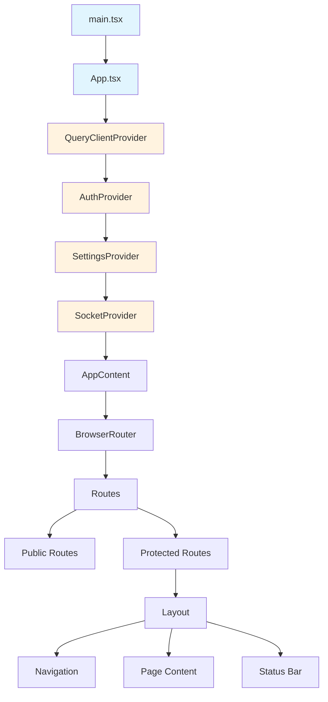
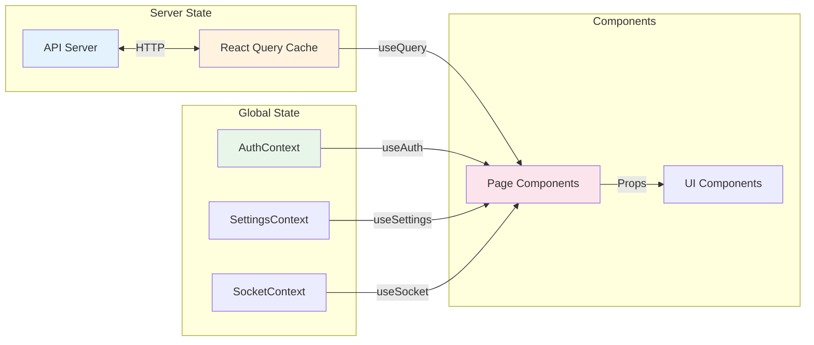
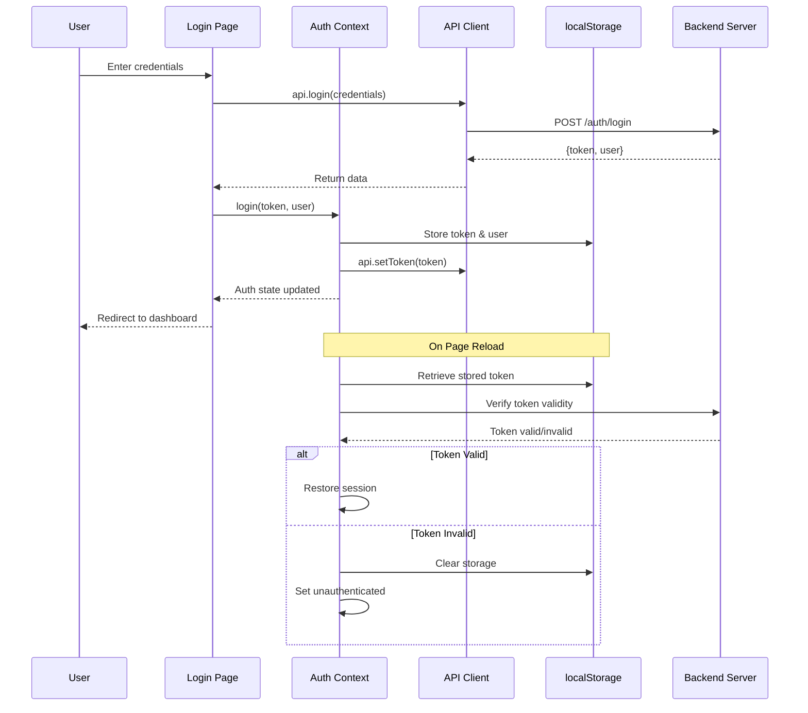
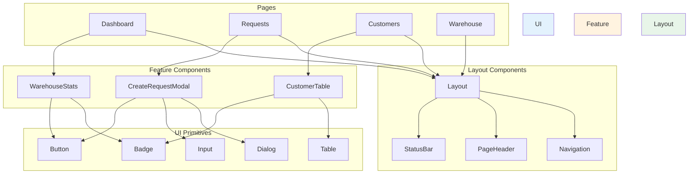
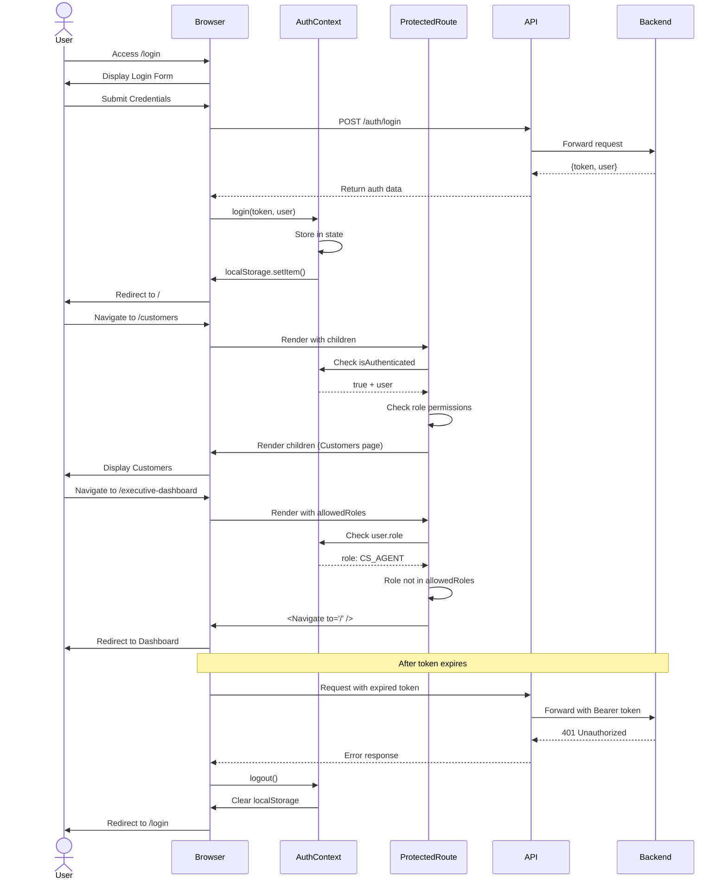
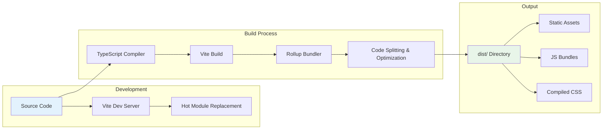
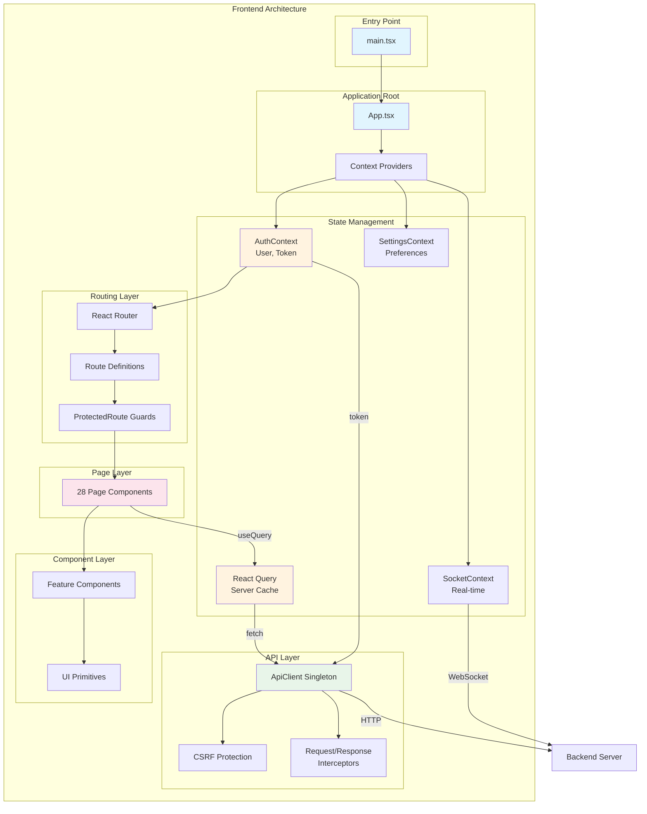

# Smart Enterprise Suite - Frontend Architecture Documentation

## 1. Architecture Overview

### Technology Stack Summary

| Category | Technology | Version | Purpose |
|----------|-----------|---------|---------|
| **Framework** | React | 19.2.0 | UI component library |
| **Language** | TypeScript | 5.9.3 | Type safety & DX |
| **Build Tool** | Vite | 7.2.4 | Fast development & bundling |
| **Styling** | Tailwind CSS | 4.1.18 | Utility-first CSS |
| **State Management** | React Query (TanStack) | 5.90.12 | Server state management |
| **Routing** | React Router DOM | 7.10.1 | Client-side navigation |
| **UI Components** | Radix UI | Various | Headless accessible primitives |
| **HTTP Client** | Native Fetch | - | API communication |
| **Real-time** | Socket.IO Client | 4.8.3 | WebSocket connections |
| **Charts** | Recharts | 3.6.0 | Data visualization |
| **Animations** | Framer Motion | 12.23.26 | UI animations |
| **Icons** | Lucide React | 0.561.0 | Icon library |
| **Forms** | Native + Custom | - | Form handling |
| **Notifications** | React Hot Toast | 2.6.0 | Toast notifications |
| **Excel** | ExcelJS / XLSX | 4.4.0 / 0.18.5 | Import/Export functionality |

### Directory Structure

```
frontend/
├── public/                    # Static assets
├── src/
│   ├── api/
│   │   └── client.ts          # API client singleton
│   ├── assets/                # Images, fonts, static files
│   ├── components/
│   │   ├── ui/                # Primitive UI components (shadcn)
│   │   ├── customers/         # Customer-related components
│   │   ├── warehouse/         # Warehouse components
│   │   ├── sim/               # SIM management components
│   │   ├── transfers/         # Transfer order components
│   │   ├── reports/           # Report components
│   │   ├── settings/          # Settings components
│   │   ├── Layout.tsx         # Main layout wrapper
│   │   ├── ProtectedRoute.tsx # Route protection
│   │   └── ...
│   ├── context/
│   │   ├── AuthContext.tsx    # Authentication state
│   │   ├── SettingsContext.tsx # User preferences
│   │   └── SocketContext.tsx  # WebSocket connection
│   ├── hooks/
│   │   ├── useAuthQuery.ts    # Auth-aware query hook
│   │   ├── useApiMutation.ts  # API mutation with toast
│   │   ├── useCustomerData.ts # Customer data fetching
│   │   └── usePushNotifications.ts # Push notification hook
│   ├── lib/
│   │   ├── types.ts           # TypeScript types
│   │   ├── permissions.ts     # RBAC permissions
│   │   ├── utils.ts           # Utility functions
│   │   ├── translations.ts    # Arabic translations
│   │   └── smart-theme.ts     # Theme configuration
│   ├── pages/                 # Route-level page components (28 pages)
│   ├── utils/
│   │   ├── reports/           # Report generation utilities
│   │   ├── exportUtils.ts     # Export helpers
│   │   └── apiNormalizers.ts  # API data normalizers
│   ├── App.tsx                # Root app with routing
│   ├── main.tsx               # Application entry point
│   └── index.css              # Global styles
├── package.json
├── tsconfig.json              # TypeScript configuration
├── tailwind.config.js         # Tailwind configuration
└── vite.config.ts             # Vite configuration
```

### Component Hierarchy



---

## 2. Routing Structure

### All 28 Pages Mapped

| # | Route | Component | Access Level | Description |
|---|-------|-----------|--------------|-------------|
| 1 | `/login` | `Login.tsx` | Public | Authentication page |
| 2 | `/` | `Dashboard` / `AdminDashboard` | Protected | Home redirect based on role |
| 3 | `/dashboard` | `Dashboard.tsx` | Protected | Main dashboard |
| 4 | `/executive-dashboard` | `ExecutiveDashboard.tsx` | SUPER_ADMIN, MANAGEMENT | Executive overview |
| 5 | `/requests` | `Requests.tsx` | Branch Users | Maintenance requests |
| 6 | `/maintenance/shipments` | `MaintenanceShipments.tsx` | Center Users | Incoming shipments |
| 7 | `/maintenance/shipments/:id` | `ShipmentDetail.tsx` | Center Users | Shipment details |
| 8 | `/maintenance-approvals` | `MaintenanceApprovals.tsx` | Protected | Maintenance approvals |
| 9 | `/track-machines` | `TrackMachines.tsx` | Branch Users | Machine tracking |
| 10 | `/pending-payments` | `PendingPayments.tsx` | Supervisor+ | Pending payments |
| 11 | `/customers` | `Customers.tsx` | Branch Users | Customer management |
| 12 | `/receipts` | `Receipts.tsx` | Branch Users | Sales & installments |
| 13 | `/payments` | `Payments.tsx` | Branch Users | Payment records |
| 14 | `/warehouse` | `Warehouse.tsx` | Protected | Spare parts inventory |
| 15 | `/warehouse-machines` | `MachineWarehouse.tsx` | Protected | Machine warehouse |
| 16 | `/warehouse-sims` | `SimWarehouse.tsx` | Protected | SIM warehouse |
| 17 | `/transfer-orders` | `TransferOrders.tsx` | Protected | Create transfers |
| 18 | `/receive-orders` | `ReceiveOrders.tsx` | Protected | Receive transfers |
| 19 | `/reports` | `Reports.tsx` | Protected | Reports dashboard |
| 20 | `/production-reports` | `ProductionReports.tsx` | Protected | Production reports |
| 21 | `/technicians` | `Users.tsx` | SUPER_ADMIN | User management |
| 22 | `/approvals` | `Approvals.tsx` | SUPER_ADMIN, CENTER_MANAGER | System approvals |
| 23 | `/branches` | `BranchesSettings.tsx` | SUPER_ADMIN | Branch management |
| 24 | `/settings` | `Settings.tsx` | Protected | User settings |
| 25 | `/maintenance-board` | `MaintenanceBoard.tsx` | Center Users | Maintenance kanban |
| 26 | `/assignments` | `TechnicianDashboard.tsx` | Center Users | Tech assignments |
| 27 | `/admin-dashboard` | `AdminDashboard.tsx` | SUPER_ADMIN | Admin overview |
| 28 | `*` | Navigate to `/` | Protected | 404 redirect |

### Route Parameters and Guards

```typescript
// Route Parameter Patterns
/maintenance/shipments/:id        // Dynamic shipment ID
/customers/:customerId/machines   // Customer-specific data
/requests?branchId=xxx&search=xxx  // Query parameters

// Role-Based Route Guards
<ProtectedRoute>                              // Basic auth check
<ProtectedRoute allowedRoles={['SUPER_ADMIN', 'MANAGEMENT']}>
<ProtectedRoute allowedRoles={['CENTER_MANAGER', 'CENTER_TECH']}>
```

### Lazy Loading Strategy

The application uses ** eager loading** for all routes currently, with potential for code-splitting:

```typescript
// Current approach (eager loading)
import Dashboard from './pages/Dashboard';

// Future optimization (lazy loading)
const Dashboard = lazy(() => import('./pages/Dashboard'));

// With suspense boundary
<Route path="/dashboard" element={
  <Suspense fallback={<PageLoader />}>
    <Dashboard />
  </Suspense>
} />
```

### Routing Tree Mermaid Diagram

```mermaid
graph TD
    ROOT[BrowserRouter] --> PUBLIC[Public Routes]
    ROOT --> PROTECTED[Protected Routes]
    
    PUBLIC --> LOGIN[/login<br/>Login.tsx]
    
    PROTECTED --> LAYOUT[Layout Component]
    LAYOUT --> DASHBOARD["/ Dashboard"]
    LAYOUT --> ADMIN_DASH["/executive-dashboard<br/>SUPER_ADMIN|MANAGEMENT"]
    
    LAYOUT --> MAINTENANCE["Maintenance Group"]
    MAINTENANCE --> REQ[/requests]
    MAINTENANCE --> SHIP[/maintenance/shipments]
    MAINTENANCE --> SHIP_DETAIL["/maintenance/shipments/:id"]
    MAINTENANCE --> APPROVALS[/maintenance-approvals]
    MAINTENANCE --> TRACK[/track-machines]
    MAINTENANCE --> PENDING[/pending-payments]
    
    LAYOUT --> CUSTOMERS["Customers Group"]
    CUSTOMERS --> CUST[/customers]
    CUSTOMERS --> RECEIPTS[/receipts]
    CUSTOMERS --> PAY[/payments]
    
    LAYOUT --> WAREHOUSE["Warehouse Group"]
    WAREHOUSE --> WH[/warehouse]
    WAREHOUSE --> WH_MACHINES[/warehouse-machines]
    WAREHOUSE --> WH_SIMS[/warehouse-sims]
    
    LAYOUT --> TRANSFERS["Transfers Group"]
    TRANSFERS --> TRANS[/transfer-orders]
    TRANSFERS --> RECV[/receive-orders]
    
    LAYOUT --> REPORTS["Reports Group"]
    REPORTS --> REP[/reports]
    REPORTS --> PROD_REP[/production-reports]
    
    LAYOUT --> ADMIN["Admin Group<br/>SUPER_ADMIN"]
    ADMIN --> USERS[/technicians]
    ADMIN --> APPROVALS_ADMIN[/approvals]
    ADMIN --> BRANCHES[/branches]
    ADMIN --> SETT[/settings]
    
    LAYOUT --> WILDCARD[/*<br/>Redirect to /]
    
    style LOGIN fill:#ffebee
    style ADMIN fill:#e8f5e9
    style MAINTENANCE fill:#e3f2fd
    style WAREHOUSE fill:#fff3e0
```

---

## 3. State Management

### AuthContext Implementation

```typescript
// Context Definition
interface AuthContextType {
    user: User | null;
    token: string | null;
    login: (token: string, user: User) => void;
    logout: () => void;
    isAuthenticated: boolean;
}

// User Interface
interface User {
    id: string;
    email: string;
    displayName: string;
    role: string;
    branchId: string | null;
    branchType?: string;
    theme?: string;
    themeVariant?: 'glass' | 'solid';
    fontFamily?: string;
}
```

**Key Features:**
- Token stored in `localStorage` for persistence
- Automatic token validation on mount via API ping
- API client token synchronization
- Role-based access information

### React Query Patterns

```typescript
// 1. Auth-Aware Query Hook
export function useAuthQuery<T>(options: UseQueryOptions<T>) {
  const { user } = useAuth();
  return useQuery({
    ...options,
    enabled: !!user && (options.enabled !== undefined ? options.enabled : true),
  });
}

// 2. API Mutation with Toast
export function useApiMutation<TData, TVariables>(options: {
  mutationFn: (variables: TVariables) => Promise<TData>;
  successMessage?: string;
  invalidateKeys?: string[][];
  onSuccess?: (data: TData) => void;
  onError?: (error: any) => void;
}) {
  const queryClient = useQueryClient();
  return useMutation({
    mutationFn: options.mutationFn,
    onSuccess: (data) => {
      toast.success(options.successMessage);
      options.invalidateKeys?.forEach(key => {
        queryClient.invalidateQueries({ queryKey: key });
      });
      options.onSuccess?.(data);
    },
    onError: (error) => {
      toast.error(error.message);
      options.onError?.(error);
    }
  });
}
```

**Query Keys Pattern:**
```typescript
// Standardized query keys for cache management
['customers']                    // All customers
['customers', branchId]          // Branch-filtered customers
['requests']                     // All requests
['requests', 'stats', branchId]  // Request statistics
['warehouse-machines', status]   // Machines by status
```

### Local vs Server State

| State Type | Location | Examples |
|------------|----------|----------|
| **Server State** | React Query | Customers, Requests, Inventory, Users |
| **Global UI State** | React Context | Auth, Settings, Socket connection |
| **Local Component State** | useState | Form inputs, Modal visibility, Selected items |
| **URL State** | React Router | Filters, Pagination, Active tabs |
| **Persistent State** | localStorage | Auth token, Font preferences |

### State Flow Diagrams



### Authentication State Flow



---

## 4. API Integration

### ApiClient Singleton Pattern

```typescript
// Singleton instance
const API_BASE_URL = import.meta.env.VITE_API_URL || 'http://localhost:5000/api';
export const api = new ApiClient(API_BASE_URL);

// Usage throughout app
import { api } from '../api/client';
const customers = await api.getCustomers({ branchId: '123' });
```

**Class Structure:**
```typescript
class ApiClient {
    private baseUrl: string;
    private token: string | null = null;

    // Token management
    setToken(token: string | null): void
    
    // Core request method
    private async request<T>(endpoint: string, options?: RequestInit): Promise<T>
    
    // HTTP method helpers
    public async get<T>(endpoint: string): Promise<T>
    public async post<T>(endpoint: string, data?: any): Promise<T>
    public async put<T>(endpoint: string, data?: any): Promise<T>
    public async patch<T>(endpoint: string, data?: any): Promise<T>
    
    // Domain-specific methods (100+ endpoints)
    // Auth, Customers, Requests, Users, Settings, 
    // Warehouse, Payments, Reports, Transfers, etc.
}
```

### CSRF Protection Implementation

```typescript
// Automatic CSRF token extraction from cookies
private getCsrfToken(): string {
    const name = "XSRF-TOKEN=";
    const decodedCookie = decodeURIComponent(document.cookie);
    const ca = decodedCookie.split(';');
    for (let i = 0; i < ca.length; i++) {
        let c = ca[i];
        while (c.charAt(0) === ' ') c = c.substring(1);
        if (c.indexOf(name) === 0) {
            return c.substring(name.length, c.length);
        }
    }
    return "";
}

// Applied to every request automatically
const csrfToken = this.getCsrfToken();
if (csrfToken) {
    headers['X-CSRF-Token'] = csrfToken;
}
```

### Request/Response Interceptors

```typescript
// Implicit interceptor pattern in request method
private async request<T>(endpoint: string, options?: RequestInit): Promise<T> {
    // 1. Header preparation
    const headers: any = { ...(options?.headers || {}) };
    
    // 2. Content-Type handling (skip for FormData)
    if (options?.body instanceof FormData) {
        delete headers['Content-Type']; // Let browser set boundary
    } else {
        headers['Content-Type'] = 'application/json';
    }
    
    // 3. Auth header injection
    if (this.token) {
        headers['Authorization'] = `Bearer ${this.token}`;
    }
    
    // 4. CSRF protection
    const csrfToken = this.getCsrfToken();
    if (csrfToken) headers['X-CSRF-Token'] = csrfToken;
    
    // 5. Execute request with credentials
    const response = await fetch(`${this.baseUrl}${endpoint}`, {
        ...options,
        headers,
        credentials: 'include', // Cookies for session/auth
    });
    
    // 6. Error handling
    if (!response.ok) {
        const errorData = await response.json().catch(() => ({}));
        throw new Error(errorData.error || `API Error: ${response.statusText}`);
    }
    
    // 7. Response parsing
    return response.json();
}
```

### Error Handling Patterns

```typescript
// 1. Component-level error handling
try {
  const data = await api.createCustomer(customerData);
  // Handle success
} catch (error) {
  toast.error(error.message);
}

// 2. React Query error handling
const { data, error, isError } = useQuery({
  queryKey: ['customers'],
  queryFn: () => api.getCustomers(),
});

if (isError) {
  return <ErrorMessage message={error.message} />;
}

// 3. useApiMutation automatic error handling
const mutation = useApiMutation({
  mutationFn: api.createCustomer,
  errorMessage: 'فشل إنشاء العميل', // Arabic error message
  // Error toast shown automatically with backend message
});
```

### API Architecture Diagram

```mermaid
graph TD
    subgraph "Frontend"
        COMP[Components]
        HOOK[Custom Hooks]
        API_CLIENT[ApiClient Singleton]
    end
    
    subgraph "Request Flow"
        AUTH_HEADER[Authorization Header]
        CSRF_HEADER[X-CSRF-Token Header]
        CONTENT_TYPE[Content-Type Handler]
        ERROR_HANDLER[Error Handler]
    end
    
    subgraph "Backend"
        SERVER[Express Server]
        AUTH_MW[Auth Middleware]
        CSRF_MW[CSRF Middleware]
        ROUTES[API Routes]
    end
    
    COMP -->|api.method()| API_CLIENT
    HOOK -->|api.method()| API_CLIENT
    
    API_CLIENT --> AUTH_HEADER
    API_CLIENT --> CSRF_HEADER
    API_CLIENT --> CONTENT_TYPE
    
    AUTH_HEADER -->|Bearer Token| SERVER
    CSRF_HEADER -->|CSRF Token| SERVER
    CONTENT_TYPE -->|JSON/FormData| SERVER
    
    SERVER --> AUTH_MW
    SERVER --> CSRF_MW
    AUTH_MW --> ROUTES
    CSRF_MW --> ROUTES
    
    ROUTES -->|Response| API_CLIENT
    API_CLIENT -->|Data/Error| COMP
    
    style API_CLIENT fill:#e3f2fd
    style SERVER fill:#e8f5e9
```

---

## 5. Component Architecture

### Feature-Based Organization

```
src/components/
├── ui/                    # Primitive components (shadcn)
│   ├── button.tsx
│   ├── input.tsx
│   ├── dialog.tsx
│   ├── table.tsx
│   └── ...
├── customers/             # Customer domain
│   ├── CustomerForm.tsx
│   └── CustomerList.tsx
├── warehouse/             # Warehouse domain
│   ├── MachineWarehouse.tsx
│   ├── SimWarehouse.tsx
│   └── WarehouseStats.tsx
├── sim/                   # SIM management
│   ├── SimTable.tsx
│   ├── SimTransferModal.tsx
│   └── SimStatsCards.tsx
├── transfers/             # Transfer orders
│   ├── TransferOrdersTable.tsx
│   ├── CreateTransferOrderForm.tsx
│   └── TransferBadges.tsx
├── reports/               # Reporting
│   └── ReportComponents...
└── settings/              # Settings
    └── SettingsComponents...
```

### UI Primitive Layer

Built on **Radix UI** primitives with **Tailwind CSS** styling:

```typescript
// Example: Button Component
import * as React from "react";
import { Slot } from "@radix-ui/react-slot";
import { cva, type VariantProps } from "class-variance-authority";
import { cn } from "@/lib/utils";

const buttonVariants = cva(
  "inline-flex items-center justify-center whitespace-nowrap rounded-md ...",
  {
    variants: {
      variant: {
        default: "bg-primary text-primary-foreground hover:bg-primary/90",
        destructive: "bg-destructive text-destructive-foreground...",
        outline: "border border-input bg-background hover:bg-accent...",
        // ... more variants
      },
      size: {
        default: "h-10 px-4 py-2",
        sm: "h-9 rounded-md px-3",
        lg: "h-11 rounded-md px-8",
      },
    },
  }
);

export interface ButtonProps
  extends React.ButtonHTMLAttributes<HTMLButtonElement>,
    VariantProps<typeof buttonVariants> {
  asChild?: boolean;
}
```

### Compound Components Pattern

```typescript
// Example: Data Table Compound Component
<DataTable
  data={customers}
  columns={customerColumns}
  searchable
  filterable
  pagination
>
  <DataTable.Search placeholder="Search customers..." />
  <DataTable.Filters>
    <DataTable.Filter column="status" options={statusOptions} />
    <DataTable.Filter column="type" options={typeOptions} />
  </DataTable.Filters>
  <DataTable.Export onExport={handleExport} />
  <DataTable.Pagination pageSize={10} />
</DataTable>
```

### Custom Hooks Strategy

| Hook | Purpose | Usage |
|------|---------|-------|
| `useAuth()` | Authentication state | User info, login/logout |
| `useSettings()` | User preferences | Theme, font, notifications |
| `useSocket()` | Real-time connection | Notifications, updates |
| `useAuthQuery()` | Auth-aware data fetching | All data queries |
| `useApiMutation()` | Mutations with toast | All data mutations |
| `useCustomerData()` | Customer data management | Customer CRUD operations |
| `usePushNotifications()` | Browser push notifications | Notification permission |

### Component Hierarchy Diagram



---

## 6. Security Implementation

### JWT Token Management

```typescript
// Token Storage Strategy
const TOKEN_KEY = 'token';
const USER_KEY = 'user';

// On Login
const login = (newToken: string, newUser: User) => {
    setToken(newToken);
    setUser(newUser);
    localStorage.setItem(TOKEN_KEY, newToken);
    localStorage.setItem(USER_KEY, JSON.stringify(newUser));
    api.setToken(newToken);
};

// On Logout
const logout = () => {
    setToken(null);
    setUser(null);
    localStorage.removeItem(TOKEN_KEY);
    localStorage.removeItem(USER_KEY);
    api.setToken(null);
};

// Token Validation on Mount
useEffect(() => {
    const storedToken = localStorage.getItem(TOKEN_KEY);
    if (storedToken) {
        // Verify with lightweight API call
        fetch(`${API_URL}/notifications/count`, {
            headers: { 'Authorization': `Bearer ${storedToken}` }
        }).then(res => {
            if (res.ok) {
                setToken(storedToken);
                setUser(JSON.parse(localStorage.getItem(USER_KEY)!));
                api.setToken(storedToken);
            } else {
                // Token invalid, clear storage
                logout();
            }
        });
    }
}, []);
```

### Route Protection (ProtectedRoute)

```typescript
interface ProtectedRouteProps {
    children: React.ReactNode;
    allowedRoles?: string[];
}

export function ProtectedRoute({ children, allowedRoles }: ProtectedRouteProps) {
    const { isAuthenticated, token, user } = useAuth();
    const location = useLocation();

    // 1. Check authentication
    if (!isAuthenticated || !token) {
        return <Navigate to="/login" state={{ from: location }} replace />;
    }

    // 2. Check role authorization
    if (allowedRoles && user && !allowedRoles.includes(normalizeRole(user.role))) {
        return <Navigate to="/" replace />; // Redirect to dashboard
    }

    return <>{children}</>;
}

// Usage examples:
<ProtectedRoute>                              // Any authenticated user
<ProtectedRoute allowedRoles={['SUPER_ADMIN']}> // Admin only
<ProtectedRoute allowedRoles={['CENTER_MANAGER', 'CENTER_TECH']}> // Center users
```

### Permission Checking in Components

```typescript
// 1. Menu Visibility (Layout.tsx)
const visibleNavItems = useMemo(() => {
    return allNavItems.filter(item => {
        if ('path' in item) {
            return canAccessRoute(user?.role, item.path);
        }
        // Filter groups based on children visibility
        const visibleChildren = item.children.filter(child => 
            canAccessRoute(user?.role, child.path)
        );
        return visibleChildren.length > 0;
    });
}, [user?.role]);

// 2. Action Button Visibility
{canPerformAction(user?.role, 'DELETE_CUSTOMER') && (
    <Button variant="destructive" onClick={handleDelete}>
        Delete Customer
    </Button>
)}

// 3. Page-Level Protection
if (!canAccessRoute(user?.role, '/executive-dashboard')) {
    return <Navigate to="/" replace />;
}
```

### Security Checklist

| Aspect | Implementation | Status |
|--------|---------------|--------|
| Authentication | JWT tokens in localStorage | ✓ |
| Token Validation | API ping on mount | ✓ |
| Route Protection | ProtectedRoute component | ✓ |
| Role-Based Access | MENU_PERMISSIONS & ACTION_PERMISSIONS | ✓ |
| CSRF Protection | X-CSRF-Token header | ✓ |
| XSS Prevention | React's built-in escaping | ✓ |
| HTTPS | Backend enforces HTTPS | ✓ |
| CORS | Configured on backend | ✓ |

### Authentication Flow Diagram



---

## 7. Build & Development

### Vite Configuration

```typescript
// vite.config.ts
import { defineConfig } from 'vite'
import react from '@vitejs/plugin-react'
import path from 'path'

export default defineConfig({
  plugins: [react()],
  resolve: {
    alias: {
      "@": path.resolve(__dirname, "./src"), // Path alias for imports
    },
  },
  server: {
    host: true, // Listen on all addresses (for LAN testing)
    port: 5173,
    proxy: {
      // Optional: Proxy API requests during development
      '/api': {
        target: 'http://localhost:5000',
        changeOrigin: true,
      }
    }
  },
  build: {
    outDir: 'dist',
    sourcemap: true,
    rollupOptions: {
      // Code splitting configuration
      output: {
        manualChunks: {
          vendor: ['react', 'react-dom', 'react-router-dom'],
          ui: ['@radix-ui/react-dialog', '@radix-ui/react-dropdown-menu', ...],
          charts: ['recharts'],
          query: ['@tanstack/react-query'],
        }
      }
    }
  }
})
```

### TypeScript Setup

**Project References Structure:**
```json
// tsconfig.json
{
  "files": [],
  "references": [
    { "path": "./tsconfig.app.json" },    // Application code
    { "path": "./tsconfig.node.json" }     // Vite/node config
  ]
}
```

**Application Configuration:**
```json
// tsconfig.app.json
{
  "compilerOptions": {
    "target": "ES2020",
    "lib": ["ES2020", "DOM", "DOM.Iterable"],
    "module": "ESNext",
    "skipLibCheck": true,
    "moduleResolution": "bundler",
    "allowImportingTsExtensions": true,
    "resolveJsonModule": true,
    "isolatedModules": true,
    "noEmit": true,
    "jsx": "react-jsx",
    "strict": true,
    "noUnusedLocals": true,
    "noUnusedParameters": true,
    "noFallthroughCasesInSwitch": true,
    "baseUrl": ".",
    "paths": {
      "@/*": ["./src/*"]                    // Path alias
    }
  },
  "include": ["src"]
}
```

### Tailwind Configuration

```javascript
// tailwind.config.js
export default {
    darkMode: 'class',                        // Dark mode via class
    content: [
        "./index.html",
        "./src/**/*.{js,ts,jsx,tsx}",
    ],
    theme: {
        extend: {
            colors: {
                // Smart Enterprise Brand Colors
                brand: {
                    primary: '#0A2472',       // Deep Navy Blue
                    cyan: '#6CE4F0',          // PANTONE 2727 C
                    purple: '#7E5BAB',        // PANTONE 525 C
                    pink: '#C85C8E',          // PANTONE 674 C
                    orange: '#E86B3A',        // PANTONE 7578 C
                    yellow: '#F5C451',        // PANTONE 141 C
                    green: '#80C646',         // PANTONE 367 C
                    teal: '#31625C',          // PANTONE 555 C
                },
                // shadcn/ui theme tokens
                border: "hsl(var(--border))",
                input: "hsl(var(--input))",
                ring: "hsl(var(--ring))",
                background: "hsl(var(--background))",
                foreground: "hsl(var(--foreground))",
                primary: {
                    DEFAULT: '#0A2472',
                    foreground: '#ffffff',
                },
                // ... additional tokens
            },
            fontFamily: {
                sans: ["Inter", "var(--font-arabic)", "sans-serif"],
                arabic: ["var(--font-arabic)", "sans-serif"],
            },
            backgroundImage: {
                'gradient-smart-purple': 'linear-gradient(135deg, #5536A7 0%, #0A2472 100%)',
                'gradient-smart-blue': 'linear-gradient(135deg, #0A2472 0%, #31625C 100%)',
                // ... additional gradients
            },
            boxShadow: {
                'smart-glow': '0 0 20px rgba(108, 228, 240, 0.3)',
                'smart-card': '0 10px 15px -3px rgba(10, 36, 114, 0.1)',
            },
        },
    },
    plugins: [],
}
```

### Development Scripts

```json
// package.json
{
  "scripts": {
    "dev": "vite",                          // Start dev server
    "build": "tsc -b && vite build",        // Type check & build
    "lint": "eslint .",                      // Run ESLint
    "preview": "vite preview"                // Preview production build
  }
}
```

### Environment Variables

```bash
# .env.development
VITE_API_URL=http://localhost:5000/api

# .env.production
VITE_API_URL=https://api.smartenterprise.com/api
```

### Build Architecture Diagram



---

## Appendix: Data Flow Architecture



---

## Document Information

- **Project**: Smart Enterprise Suite
- **Version**: 1.0.0
- **Last Updated**: 2026-01-31
- **Author**: Development Team
- **Status**: Production Ready

---

*This document provides a comprehensive overview of the Smart Enterprise Suite frontend architecture. For detailed implementation questions, refer to the source code or contact the development team.*
