# Smart Enterprise Suite - System Architecture

**Last Updated**: January 30, 2026  
**Version**: 1.0.0  
**Status**: Production Ready

---

## Table of Contents

1. [High-Level Architecture](#1-high-level-architecture)
2. [Deployment Architecture](#2-deployment-architecture)
3. [Data Flow Architecture](#3-data-flow-architecture)
4. [Security Architecture](#4-security-architecture)
5. [Service Interactions](#5-service-interactions)
6. [Appendix: Technology Stack](#appendix-technology-stack)

---

## 1. High-Level Architecture

### 1.1 System Overview

Smart Enterprise Suite is a modern, full-stack enterprise application built with a layered architecture. The system follows the **Service-Oriented Architecture (SOA)** pattern, with clear separation of concerns across Frontend, Backend, and Data layers.

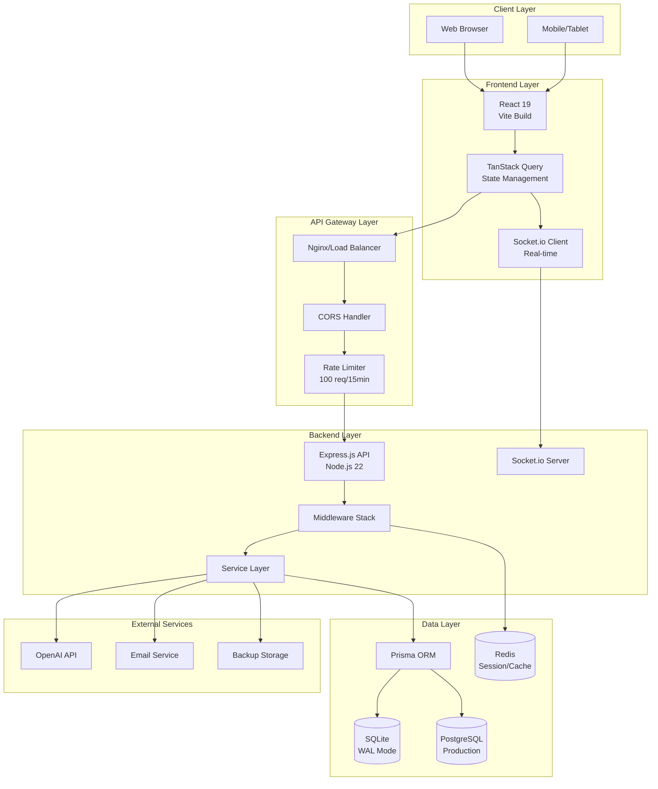
```mermaid
flowchart TB
    subgraph "Client Layer"
        WEB[Web Browser]
        MOB[Mobile/Tablet]
    end

    subgraph "Frontend Layer"
        REACT[React 19<br/>Vite Build]
        TQ[TanStack Query<br/>State Management]
        SC[Socket.io Client<br/>Real-time]
    end

    subgraph "API Gateway Layer"
        NGX[Nginx/Load Balancer]
        CORS[CORS Handler]
        RATE[Rate Limiter<br/>100 req/15min]
    end

    subgraph "Backend Layer"
        EXP[Express.js API<br/>Node.js 22]
        MID[Middleware Stack]
        SVC[Service Layer]
        IO[Socket.io Server]
    end

    subgraph "Data Layer"
        PRISMA[Prisma ORM]
        SQLITE[(SQLite<br/>WAL Mode)]
        PG[(PostgreSQL<br/>Production)]
        REDIS[(Redis<br/>Session/Cache)]
    end

    subgraph "External Services"
        AI[OpenAI API]
        EMAIL[Email Service]
        BACKUP[Backup Storage]
    end

    WEB --> REACT
    MOB --> REACT
    REACT --> TQ
    TQ --> SC
    SC --> IO
    TQ --> NGX
    NGX --> CORS
    CORS --> RATE
    RATE --> EXP
    EXP --> MID
    MID --> SVC
    SVC --> PRISMA
    PRISMA --> SQLITE
    PRISMA --> PG
    MID --> REDIS
    SVC --> AI
    SVC --> EMAIL
    SVC --> BACKUP
```

### 1.2 Component Layers

| Layer | Technology | Purpose |
|-------|-----------|---------|
| **Presentation** | React 19, TypeScript, Tailwind CSS | User interface and interactions |
| **State Management** | TanStack Query, React Context | Data fetching and caching |
| **API Layer** | Express.js, Socket.io | RESTful endpoints and real-time communication |
| **Business Logic** | Service Layer (SOA) | Core business operations |
| **Data Access** | Prisma ORM | Database abstraction and queries |
| **Storage** | SQLite (Dev) / PostgreSQL (Prod) | Persistent data storage |
| **Cache** | Redis | Session management and performance |

### 1.3 Technology Stack by Layer

#### Frontend Stack
```
┌─────────────────────────────────────────────────┐
│  UI Components                                  │
│  ├── Radix UI (Headless)                        │
│  ├── Shadcn/ui (Styled)                         │
│  └── Framer Motion (Animations)                 │
├─────────────────────────────────────────────────┤
│  State Management                               │
│  ├── TanStack Query (Server State)              │
│  ├── React Context (Global State)               │
│  └── Zustand (Future: Local State)              │
├─────────────────────────────────────────────────┤
│  Build & Development                            │
│  ├── Vite (Build Tool)                          │
│  ├── TypeScript (Type Safety)                   │
│  └── ESLint (Code Quality)                      │
└─────────────────────────────────────────────────┘
```

#### Backend Stack
```
┌─────────────────────────────────────────────────┐
│  API & Communication                            │
│  ├── Express.js (Web Framework)                 │
│  ├── Socket.io (Real-time)                      │
│  └── Swagger/OpenAPI (Documentation)            │
├─────────────────────────────────────────────────┤
│  Security                                       │
│  ├── Helmet.js (Security Headers)               │
│  ├── JWT (Authentication)                       │
│  ├── CSRF Protection                            │
│  └── Rate Limiting                              │
├─────────────────────────────────────────────────┤
│  Data & Logic                                   │
│  ├── Prisma ORM (Database)                      │
│  ├── Service Layer (Business Logic)             │
│  └── Zod (Validation)                           │
└─────────────────────────────────────────────────┘
```

### 1.4 Communication Protocols

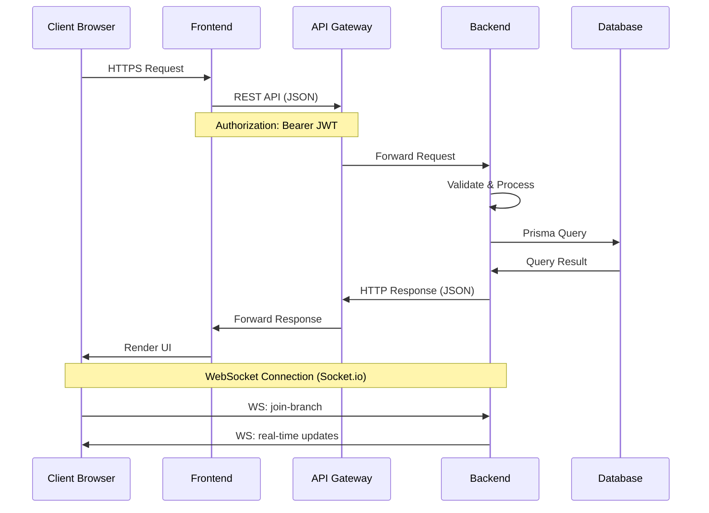
```mermaid
sequenceDiagram
    participant C as Client Browser
    participant F as Frontend
    participant A as API Gateway
    participant B as Backend
    participant D as Database

    C->>F: HTTPS Request
    F->>A: REST API (JSON)
    Note over F,A: Authorization: Bearer JWT
    A->>B: Forward Request
    B->>B: Validate & Process
    B->>D: Prisma Query
    D->>B: Query Result
    B->>A: HTTP Response (JSON)
    A->>F: Forward Response
    F->>C: Render UI

    Note over C,B: WebSocket Connection (Socket.io)
    C->>B: WS: join-branch
    B->>C: WS: real-time updates
```

| Protocol | Usage | Port |
|----------|-------|------|
| HTTPS | API Communication | 443 |
| HTTP | Development | 5000/5173 |
| WebSocket | Real-time Updates | 5000 |
| PostgreSQL | Database | 5432 |

---

## 2. Deployment Architecture

### 2.1 Single-Server Deployment (Current)

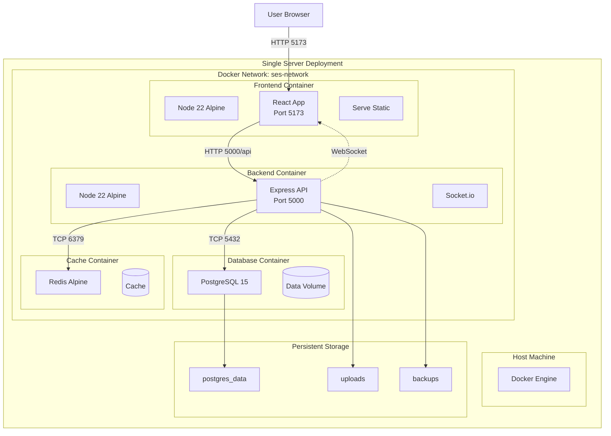
```mermaid
flowchart TB
    subgraph "Single Server Deployment"
        direction TB
        
        subgraph "Host Machine"
            DOCKER[Docker Engine]
        end
        
        subgraph "Docker Network: ses-network"
            direction LR
            
            subgraph "Frontend Container"
                F_IMG[Node 22 Alpine]
                F_APP[React App<br/>Port 5173]
                F_SERVE[Serve Static]
            end
            
            subgraph "Backend Container"
                B_IMG[Node 22 Alpine]
                B_APP[Express API<br/>Port 5000]
                B_SOCK[Socket.io]
            end
            
            subgraph "Database Container"
                DB_IMG[PostgreSQL 15]
                DB_DATA[(Data Volume)]
            end
            
            subgraph "Cache Container"
                REDIS_IMG[Redis Alpine]
                REDIS_DATA[(Cache)]
            end
        end
        
        subgraph "Persistent Storage"
            VOL1[postgres_data]
            VOL2[uploads]
            VOL3[backups]
        end
    end

    USER[User Browser] -->|HTTP 5173| F_APP
    F_APP -->|HTTP 5000/api| B_APP
    B_APP -->|TCP 5432| DB_IMG
    B_APP -->|TCP 6379| REDIS_IMG
    B_APP -.->|WebSocket| F_APP
    DB_IMG --> VOL1
    B_APP --> VOL2
    B_APP --> VOL3
```

### 2.2 Scaled Deployment (Future)

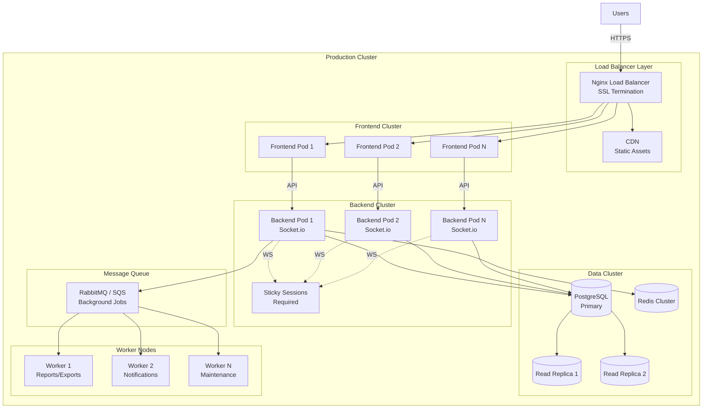
```mermaid
flowchart TB
    subgraph "Production Cluster"
        direction TB
        
        subgraph "Load Balancer Layer"
            LB[Nginx Load Balancer<br/>SSL Termination]
            CDN[CDN<br/>Static Assets]
        end
        
        subgraph "Frontend Cluster"
            F1[Frontend Pod 1]
            F2[Frontend Pod 2]
            F3[Frontend Pod N]
        end
        
        subgraph "Backend Cluster"
            B1[Backend Pod 1<br/>Socket.io]
            B2[Backend Pod 2<br/>Socket.io]
            B3[Backend Pod N<br/>Socket.io]
            STICKY[Sticky Sessions<br/>Required]
        end
        
        subgraph "Data Cluster"
            DB_MASTER[(PostgreSQL<br/>Primary)]
            DB_REPLICA1[(Read Replica 1)]
            DB_REPLICA2[(Read Replica 2)]
            REDIS_CLUSTER[(Redis Cluster)]
        end
        
        subgraph "Message Queue"
            MQ[RabbitMQ / SQS<br/>Background Jobs]
        end
        
        subgraph "Worker Nodes"
            W1[Worker 1<br/>Reports/Exports]
            W2[Worker 2<br/>Notifications]
            W3[Worker N<br/>Maintenance]
        end
    end

    USER[Users] -->|HTTPS| LB
    LB --> CDN
    LB --> F1
    LB --> F2
    LB --> F3
    F1 -->|API| B1
    F2 -->|API| B2
    F3 -->|API| B3
    B1 -.->|WS| STICKY
    B2 -.->|WS| STICKY
    B3 -.->|WS| STICKY
    B1 --> DB_MASTER
    B2 --> DB_MASTER
    B3 --> DB_MASTER
    DB_MASTER --> DB_REPLICA1
    DB_MASTER --> DB_REPLICA2
    B1 --> REDIS_CLUSTER
    B1 --> MQ
    MQ --> W1
    MQ --> W2
    MQ --> W3
```

### 2.3 Docker Containerization

**Docker Compose Configuration:**

```yaml
version: '3.8'
services:
  db:
    image: postgres:15-alpine
    environment:
      POSTGRES_USER: ${DB_USER}
      POSTGRES_PASSWORD: ${DB_PASSWORD}
      POSTGRES_DB: ${DB_NAME}
    volumes:
      - postgres_data:/var/lib/postgresql/data
    
  backend:
    build: ./backend
    environment:
      DATABASE_URL: postgresql://...
      JWT_SECRET: ${JWT_SECRET}
      PORT: 5000
    depends_on:
      - db
    
  frontend:
    build: ./frontend
    environment:
      VITE_API_URL: http://localhost:5000/api
    ports:
      - "5173:5173"
    depends_on:
      - backend
```

**Container Architecture:**

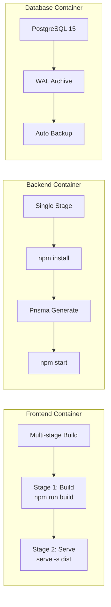
```mermaid
flowchart LR
    subgraph "Frontend Container"
        F1[Multi-stage Build]
        F2[Stage 1: Build<br/>npm run build]
        F3[Stage 2: Serve<br/>serve -s dist]
        F1 --> F2 --> F3
    end
    
    subgraph "Backend Container"
        B1[Single Stage]
        B2[npm install]
        B3[Prisma Generate]
        B4[npm start]
        B1 --> B2 --> B3 --> B4
    end
    
    subgraph "Database Container"
        D1[PostgreSQL 15]
        D2[WAL Archive]
        D3[Auto Backup]
        D1 --> D2 --> D3
    end
```

### 2.4 Load Balancing Strategy

| Strategy | Use Case | Implementation |
|----------|----------|----------------|
| **Round Robin** | API Requests | Default for REST endpoints |
| **Sticky Sessions** | WebSocket | IP hash or session cookie |
| **Least Connections** | File Uploads | For long-running requests |
| **Health Check** | All Services | /health endpoint monitoring |

---

## 3. Data Flow Architecture

### 3.1 Request Lifecycle

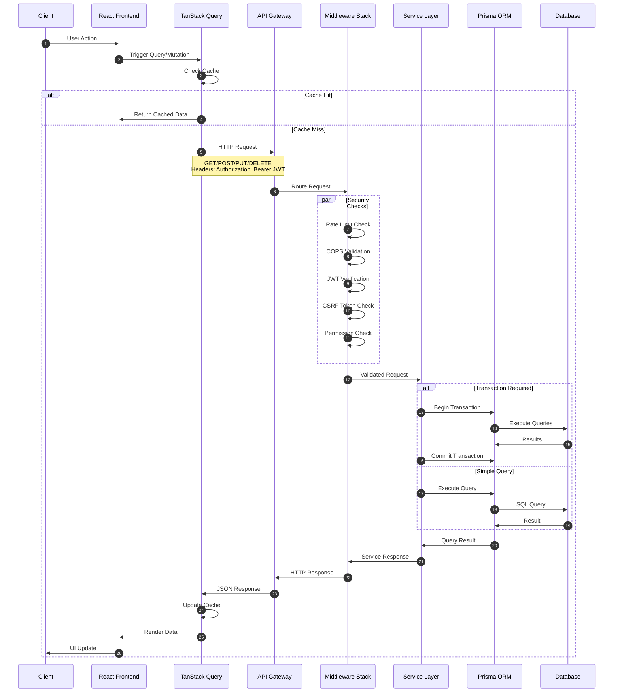
```mermaid
sequenceDiagram
    autonumber
    participant C as Client
    participant R as React Frontend
    participant Q as TanStack Query
    participant A as API Gateway
    participant M as Middleware Stack
    participant S as Service Layer
    participant P as Prisma ORM
    participant D as Database

    C->>R: User Action
    R->>Q: Trigger Query/Mutation
    Q->>Q: Check Cache
    
    alt Cache Hit
        Q->>R: Return Cached Data
    else Cache Miss
        Q->>A: HTTP Request
        Note over Q,A: GET/POST/PUT/DELETE<br/>Headers: Authorization: Bearer JWT
        
        A->>M: Route Request
        
        par Security Checks
            M->>M: Rate Limit Check
            M->>M: CORS Validation
            M->>M: JWT Verification
            M->>M: CSRF Token Check
            M->>M: Permission Check
        end
        
        M->>S: Validated Request
        
        alt Transaction Required
            S->>P: Begin Transaction
            P->>D: Execute Queries
            D->>P: Results
            S->>P: Commit Transaction
        else Simple Query
            S->>P: Execute Query
            P->>D: SQL Query
            D->>P: Result
        end
        
        P->>S: Query Result
        S->>M: Service Response
        M->>A: HTTP Response
        A->>Q: JSON Response
        Q->>Q: Update Cache
        Q->>R: Render Data
        R->>C: UI Update
    end
```

### 3.2 Data Flow: UI to Database

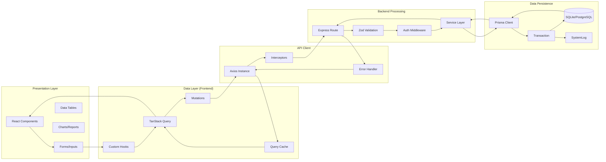
```mermaid
flowchart LR
    subgraph "Presentation Layer"
        UI[React Components]
        FORM[Forms/Inputs]
        TABLE[Data Tables]
        CHART[Charts/Reports]
    end

    subgraph "Data Layer (Frontend)"
        HOOK[Custom Hooks]
        TQUERY[TanStack Query]
        MUTATE[Mutations]
        CACHE[Query Cache]
    end

    subgraph "API Client"
        AXIOS[Axios Instance]
        INTER[Interceptors]
        ERR[Error Handler]
    end

    subgraph "Backend Processing"
        ROUTE[Express Route]
        VALID[Zod Validation]
        AUTH[Auth Middleware]
        SERVICE[Service Layer]
    end

    subgraph "Data Persistence"
        PRISMA[Prisma Client]
        TX[Transaction]
        DB[(SQLite/PostgreSQL)]
        LOG[SystemLog]
    end

    UI --> FORM
    FORM --> HOOK
    HOOK --> TQUERY
    TQUERY --> MUTATE
    MUTATE --> AXIOS
    AXIOS --> INTER
    INTER --> ROUTE
    ROUTE --> VALID
    VALID --> AUTH
    AUTH --> SERVICE
    SERVICE --> PRISMA
    PRISMA --> TX
    TX --> DB
    TX --> LOG
    
    DB --> PRISMA
    PRISMA --> SERVICE
    SERVICE --> ROUTE
    ROUTE --> ERR
    ERR --> AXIOS
    AXIOS --> CACHE
    CACHE --> TQUERY
    TQUERY --> UI
```

### 3.3 Real-Time Updates via WebSocket

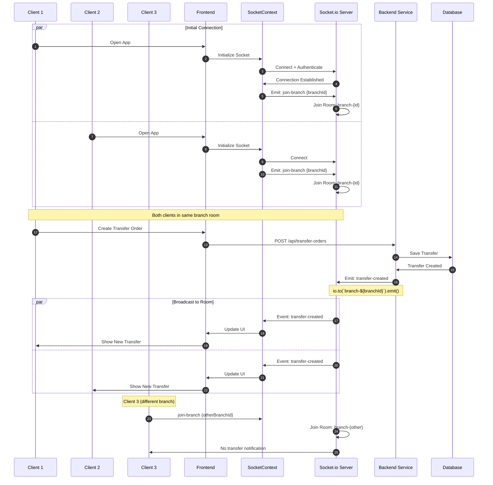
```mermaid
sequenceDiagram
    autonumber
    participant C1 as Client 1
    participant C2 as Client 2
    participant C3 as Client 3
    participant F as Frontend
    participant S as SocketContext
    participant IO as Socket.io Server
    participant B as Backend Service
    participant D as Database

    par Initial Connection
        C1->>F: Open App
        F->>S: Initialize Socket
        S->>IO: Connect + Authenticate
        IO->>S: Connection Established
        S->>IO: Emit: join-branch {branchId}
        IO->>IO: Join Room: branch-{id}
    and
        C2->>F: Open App
        F->>S: Initialize Socket
        S->>IO: Connect
        S->>IO: Emit: join-branch {branchId}
        IO->>IO: Join Room: branch-{id}
    end

    Note over C1,IO: Both clients in same branch room

    C1->>F: Create Transfer Order
    F->>B: POST /api/transfer-orders
    B->>D: Save Transfer
    D->>B: Transfer Created
    
    B->>IO: Emit: transfer-created
    Note over B,IO: io.to(`branch-${branchId}`).emit()
    
    par Broadcast to Room
        IO->>S: Event: transfer-created
        S->>F: Update UI
        F->>C1: Show New Transfer
    and
        IO->>S: Event: transfer-created
        S->>F: Update UI
        F->>C2: Show New Transfer
    end

    Note over C3: Client 3 (different branch)
    C3->>S: join-branch {otherBranchId}
    IO->>IO: Join Room: branch-{other}
    IO->>C3: No transfer notification
```

### 3.4 Background Job Processing

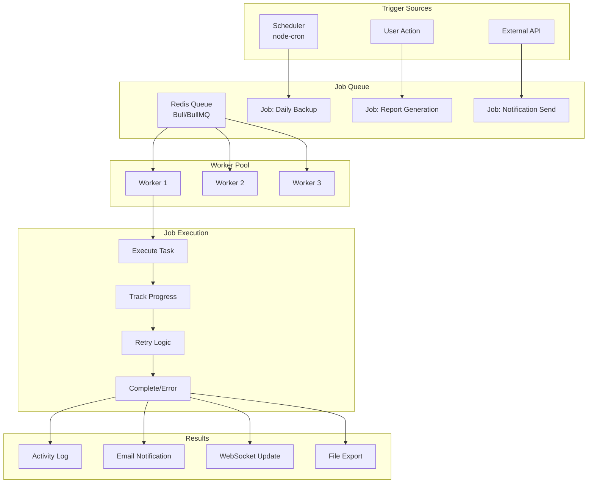
```mermaid
flowchart TB
    subgraph "Trigger Sources"
        SCHED[Scheduler<br/>node-cron]
        USER[User Action]
        API[External API]
    end

    subgraph "Job Queue"
        QUEUE[Redis Queue<br/>Bull/BullMQ]
        JOB1[Job: Daily Backup]
        JOB2[Job: Report Generation]
        JOB3[Job: Notification Send]
    end

    subgraph "Worker Pool"
        W1[Worker 1]
        W2[Worker 2]
        W3[Worker 3]
    end

    subgraph "Job Execution"
        EXEC1[Execute Task]
        PROG[Track Progress]
        RETRY[Retry Logic]
        COMP[Complete/Error]
    end

    subgraph "Results"
        LOG[Activity Log]
        EMAIL[Email Notification]
        WS[WebSocket Update]
        FILE[File Export]
    end

    SCHED --> JOB1
    USER --> JOB2
    API --> JOB3
    
    QUEUE --> W1
    QUEUE --> W2
    QUEUE --> W3
    
    W1 --> EXEC1
    EXEC1 --> PROG
    PROG --> RETRY
    RETRY --> COMP
    
    COMP --> LOG
    COMP --> EMAIL
    COMP --> WS
    COMP --> FILE
```

**Current Scheduled Jobs:**

| Job | Schedule | Description |
|-----|----------|-------------|
| Metrics Cache Refresh | Every 5 minutes | Pre-calculates dashboard metrics |
| Daily Backup | 2:00 AM | Database backup to storage |
| Transfer Expiry Check | Hourly | Auto-expires pending transfers |

---

## 4. Security Architecture

### 4.1 Multi-Layer Security Model

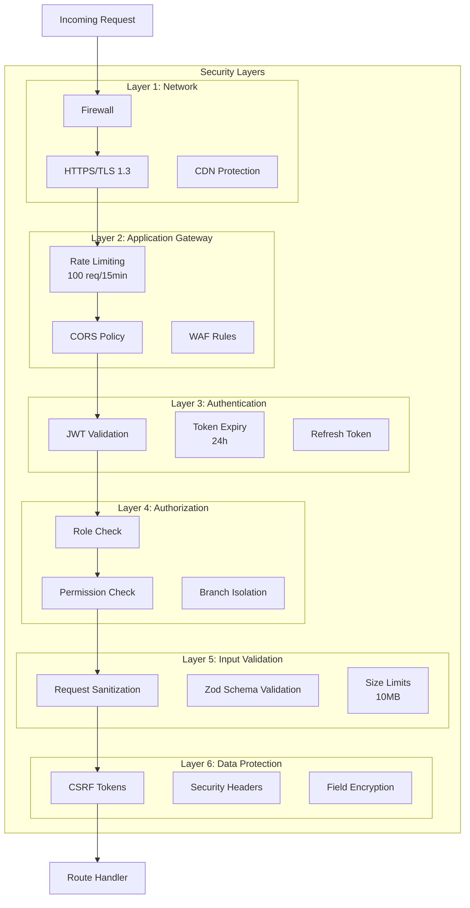
```mermaid
flowchart TB
    subgraph "Security Layers"
        direction TB
        
        subgraph "Layer 1: Network"
            L1_FIREWALL[Firewall]
            L1_HTTPS[HTTPS/TLS 1.3]
            L1_CDN[CDN Protection]
        end
        
        subgraph "Layer 2: Application Gateway"
            L2_RATE[Rate Limiting<br/>100 req/15min]
            L2_CORS[CORS Policy]
            L2_WAF[WAF Rules]
        end
        
        subgraph "Layer 3: Authentication"
            L3_JWT[JWT Validation]
            L3_EXPIRY[Token Expiry<br/>24h]
            L3_REFRESH[Refresh Token]
        end
        
        subgraph "Layer 4: Authorization"
            L4_ROLE[Role Check]
            L4_PERM[Permission Check]
            L4_BRANCH[Branch Isolation]
        end
        
        subgraph "Layer 5: Input Validation"
            L5_SANITIZE[Request Sanitization]
            L5_ZOD[Zod Schema Validation]
            L5_SIZE[Size Limits<br/>10MB]
        end
        
        subgraph "Layer 6: Data Protection"
            L6_CSRF[CSRF Tokens]
            L6_HELMET[Security Headers]
            L6_ENCRYPT[Field Encryption]
        end
    end

    REQUEST[Incoming Request] --> L1_FIREWALL
    L1_FIREWALL --> L1_HTTPS
    L1_HTTPS --> L2_RATE
    L2_RATE --> L2_CORS
    L2_CORS --> L3_JWT
    L3_JWT --> L4_ROLE
    L4_ROLE --> L4_PERM
    L4_PERM --> L5_SANITIZE
    L5_SANITIZE --> L6_CSRF
    L6_CSRF --> HANDLER[Route Handler]
```

### 4.2 Authentication Flow

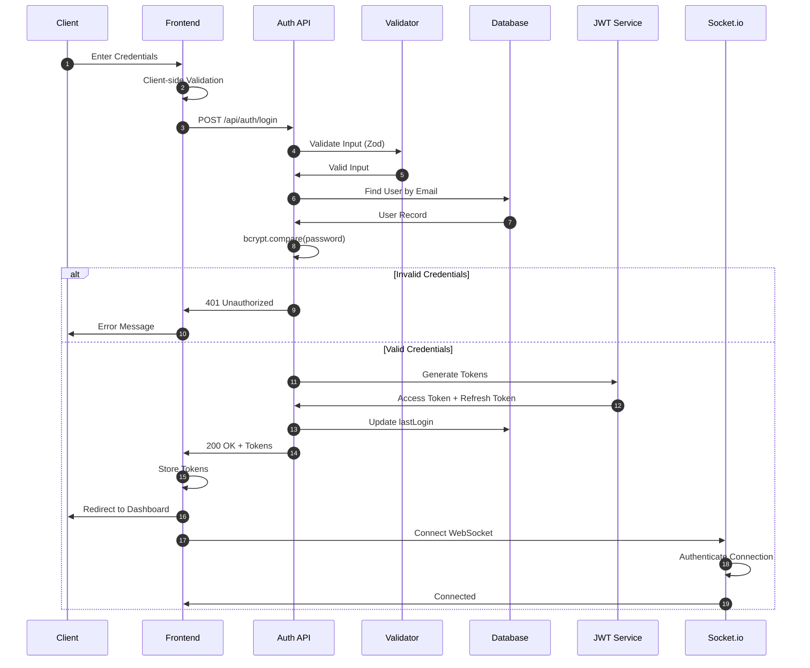
```mermaid
sequenceDiagram
    autonumber
    participant C as Client
    participant F as Frontend
    participant A as Auth API
    participant V as Validator
    participant DB as Database
    participant JWT as JWT Service
    participant S as Socket.io

    C->>F: Enter Credentials
    F->>F: Client-side Validation
    F->>A: POST /api/auth/login
    
    A->>V: Validate Input (Zod)
    V->>A: Valid Input
    
    A->>DB: Find User by Email
    DB->>A: User Record
    
    A->>A: bcrypt.compare(password)
    
    alt Invalid Credentials
        A->>F: 401 Unauthorized
        F->>C: Error Message
    else Valid Credentials
        A->>JWT: Generate Tokens
        JWT->>A: Access Token + Refresh Token
        
        A->>DB: Update lastLogin
        A->>F: 200 OK + Tokens
        
        F->>F: Store Tokens
        F->>C: Redirect to Dashboard
        
        F->>S: Connect WebSocket
        S->>S: Authenticate Connection
        S->>F: Connected
    end
```

### 4.3 Authorization Checks

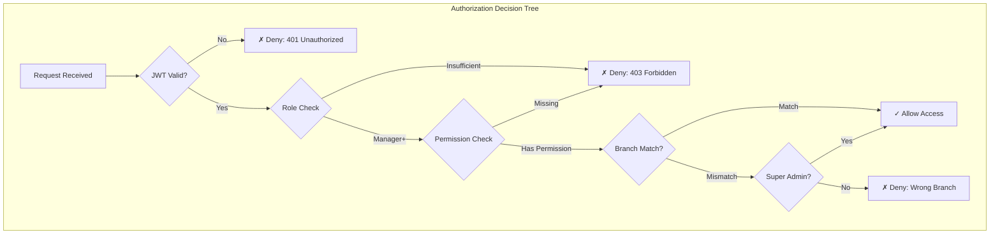
```mermaid
flowchart TD
    subgraph "Authorization Decision Tree"
        START[Request Received]
        
        AUTH{JWT Valid?}
        ROLE{Role Check}
        PERM{Permission Check}
        BRANCH{Branch Match?}
        SUPER{Super Admin?}
        
        ALLOW[✓ Allow Access]
        DENY1[✗ Deny: 401 Unauthorized]
        DENY2[✗ Deny: 403 Forbidden]
        DENY3[✗ Deny: Wrong Branch]
    end

    START --> AUTH
    
    AUTH -->|No| DENY1
    AUTH -->|Yes| ROLE
    
    ROLE -->|Manager+| PERM
    ROLE -->|Insufficient| DENY2
    
    PERM -->|Has Permission| BRANCH
    PERM -->|Missing| DENY2
    
    BRANCH -->|Match| ALLOW
    BRANCH -->|Mismatch| SUPER
    
    SUPER -->|Yes| ALLOW
    SUPER -->|No| DENY3
```

**Role Hierarchy:**

```
SUPER_ADMIN
    └── Full system access, all branches

ADMIN
    └── Full branch access, can manage users

MANAGER / BRANCH_MANAGER / CENTER_MANAGER
    └── Can approve, view reports, manage assignments

TECHNICIAN / BRANCH_TECH / CENTER_TECH
    └── Can view assigned work, update status

CS_AGENT / CS_SUPERVISOR
    └── Customer service operations

SALES
    └── Sales operations only
```

### 4.4 Data Isolation Mechanism

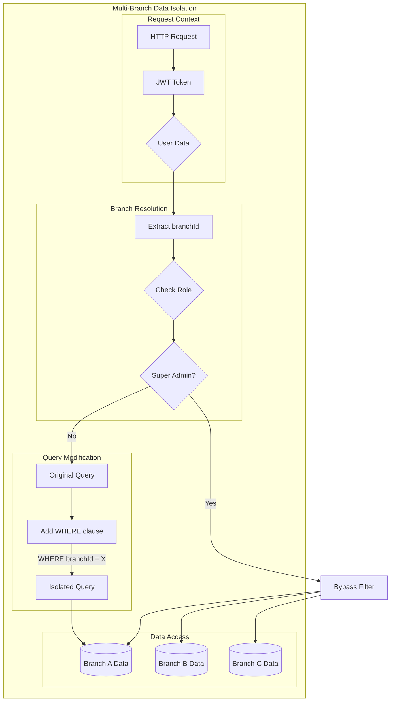
```mermaid
flowchart TB
    subgraph "Multi-Branch Data Isolation"
        
        subgraph "Request Context"
            REQ[HTTP Request]
            JWT[JWT Token]
            USER{User Data}
        end

        subgraph "Branch Resolution"
            ROLE{Check Role}
            BID[Extract branchId]
            SADMIN{Super Admin?}
        end

        subgraph "Query Modification"
            RAW[Original Query]
            MOD[Add WHERE clause]
            FINAL[Isolated Query]
        end

        subgraph "Data Access"
            T1[(Branch A Data)]
            T2[(Branch B Data)]
            T3[(Branch C Data)]
        end
    end

    REQ --> JWT
    JWT --> USER
    USER --> BID
    BID --> ROLE
    ROLE --> SADMIN
    
    SADMIN -->|Yes| BYPASS[Bypass Filter]
    SADMIN -->|No| RAW
    
    RAW --> MOD
    MOD -->|WHERE branchId = X| FINAL
    
    FINAL --> T1
    BYPASS --> T1
    BYPASS --> T2
    BYPASS --> T3
```

**Branch Isolation Code Pattern:**

```javascript
// Middleware adds branchId to request
req.user.branchId = decoded.branchId;

// Service layer applies filter automatically
const query = {
  where: {
    ...otherFilters,
    // Super admin sees all, others see their branch
    ...(req.user.role !== 'SUPER_ADMIN' && {
      branchId: req.user.branchId
    })
  }
};
```

---

## 5. Service Interactions

### 5.1 Service Layer Communication

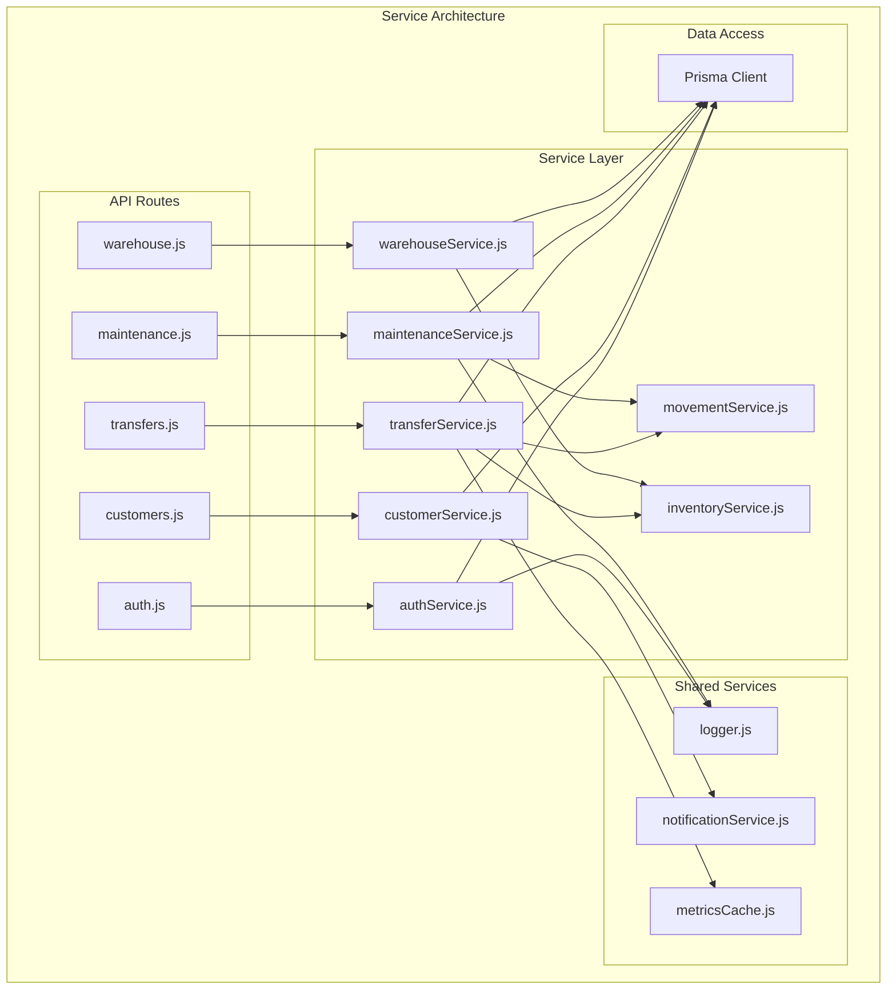
```mermaid
flowchart TB
    subgraph "Service Architecture"
        
        subgraph "API Routes"
            R1[auth.js]
            R2[customers.js]
            R3[transfers.js]
            R4[maintenance.js]
            R5[warehouse.js]
        end

        subgraph "Service Layer"
            S1[authService.js]
            S2[customerService.js]
            S3[transferService.js]
            S4[maintenanceService.js]
            S5[warehouseService.js]
            S6[movementService.js]
            S7[inventoryService.js]
        end

        subgraph "Shared Services"
            SS1[logger.js]
            SS2[metricsCache.js]
            SS3[notificationService.js]
        end

        subgraph "Data Access"
            DB[Prisma Client]
        end
    end

    R1 --> S1
    R2 --> S2
    R3 --> S3
    R4 --> S4
    R5 --> S5
    
    S3 --> S6
    S3 --> S7
    S4 --> S6
    S5 --> S7
    
    S1 --> SS1
    S2 --> SS3
    S3 --> SS2
    S4 --> SS1
    
    S1 --> DB
    S2 --> DB
    S3 --> DB
    S4 --> DB
    S5 --> DB
```

### 5.2 Transaction Boundaries

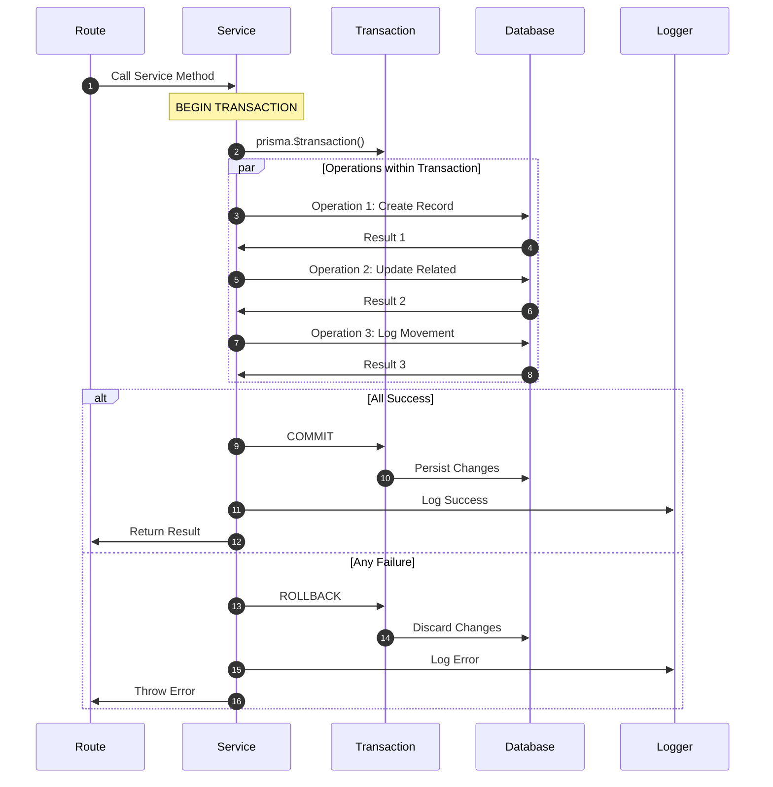
```mermaid
sequenceDiagram
    autonumber
    participant R as Route
    participant S as Service
    participant T as Transaction
    participant D as Database
    participant L as Logger

    R->>S: Call Service Method
    
    Note over S: BEGIN TRANSACTION
    S->>T: prisma.$transaction()
    
    par Operations within Transaction
        S->>D: Operation 1: Create Record
        D->>S: Result 1
        
        S->>D: Operation 2: Update Related
        D->>S: Result 2
        
        S->>D: Operation 3: Log Movement
        D->>S: Result 3
    end
    
    alt All Success
        S->>T: COMMIT
        T->>D: Persist Changes
        S->>L: Log Success
        S->>R: Return Result
    else Any Failure
        S->>T: ROLLBACK
        T->>D: Discard Changes
        S->>L: Log Error
        S->>R: Throw Error
    end
```

**Transaction Pattern Example:**

```javascript
// Transfer Creation with Transaction
async createTransfer(data) {
  return await prisma.$transaction(async (tx) => {
    // 1. Create transfer order
    const transfer = await tx.transferOrder.create({...});
    
    // 2. Update machine statuses
    await tx.machine.updateMany({...});
    
    // 3. Log movements
    await tx.movementLog.createMany({...});
    
    // 4. Create notifications
    await tx.notification.create({...});
    
    return transfer;
  }, {
    isolationLevel: 'Serializable',
    maxWait: 5000,
    timeout: 10000
  });
}
```

### 5.3 Event Flow

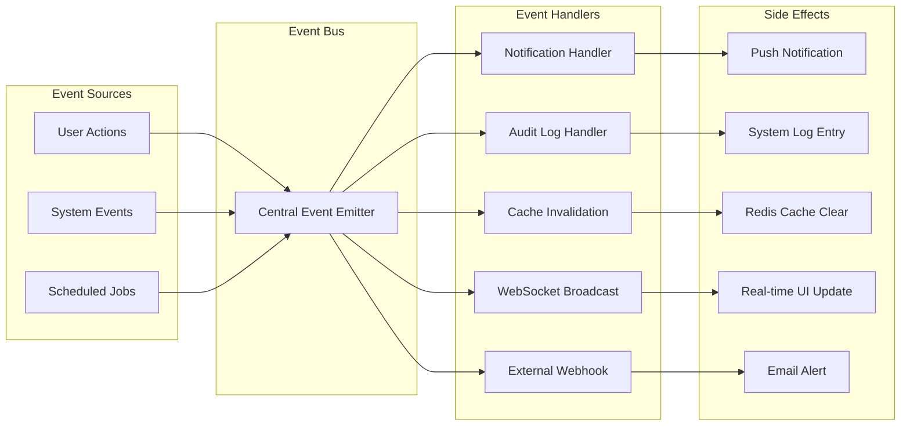
```mermaid
flowchart LR
    subgraph "Event Sources"
        E1[User Actions]
        E2[System Events]
        E3[Scheduled Jobs]
    end

    subgraph "Event Bus"
        BUS[Central Event Emitter]
    end

    subgraph "Event Handlers"
        H1[Notification Handler]
        H2[Audit Log Handler]
        H3[Cache Invalidation]
        H4[WebSocket Broadcast]
        H5[External Webhook]
    end

    subgraph "Side Effects"
        S1[Push Notification]
        S2[System Log Entry]
        S3[Redis Cache Clear]
        S4[Real-time UI Update]
        S5[Email Alert]
    end

    E1 --> BUS
    E2 --> BUS
    E3 --> BUS
    
    BUS --> H1
    BUS --> H2
    BUS --> H3
    BUS --> H4
    BUS --> H5
    
    H1 --> S1
    H2 --> S2
    H3 --> S3
    H4 --> S4
    H5 --> S5
```

### 5.4 Error Propagation

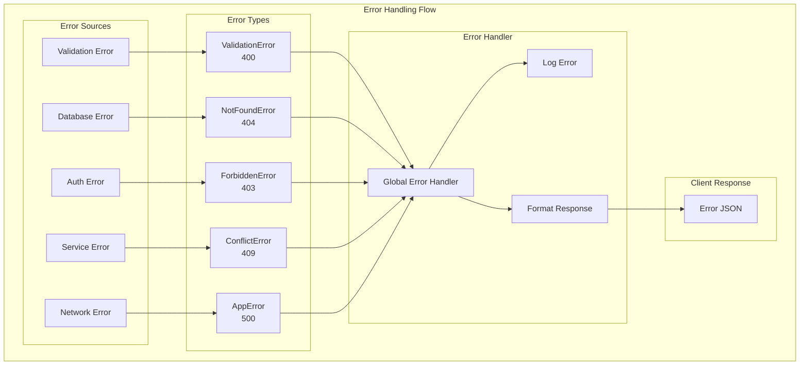
```mermaid
flowchart TB
    subgraph "Error Handling Flow"
        
        subgraph "Error Sources"
            ERR1[Validation Error]
            ERR2[Database Error]
            ERR3[Auth Error]
            ERR4[Service Error]
            ERR5[Network Error]
        end

        subgraph "Error Types"
            T1[ValidationError<br/>400]
            T2[NotFoundError<br/>404]
            T3[ForbiddenError<br/>403]
            T4[ConflictError<br/>409]
            T5[AppError<br/>500]
        end

        subgraph "Error Handler"
            CATCH[Global Error Handler]
            LOG[Log Error]
            RESP[Format Response]
        end

        subgraph "Client Response"
            JSON[Error JSON]
        end
    end

    ERR1 --> T1
    ERR2 --> T2
    ERR3 --> T3
    ERR4 --> T4
    ERR5 --> T5
    
    T1 --> CATCH
    T2 --> CATCH
    T3 --> CATCH
    T4 --> CATCH
    T5 --> CATCH
    
    CATCH --> LOG
    CATCH --> RESP
    RESP --> JSON
```

**Error Response Format:**

```json
{
  "error": {
    "message": "Machine not found",
    "code": "NOT_FOUND",
    "statusCode": 404,
    "timestamp": "2026-01-30T10:30:00.000Z",
    "path": "/api/machines/12345",
    "details": {
      "resource": "Machine",
      "id": "12345"
    }
  }
}
```

---

## Appendix: Technology Stack

### Frontend Technologies

| Category | Technology | Version | Purpose |
|----------|-----------|---------|---------|
| Framework | React | 19.2.0 | UI Library |
| Language | TypeScript | 5.9.3 | Type Safety |
| Build Tool | Vite | 7.2.4 | Development & Building |
| Styling | Tailwind CSS | 4.1.18 | CSS Framework |
| UI Components | Radix UI | ^1.x | Headless Components |
| Animation | Framer Motion | 12.23.26 | Animations |
| State | TanStack Query | 5.90.12 | Server State |
| Tables | TanStack Table | 8.21.3 | Data Tables |
| Charts | Recharts | 3.6.0 | Data Visualization |
| Forms | React Hook Form | - | Form Management |
| Icons | Lucide React | 0.561.0 | Icon Library |

### Backend Technologies

| Category | Technology | Version | Purpose |
|----------|-----------|---------|---------|
| Runtime | Node.js | 22.x | JavaScript Runtime |
| Framework | Express.js | 4.18.2 | Web Framework |
| ORM | Prisma | 5.22.0 | Database ORM |
| Validation | Zod | 3.22.4 | Schema Validation |
| Auth | JWT | 9.0.3 | Token Authentication |
| Security | Helmet.js | 7.1.0 | Security Headers |
| Logging | Pino | 8.17.2 | Structured Logging |
| Real-time | Socket.io | 4.8.3 | WebSocket Communication |
| API Docs | Swagger | 6.2.8 | API Documentation |
| Testing | Jest | 30.2.0 | Unit Testing |

### Database & Storage

| Category | Technology | Purpose |
|----------|-----------|---------|
| Development | SQLite | Local database |
| Production | PostgreSQL 15 | Production database |
| Cache | Redis | Session & metrics cache |
| ORM | Prisma | Database abstraction |
| Migrations | Prisma Migrate | Schema versioning |

### DevOps & Infrastructure

| Category | Technology | Purpose |
|----------|-----------|---------|
| Container | Docker | Application packaging |
| Orchestration | Docker Compose | Multi-container management |
| Base Image | Node 22 Alpine | Minimal container image |
| Web Server | Nginx | Reverse proxy & static files |
| CI/CD | GitHub Actions | Automated testing |

---

## Document Information

- **Author**: Smart Enterprise Suite Team
- **Reviewers**: Architecture Team
- **Approval Date**: January 30, 2026
- **Next Review**: April 30, 2026
- **Change Log**:
  - v1.0.0 (2026-01-30): Initial architecture documentation

---

*This document is a living document and should be updated as the architecture evolves.*
