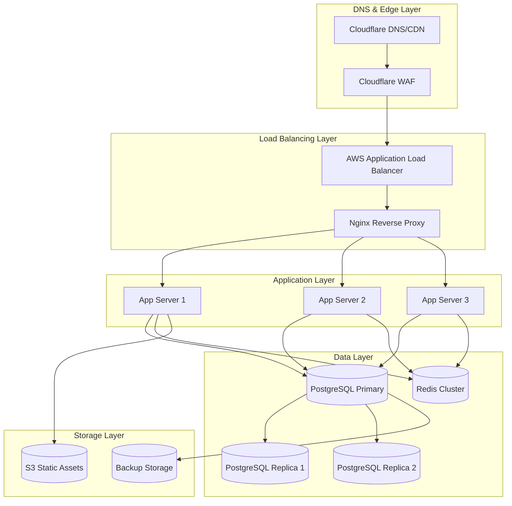
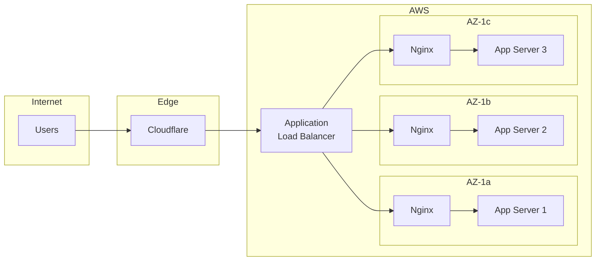
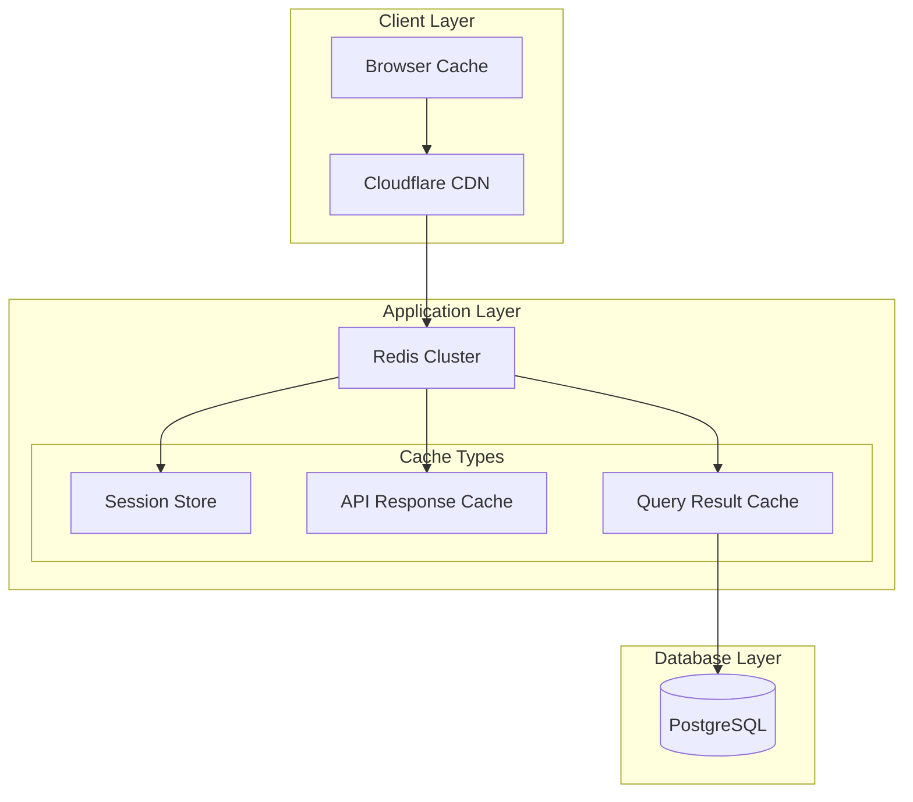
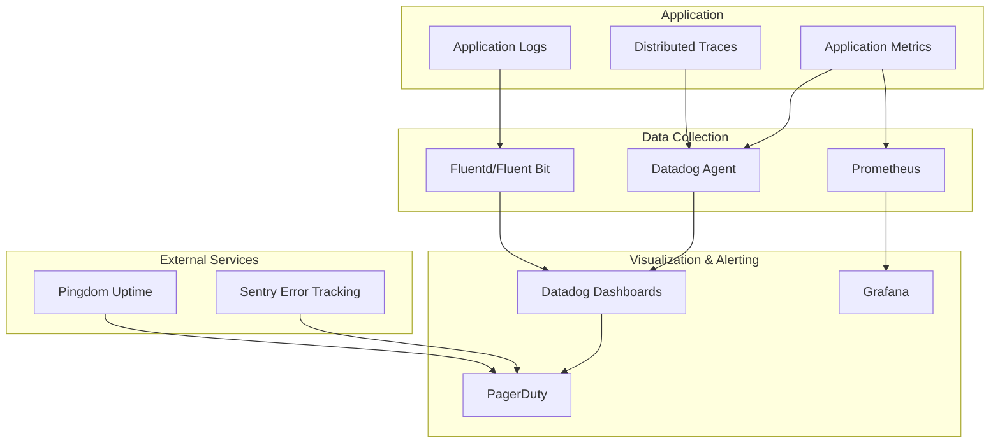
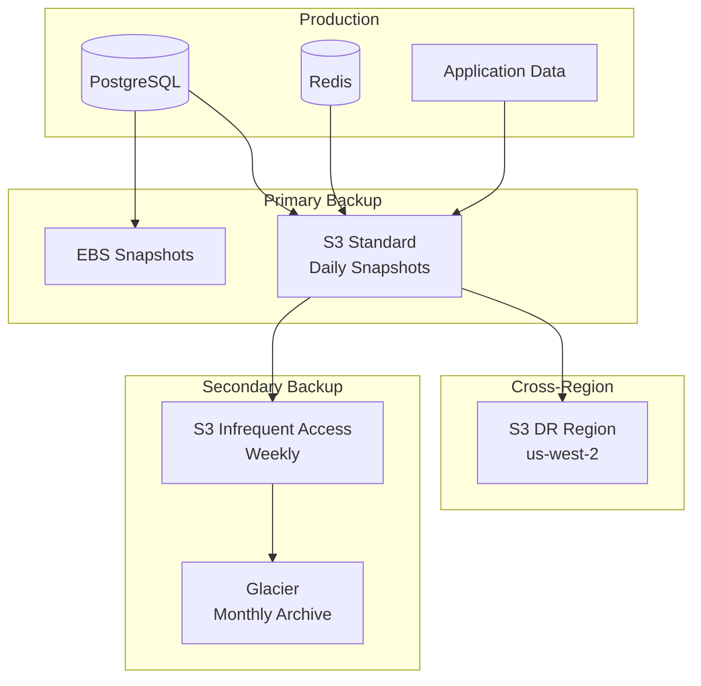
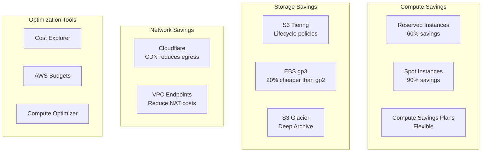

# Smart Enterprise Suite - Production Infrastructure Recommendations

## Executive Summary

This document provides comprehensive infrastructure recommendations for deploying Smart Enterprise Suite in a production environment, designed to support enterprise-scale operations with high availability, security, and performance.

**Target Specifications:**
- 1000+ concurrent users
- 99.9% uptime SLA
- Sub-second API response times (95th percentile)
- Global availability with CDN acceleration
- Disaster recovery with <4 hour RTO

---

## Table of Contents

1. [Cloud Infrastructure](#1-cloud-infrastructure)
2. [Database Infrastructure](#2-database-infrastructure)
3. [Application Infrastructure](#3-application-infrastructure)
4. [Caching Strategy](#4-caching-strategy)
5. [Monitoring & Observability](#5-monitoring--observability)
6. [Security Infrastructure](#6-security-infrastructure)
7. [Backup & Disaster Recovery](#7-backup--disaster-recovery)
8. [Cost Optimization](#8-cost-optimization)

---

## 1. Cloud Infrastructure

### 1.1 Architecture Overview



### 1.2 Cloud Provider Comparison

| Provider | Advantages | Disadvantages | Best For |
|----------|------------|---------------|----------|
| **AWS** | Broad service portfolio, enterprise tools, RDS, Lambda | Complex pricing, steep learning curve | **Recommended** - Full enterprise stack |
| **Azure** | Microsoft integration, hybrid cloud, enterprise support | Limited regions, higher costs | Organizations with Microsoft ecosystem |
| **GCP** | Kubernetes leadership, BigQuery, AI/ML tools | Smaller market share, fewer enterprise features | Data analytics, ML workloads |
| **DigitalOcean** | Simplicity, predictable pricing, good for startups | Limited enterprise features, smaller ecosystem | SMB deployments, dev environments |

**Recommendation:** AWS as primary provider with Cloudflare for CDN/WAF.

### 1.3 Server Specifications

#### Production Application Servers (x3 minimum)

```yaml
Specification:
  Instance_Type: "c6i.xlarge"  # AWS Compute Optimized
  vCPU: 4
  RAM: "8 GB"
  Storage:
    Root: "100 GB gp3 SSD"
    IOPS: 3000
    Throughput: 125 MB/s
  Network: "Up to 12.5 Gbps"
  OS: "Amazon Linux 2023 / Ubuntu 22.04 LTS"
  
Alternative_Options:
  - "c6g.xlarge (Graviton - 20% cost savings)"
  - "t3.xlarge (Burstable - for variable workloads)"
  - "m6i.xlarge (General purpose - balanced)"
```

#### Production Database Server (Primary)

```yaml
Specification:
  Instance_Type: "r6i.2xlarge"  # Memory Optimized
  vCPU: 8
  RAM: "64 GB"
  Storage:
    Type: "io2 Block Express"
    Size: "500 GB"
    IOPS: 16000
  Network: "Up to 12.5 Gbps"
  OS: "Amazon Linux 2023"
  
RDS_Alternative:
  Instance_Class: "db.r6g.2xlarge"
  Engine: "PostgreSQL 15"
  Multi_AZ: true
  Storage_Encryption: true
```

#### Read Replicas (x2)

```yaml
Specification:
  Instance_Type: "r6i.xlarge"
  vCPU: 4
  RAM: "32 GB"
  Storage:
    Type: "gp3"
    Size: "500 GB"
    IOPS: 3000
```

#### Redis Cache Servers (Cluster Mode)

```yaml
Primary:
  Instance_Type: "cache.r6g.large"
  RAM: "13.07 GB"
  Engine: "Redis 7.0"
  
Replicas: 2
  Instance_Type: "cache.r6g.large"
```

### 1.4 Database Hosting Options

| Option | Pros | Cons | Cost/Month |
|--------|------|------|------------|
| **RDS PostgreSQL** | Managed backups, automatic failover, monitoring | Less control, vendor lock-in | $450-800 |
| **Self-Managed EC2** | Full control, custom configurations | Maintenance overhead, manual backups | $350-600 |
| **Aurora PostgreSQL** | Better performance, storage auto-scaling | Higher cost, AWS-specific | $600-1200 |
| **Google Cloud SQL** | Good integration with GCP, automated backups | Limited to GCP | $400-750 |
| **Azure Database** | Microsoft ecosystem integration | Azure-specific limitations | $400-700 |

**Recommendation:** Start with RDS PostgreSQL for operational simplicity, migrate to Aurora if performance becomes critical.

### 1.5 CDN Recommendations

#### Primary CDN: Cloudflare

```yaml
Plan: "Cloudflare Pro" ($20/month per domain)
Features:
  - Global CDN with 275+ PoPs
  - DDoS protection (unmetered)
  - WAF with OWASP rules
  - Argo Smart Routing
  - Load balancing
  - Rate limiting
  
Configuration:
  Caching_Level: "Standard"
  Browser_Cache_TTL: "4 hours"
  Edge_Cache_TTL: "1 month"
  Always_Online: true
  Auto_Minify: ["HTML", "CSS", "JavaScript"]
  Brotli: true
```

#### Static Asset Storage: AWS S3 + CloudFront

```yaml
S3_Buckets:
  static_assets:
    Storage_Class: "Standard"
    Versioning: true
    Encryption: "AES-256"
    
  frontend_builds:
    Storage_Class: "Standard"
    Lifecycle_Policy: "Transition to Infrequent Access after 30 days"

CloudFront_Distribution:
  Price_Class: "Use All Edge Locations"
  Origin: "S3 static_assets bucket"
  Default_TTL: 86400  # 1 day
  Compress: true
  HTTPS_Only: true
  
Estimated_Cost: "$50-150/month"
```

### 1.6 Cost Estimate Summary (Monthly)

| Component | AWS | Azure | GCP |
|-----------|-----|-------|-----|
| Compute (3x app servers) | $350 | $380 | $320 |
| Database (Primary + 2 replicas) | $800 | $850 | $750 |
| Redis Cluster | $200 | $220 | $180 |
| Load Balancer | $50 | $60 | $40 |
| CDN (Cloudflare) | $20 | $20 | $20 |
| S3 Storage (100GB) | $25 | $23 | $20 |
| Data Transfer | $100 | $110 | $90 |
| **Total** | **$1,545** | **$1,663** | **$1,420** |

---

## 2. Database Infrastructure

### 2.1 PostgreSQL Configuration

#### RDS PostgreSQL Parameter Group

```sql
-- Connection Settings
max_connections = 200
shared_buffers = 16GB  # 25% of RAM
effective_cache_size = 48GB  # 75% of RAM
maintenance_work_mem = 2GB
work_mem = 20971kB

-- Checkpoint & WAL Settings
wal_buffers = 16MB
checkpoint_completion_target = 0.9
checkpoint_timeout = 10min
max_wal_size = 4GB
min_wal_size = 1GB

-- Query Planning
effective_io_concurrency = 200
random_page_cost = 1.1  # For SSD storage
seq_page_cost = 1.0

-- Autovacuum
autovacuum = on
autovacuum_max_workers = 5
autovacuum_naptime = 30s

-- Logging (for monitoring)
log_min_duration_statement = 1000  # Log queries > 1s
log_connections = on
log_disconnections = on
log_checkpoints = on
log_lock_waits = on
```

#### Self-Managed PostgreSQL Configuration (postgresql.conf)

```ini
# File locations
data_directory = '/var/lib/postgresql/15/main'
hba_file = '/etc/postgresql/15/main/pg_hba.conf'
ident_file = '/etc/postgresql/15/main/pg_ident.conf'

# Connection settings
listen_addresses = '*'
port = 5432
max_connections = 200
superuser_reserved_connections = 10

# Memory settings
shared_buffers = 16GB
effective_cache_size = 48GB
maintenance_work_mem = 2GB
work_mem = 20MB
huge_pages = try

# WAL settings
wal_level = replica
wal_buffers = 16MB
max_wal_size = 4GB
min_wal_size = 1GB
checkpoint_timeout = 10min
checkpoint_completion_target = 0.9

# Replication
max_wal_senders = 10
max_replication_slots = 10
wal_keep_size = 1GB
hot_standby = on
hot_standby_feedback = on

# Query planner
random_page_cost = 1.1
effective_io_concurrency = 200
default_statistics_target = 100

# Logging
logging_collector = on
log_directory = '/var/log/postgresql'
log_filename = 'postgresql-%Y-%m-%d_%H%M%S.log'
log_rotation_age = 1d
log_rotation_size = 100MB
log_min_duration_statement = 1000
log_line_prefix = '%t [%p]: [%l-1] user=%u,db=%d,app=%a,client=%h '
log_checkpoints = on
log_connections = on
log_disconnections = on
log_lock_waits = on
log_temp_files = 0
log_autovacuum_min_duration = 0

# Autovacuum
autovacuum = on
autovacuum_max_workers = 5
autovacuum_naptime = 30s
autovacuum_vacuum_threshold = 50
autovacuum_vacuum_scale_factor = 0.1
autovacuum_analyze_threshold = 50
autovacuum_analyze_scale_factor = 0.05
```

### 2.2 Connection Pooling (PgBouncer)

#### PgBouncer Configuration (pgbouncer.ini)

```ini
[databases]
* = host=primary-db.internal port=5432 auth_user=pgbouncer

[pgbouncer]
listen_port = 6432
listen_addr = 0.0.0.0
auth_type = md5
auth_file = /etc/pgbouncer/userlist.txt
admin_users = admin
stats_users = stats

# Pool settings
pool_mode = transaction
max_client_conn = 1000
default_pool_size = 50
reserve_pool_size = 10
reserve_pool_timeout = 3
max_db_connections = 100
max_user_connections = 100
server_lifetime = 3600
server_idle_timeout = 600
server_connect_timeout = 15
server_login_retry = 15

# Timeouts
client_login_timeout = 60
autodb_idle_timeout = 3600
dns_max_ttl = 15
dns_nxdomain_ttl = 15

# Logging
log_connections = 1
log_disconnections = 1
log_pooler_errors = 1
stats_period = 60
verbose = 0

# TLS
client_tls_sslmode = prefer
client_tls_key_file = /etc/pgbouncer/server.key
client_tls_cert_file = /etc/pgbouncer/server.crt
client_tls_ca_file = /etc/pgbouncer/ca.crt
```

#### User List (userlist.txt)

```
"pgbouncer" "SCRAM-SHA-256$4096:..."
"app_user" "SCRAM-SHA-256$4096:..."
"admin" "SCRAM-SHA-256$4096:..."
```

### 2.3 Read Replicas Configuration

#### Streaming Replication Setup

```sql
-- On Primary Server:
-- 1. Create replication user
CREATE USER replicator WITH REPLICATION ENCRYPTED PASSWORD 'strong_password';

-- 2. Update pg_hba.conf
# TYPE  DATABASE        USER            ADDRESS                 METHOD
host    replication     replicator      replica1_ip/32          scram-sha-256
host    replication     replicator      replica2_ip/32          scram-sha-256

-- 3. Configure replication slots (for consistent reads)
SELECT pg_create_physical_replication_slot('replica_1_slot', true);
SELECT pg_create_physical_replication_slot('replica_2_slot', true);
```

```bash
# On Replica Servers - Initial Sync:
# 1. Stop PostgreSQL
sudo systemctl stop postgresql

# 2. Clear data directory
sudo rm -rf /var/lib/postgresql/15/main/*

# 3. Base backup from primary
sudo -u postgres pg_basebackup -h primary-db.internal -D /var/lib/postgresql/15/main -U replicator -P -v -R -X stream -S replica_1_slot

# 4. Start PostgreSQL
sudo systemctl start postgresql
```

#### Application Read Replica Routing

```javascript
// Node.js example with node-postgres
const { Pool } = require('pg');

const primaryPool = new Pool({
  host: 'pgbouncer.internal',
  port: 6432,
  database: 'smart_enterprise',
  user: 'app_user',
  password: process.env.DB_PASSWORD,
  max: 20,
  idleTimeoutMillis: 30000,
  connectionTimeoutMillis: 2000,
});

const replicaPool = new Pool({
  host: 'pgbouncer-replica.internal',
  port: 6432,
  database: 'smart_enterprise',
  user: 'app_user',
  password: process.env.DB_PASSWORD,
  max: 30,
  idleTimeoutMillis: 30000,
  connectionTimeoutMillis: 2000,
});

// Read/write splitting
async function query(sql, params, isReadOnly = false) {
  const pool = isReadOnly ? replicaPool : primaryPool;
  const client = await pool.connect();
  try {
    return await client.query(sql, params);
  } finally {
    client.release();
  }
}
```

### 2.4 Backup Strategies

#### Automated Backup Configuration

```bash
#!/bin/bash
# /opt/scripts/pg_backup.sh
# Run daily via cron: 0 2 * * * /opt/scripts/pg_backup.sh

set -euo pipefail

# Configuration
PG_HOST="primary-db.internal"
PG_PORT="5432"
PG_USER="backup_user"
PG_DATABASE="smart_enterprise"
BACKUP_DIR="/backup/postgresql"
S3_BUCKET="s3://ses-backups-prod"
RETENTION_DAYS=30
DATE=$(date +%Y%m%d_%H%M%S)
BACKUP_FILE="${BACKUP_DIR}/backup_${DATE}.sql.gz"

# Create backup directory
mkdir -p "$BACKUP_DIR"

# Perform backup
echo "Starting backup at $(date)"
pg_dump -h "$PG_HOST" -p "$PG_PORT" -U "$PG_USER" -d "$PG_DATABASE" \
  --format=custom --verbose --jobs=4 \
  | gzip > "$BACKUP_FILE"

# Calculate checksum
md5sum "$BACKUP_FILE" > "${BACKUP_FILE}.md5"

# Upload to S3
echo "Uploading to S3..."
aws s3 cp "$BACKUP_FILE" "$S3_BUCKET/daily/"
aws s3 cp "${BACKUP_FILE}.md5" "$S3_BUCKET/daily/"

# Cleanup old backups locally
find "$BACKUP_DIR" -name "backup_*.sql.gz" -mtime +7 -delete

# Cleanup old S3 backups (keep 30 days)
aws s3 ls "$S3_BUCKET/daily/" | \
  awk '{print $4}' | \
  while read file; do
    file_date=$(echo "$file" | grep -oP '\d{8}')
    if [[ $(date -d "$file_date" +%s) -lt $(date -d "-$RETENTION_DAYS days" +%s) ]]; then
      aws s3 rm "$S3_BUCKET/daily/$file"
    fi
  done

echo "Backup completed at $(date)"
```

#### Point-in-Time Recovery (PITR)

```sql
-- Enable WAL archiving (postgresql.conf)
archive_mode = on
archive_command = 'test ! -f /backup/wal/%f && cp %p /backup/wal/%f'
archive_timeout = 600
wal_level = replica
max_wal_size = 4GB

-- For PITR, restore to specific point:
-- 1. Stop PostgreSQL
-- 2. Restore base backup
-- 3. Create recovery.signal
-- 4. Configure recovery in postgresql.conf:
restore_command = 'cp /backup/wal/%f %p'
recovery_target_time = '2026-01-15 14:30:00'
recovery_target_action = 'promote'
```

### 2.5 Database Monitoring

#### pgAdmin Configuration

```yaml
pgAdmin_Setup:
  Version: "pgAdmin 4 v8.0"
  Deployment: "Docker container"
  
  Configuration:
    servers:
      - name: "SES Production Primary"
        host: "primary-db.internal"
        port: 5432
        maintenance_db: "smart_enterprise"
        username: "pgadmin_monitor"
        ssl_mode: "require"
        
      - name: "SES Replica 1"
        host: "replica1-db.internal"
        port: 5432
        maintenance_db: "smart_enterprise"
        username: "pgadmin_monitor"
        
    dashboards:
      - "Server Activity"
      - "Replication Status"
      - "Database Statistics"
      - "Table Statistics"
```

#### Datadog PostgreSQL Integration

```yaml
# /etc/datadog-agent/conf.d/postgres.d/conf.yaml
init_config:

instances:
  - host: primary-db.internal
    port: 5432
    username: datadog
    password: "ENC[datadog_db_password]"
    dbname: smart_enterprise
    ssl: true
    
    # Collect metrics
    collect_function_metrics: true
    collect_activity_metrics: true
    collect_database_size_metrics: true
    collect_count_metrics: true
    
    # Query metrics
    collect_statement_metrics: true
    collect_statement_samples: true
    
    # Custom queries for business metrics
    custom_queries:
      - query: SELECT COUNT(*) as total_users FROM users
        columns:
          - name: total_users
            type: gauge
        tags:
          - "metric:business_metrics"
```

---

## 3. Application Infrastructure

### 3.1 Load Balancing Architecture



#### AWS Application Load Balancer Configuration

```yaml
# Terraform configuration
resource "aws_lb" "ses_alb" {
  name               = "ses-prod-alb"
  internal           = false
  load_balancer_type = "application"
  security_groups    = [aws_security_group.alb.id]
  subnets            = var.public_subnet_ids

  enable_deletion_protection = true
  enable_http2              = true
  idle_timeout              = 60

  access_logs {
    bucket  = aws_s3_bucket.logs.bucket
    prefix  = "alb-logs"
    enabled = true
  }
}

resource "aws_lb_target_group" "ses_app" {
  name     = "ses-app-tg"
  port     = 3000
  protocol = "HTTP"
  vpc_id   = var.vpc_id

  health_check {
    enabled             = true
    healthy_threshold   = 2
    unhealthy_threshold = 3
    timeout             = 5
    interval            = 30
    path                = "/api/health"
    port                = "traffic-port"
    protocol            = "HTTP"
    matcher             = "200"
  }

  stickiness {
    type            = "lb_cookie"
    cookie_duration = 86400
    enabled         = true
  }
}

resource "aws_lb_listener" "https" {
  load_balancer_arn = aws_lb.ses_alb.arn
  port              = "443"
  protocol          = "HTTPS"
  ssl_policy        = "ELBSecurityPolicy-TLS13-1-2-2021-06"
  certificate_arn   = aws_acm_certificate.ses.arn

  default_action {
    type             = "forward"
    target_group_arn = aws_lb_target_group.ses_app.arn
  }
}

resource "aws_lb_listener" "http_redirect" {
  load_balancer_arn = aws_lb.ses_alb.arn
  port              = "80"
  protocol          = "HTTP"

  default_action {
    type = "redirect"
    redirect {
      port        = "443"
      protocol    = "HTTPS"
      status_code = "HTTP_301"
    }
  }
}
```

#### Nginx Configuration (Reverse Proxy)

```nginx
# /etc/nginx/nginx.conf
user nginx;
worker_processes auto;
error_log /var/log/nginx/error.log warn;
pid /var/run/nginx.pid;

events {
    worker_connections 4096;
    use epoll;
    multi_accept on;
}

http {
    include /etc/nginx/mime.types;
    default_type application/octet-stream;

    # Logging format
    log_format main '$remote_addr - $remote_user [$time_local] "$request" '
                    '$status $body_bytes_sent "$http_referer" '
                    '"$http_user_agent" "$http_x_forwarded_for" '
                    'rt=$request_time uct="$upstream_connect_time" '
                    'uht="$upstream_header_time" urt="$upstream_response_time"';

    access_log /var/log/nginx/access.log main;

    # Performance
    sendfile on;
    tcp_nopush on;
    tcp_nodelay on;
    keepalive_timeout 65;
    types_hash_max_size 2048;

    # Gzip compression
    gzip on;
    gzip_vary on;
    gzip_proxied any;
    gzip_comp_level 6;
    gzip_types text/plain text/css text/xml application/json application/javascript application/rss+xml application/atom+xml image/svg+xml;

    # Rate limiting zones
    limit_req_zone $binary_remote_addr zone=api:10m rate=10r/s;
    limit_req_zone $binary_remote_addr zone=login:10m rate=1r/s;
    limit_conn_zone $binary_remote_addr zone=conn:10m;

    # Upstream backend
    upstream app_servers {
        least_conn;
        server 10.0.1.10:3000 max_fails=3 fail_timeout=30s;
        server 10.0.2.10:3000 max_fails=3 fail_timeout=30s;
        server 10.0.3.10:3000 max_fails=3 fail_timeout=30s;
        
        keepalive 32;
    }

    # SSL Configuration
    ssl_protocols TLSv1.2 TLSv1.3;
    ssl_ciphers ECDHE-ECDSA-AES128-GCM-SHA256:ECDHE-RSA-AES128-GCM-SHA256:ECDHE-ECDSA-AES256-GCM-SHA384:ECDHE-RSA-AES256-GCM-SHA384;
    ssl_prefer_server_ciphers off;
    ssl_session_cache shared:SSL:10m;
    ssl_session_timeout 10m;

    server {
        listen 80;
        server_name _;
        return 301 https://$host$request_uri;
    }

    server {
        listen 443 ssl http2;
        server_name app.smartenterprise.com;

        ssl_certificate /etc/nginx/ssl/cert.pem;
        ssl_certificate_key /etc/nginx/ssl/key.pem;

        # Security headers
        add_header X-Frame-Options "SAMEORIGIN" always;
        add_header X-Content-Type-Options "nosniff" always;
        add_header X-XSS-Protection "1; mode=block" always;
        add_header Referrer-Policy "strict-origin-when-cross-origin" always;
        add_header Content-Security-Policy "default-src 'self'; script-src 'self' 'unsafe-inline' 'unsafe-eval'; style-src 'self' 'unsafe-inline';" always;

        # Health check endpoint (no rate limit)
        location /api/health {
            access_log off;
            proxy_pass http://app_servers;
            proxy_http_version 1.1;
            proxy_set_header Connection "";
        }

        # API endpoints
        location /api/ {
            limit_req zone=api burst=20 nodelay;
            limit_conn conn 10;
            
            proxy_pass http://app_servers;
            proxy_http_version 1.1;
            proxy_set_header Upgrade $http_upgrade;
            proxy_set_header Connection 'upgrade';
            proxy_set_header Host $host;
            proxy_set_header X-Real-IP $remote_addr;
            proxy_set_header X-Forwarded-For $proxy_add_x_forwarded_for;
            proxy_set_header X-Forwarded-Proto $scheme;
            proxy_cache_bypass $http_upgrade;
            
            proxy_connect_timeout 5s;
            proxy_send_timeout 60s;
            proxy_read_timeout 60s;
        }

        # Static assets
        location /static/ {
            alias /var/www/static/;
            expires 1y;
            add_header Cache-Control "public, immutable";
            access_log off;
        }

        # Frontend
        location / {
            proxy_pass http://app_servers;
            proxy_http_version 1.1;
            proxy_set_header Host $host;
            proxy_set_header X-Real-IP $remote_addr;
            proxy_set_header X-Forwarded-For $proxy_add_x_forwarded_for;
            proxy_set_header X-Forwarded-Proto $scheme;
        }
    }
}
```

### 3.2 Auto-Scaling Configuration

#### AWS Auto Scaling Group

```yaml
# Terraform configuration
resource "aws_launch_template" "ses_app" {
  name_prefix   = "ses-app-"
  image_id      = "ami-xxxxxxxx"  # Custom AMI with app
  instance_type = "c6i.xlarge"

  vpc_security_group_ids = [aws_security_group.app.id]

  user_data = base64encode(templatefile("${path.module}/user_data.sh", {
    environment = "production"
    version     = var.app_version
  }))

  tag_specifications {
    resource_type = "instance"
    tags = {
      Name = "ses-app"
    }
  }
}

resource "aws_autoscaling_group" "ses_app" {
  name                = "ses-app-asg"
  vpc_zone_identifier = var.private_subnet_ids
  target_group_arns   = [aws_lb_target_group.ses_app.arn]
  health_check_type   = "ELB"
  health_check_grace_period = 300

  min_size         = 3
  max_size         = 20
  desired_capacity = 3

  launch_template {
    id      = aws_launch_template.ses_app.id
    version = "$Latest"
  }

  instance_refresh {
    strategy = "Rolling"
    preferences {
      min_healthy_percentage = 50
      instance_warmup        = 300
    }
  }

  tag {
    key                 = "Name"
    value               = "ses-app"
    propagate_at_launch = true
  }
}

# Scaling policies
resource "aws_autoscaling_policy" "scale_up" {
  name                   = "ses-scale-up"
  scaling_adjustment     = 2
  adjustment_type        = "ChangeInCapacity"
  cooldown               = 300
  autoscaling_group_name = aws_autoscaling_group.ses_app.name
}

resource "aws_autoscaling_policy" "scale_down" {
  name                   = "ses-scale-down"
  scaling_adjustment     = -1
  adjustment_type        = "ChangeInCapacity"
  cooldown               = 600
  autoscaling_group_name = aws_autoscaling_group.ses_app.name
}

# CloudWatch alarms
resource "aws_cloudwatch_metric_alarm" "high_cpu" {
  alarm_name          = "ses-high-cpu"
  comparison_operator = "GreaterThanThreshold"
  evaluation_periods  = "2"
  metric_name         = "CPUUtilization"
  namespace           = "AWS/EC2"
  period              = "120"
  statistic           = "Average"
  threshold           = "70"
  alarm_description   = "Scale up when CPU > 70%"
  
  dimensions = {
    AutoScalingGroupName = aws_autoscaling_group.ses_app.name
  }

  alarm_actions = [aws_autoscaling_policy.scale_up.arn]
}

resource "aws_cloudwatch_metric_alarm" "low_cpu" {
  alarm_name          = "ses-low-cpu"
  comparison_operator = "LessThanThreshold"
  evaluation_periods  = "4"
  metric_name         = "CPUUtilization"
  namespace           = "AWS/EC2"
  period              = "300"
  statistic           = "Average"
  threshold           = "30"
  alarm_description   = "Scale down when CPU < 30%"
  
  dimensions = {
    AutoScalingGroupName = aws_autoscaling_group.ses_app.name
  }

  alarm_actions = [aws_autoscaling_policy.scale_down.arn]
}
```

### 3.3 Health Check Endpoints

#### Express.js Health Check Implementation

```javascript
// src/routes/health.js
const express = require('express');
const { Pool } = require('pg');
const redis = require('redis');
const os = require('os');

const router = express.Router();

const dbPool = new Pool({
  host: process.env.DB_HOST,
  port: process.env.DB_PORT,
  database: process.env.DB_NAME,
  user: process.env.DB_USER,
  password: process.env.DB_PASSWORD,
});

const redisClient = redis.createClient({
  host: process.env.REDIS_HOST,
  port: process.env.REDIS_PORT,
});

// Liveness probe - basic check
router.get('/live', (req, res) => {
  res.status(200).json({
    status: 'alive',
    timestamp: new Date().toISOString(),
    uptime: process.uptime(),
  });
});

// Readiness probe - check dependencies
router.get('/ready', async (req, res) => {
  const checks = {
    database: false,
    redis: false,
    diskSpace: false,
  };

  try {
    // Check database
    const dbResult = await dbPool.query('SELECT 1');
    checks.database = dbResult.rows.length === 1;
  } catch (error) {
    console.error('Database health check failed:', error);
  }

  try {
    // Check Redis
    await redisClient.ping();
    checks.redis = true;
  } catch (error) {
    console.error('Redis health check failed:', error);
  }

  try {
    // Check disk space
    const stats = fs.statSync('/');
    const freeSpace = stats.size;
    checks.diskSpace = freeSpace > 1024 * 1024 * 1024; // 1GB threshold
  } catch (error) {
    console.error('Disk space check failed:', error);
  }

  const allHealthy = Object.values(checks).every(check => check);

  res.status(allHealthy ? 200 : 503).json({
    status: allHealthy ? 'ready' : 'not ready',
    checks,
    timestamp: new Date().toISOString(),
  });
});

// Comprehensive health check with metrics
router.get('/health', async (req, res) => {
  const startTime = Date.now();
  
  const health = {
    status: 'healthy',
    version: process.env.APP_VERSION || '1.0.0',
    environment: process.env.NODE_ENV,
    timestamp: new Date().toISOString(),
    system: {
      platform: os.platform(),
      arch: os.arch(),
      nodeVersion: process.version,
      memory: {
        total: os.totalmem(),
        free: os.freemem(),
        used: process.memoryUsage(),
      },
      cpus: os.cpus().length,
      loadAvg: os.loadavg(),
    },
    dependencies: {
      database: { status: 'unknown', latency: null },
      redis: { status: 'unknown', latency: null },
    },
  };

  // Check database with timing
  try {
    const dbStart = Date.now();
    await dbPool.query('SELECT 1');
    health.dependencies.database = {
      status: 'connected',
      latency: Date.now() - dbStart,
    };
  } catch (error) {
    health.dependencies.database = {
      status: 'error',
      error: error.message,
    };
    health.status = 'unhealthy';
  }

  // Check Redis with timing
  try {
    const redisStart = Date.now();
    await redisClient.ping();
    health.dependencies.redis = {
      status: 'connected',
      latency: Date.now() - redisStart,
    };
  } catch (error) {
    health.dependencies.redis = {
      status: 'error',
      error: error.message,
    };
    health.status = 'unhealthy';
  }

  health.responseTime = Date.now() - startTime;

  const statusCode = health.status === 'healthy' ? 200 : 503;
  res.status(statusCode).json(health);
});

module.exports = router;
```

### 3.4 Graceful Shutdown Handling

```javascript
// src/server.js
const express = require('express');
const { Pool } = require('pg');
const http = require('http');

const app = express();
const server = http.createServer(app);

const dbPool = new Pool({
  // ... connection config
});

// Graceful shutdown handling
let isShuttingDown = false;

async function gracefulShutdown(signal) {
  console.log(`Received ${signal}. Starting graceful shutdown...`);
  isShuttingDown = true;

  // Stop accepting new connections
  server.close(async () => {
    console.log('HTTP server closed. Cleaning up resources...');

    try {
      // Close database connections
      await dbPool.end();
      console.log('Database connections closed');

      // Close Redis connections
      await redisClient.quit();
      console.log('Redis connections closed');

      // Any other cleanup
      // ...

      console.log('Graceful shutdown completed');
      process.exit(0);
    } catch (error) {
      console.error('Error during shutdown:', error);
      process.exit(1);
    }
  });

  // Force shutdown after 30 seconds
  setTimeout(() => {
    console.error('Forced shutdown after timeout');
    process.exit(1);
  }, 30000);
}

// Health check endpoint - reject new requests during shutdown
app.use((req, res, next) => {
  if (isShuttingDown && req.path !== '/health') {
    res.status(503).json({
      error: 'Service is shutting down',
      message: 'Please retry your request',
    });
  } else {
    next();
  }
});

// Signal handlers
process.on('SIGTERM', () => gracefulShutdown('SIGTERM'));
process.on('SIGINT', () => gracefulShutdown('SIGINT'));

// Kubernetes-style preStop hook
app.post('/pre-stop', async (req, res) => {
  isShuttingDown = true;
  res.json({ status: 'shutting down' });
});

const PORT = process.env.PORT || 3000;
server.listen(PORT, () => {
  console.log(`Server running on port ${PORT}`);
});
```

---

## 4. Caching Strategy

### 4.1 Caching Architecture



### 4.2 Redis for Session Storage

#### Redis Configuration

```yaml
# redis.conf for session storage
port 6379
daemonize no
supervised systemd

# Memory management
maxmemory 2gb
maxmemory-policy allkeys-lru
maxmemory-samples 10

# Persistence for sessions (required)
save 900 1
save 300 10
save 60 10000
stop-writes-on-bgsave-error yes
rdbcompression yes
rdbchecksum yes
dbfilename dump.rdb
dir /var/lib/redis

# AOF for durability
appendonly yes
appendfilename "appendonly.aof"
appendfsync everysec
no-appendfsync-on-rewrite no
auto-aof-rewrite-percentage 100
auto-aof-rewrite-min-size 64mb

# Security
requirepass "${REDIS_PASSWORD}"
rename-command FLUSHDB ""
rename-command FLUSHALL ""
rename-command CONFIG "CONFIG_9f82b71a8c0d"

# Networking
bind 0.0.0.0
protected-mode yes
tcp-backlog 511
timeout 0
tcp-keepalive 300

# Performance
thread-pool-num-threads 4
io-threads 4
io-threads-do-reads yes
```

#### Session Management Implementation

```javascript
// src/middleware/session.js
const session = require('express-session');
const RedisStore = require('connect-redis')(session);
const redis = require('redis');

const redisClient = redis.createClient({
  host: process.env.REDIS_HOST,
  port: process.env.REDIS_PORT,
  password: process.env.REDIS_PASSWORD,
  db: 0,  // Database 0 for sessions
  retry_max_delay: 5000,
  retry_unfulfilled_commands: true,
});

redisClient.on('error', (err) => {
  console.error('Redis session client error:', err);
});

const sessionConfig = {
  store: new RedisStore({
    client: redisClient,
    prefix: 'ses:session:',
    ttl: 86400,  // 24 hours in seconds
  }),
  name: 'sessionId',
  secret: process.env.SESSION_SECRET,
  resave: false,
  saveUninitialized: false,
  cookie: {
    secure: process.env.NODE_ENV === 'production',
    httpOnly: true,
    maxAge: 24 * 60 * 60 * 1000,  // 24 hours in milliseconds
    sameSite: 'strict',
    domain: process.env.COOKIE_DOMAIN,
  },
  rolling: true,  // Reset expiration on each request
};

module.exports = session(sessionConfig);
```

### 4.3 Redis for API Response Caching

#### Cache Middleware

```javascript
// src/middleware/cache.js
const redis = require('redis');

const redisClient = redis.createClient({
  host: process.env.REDIS_HOST,
  port: process.env.REDIS_PORT,
  password: process.env.REDIS_PASSWORD,
  db: 1,  // Database 1 for API cache
});

class APICache {
  constructor(options = {}) {
    this.defaultTTL = options.defaultTTL || 300;  // 5 minutes
    this.prefix = options.prefix || 'ses:api:';
  }

  generateKey(req) {
    const { method, originalUrl, body } = req;
    const bodyHash = body ? JSON.stringify(body) : '';
    return `${this.prefix}${method}:${originalUrl}:${bodyHash}`;
  }

  async get(key) {
    try {
      const data = await redisClient.get(key);
      return data ? JSON.parse(data) : null;
    } catch (error) {
      console.error('Cache get error:', error);
      return null;
    }
  }

  async set(key, value, ttl = this.defaultTTL) {
    try {
      const serialized = JSON.stringify({
        data: value,
        cachedAt: Date.now(),
      });
      await redisClient.setex(key, ttl, serialized);
    } catch (error) {
      console.error('Cache set error:', error);
    }
  }

  async del(pattern) {
    try {
      const keys = await redisClient.keys(pattern);
      if (keys.length > 0) {
        await redisClient.del(...keys);
      }
    } catch (error) {
      console.error('Cache delete error:', error);
    }
  }
}

// Express middleware
const apiCache = new APICache();

function cacheMiddleware(ttl = 300, keyGenerator = null) {
  return async (req, res, next) => {
    // Skip caching for non-GET requests
    if (req.method !== 'GET') {
      return next();
    }

    // Skip caching if disabled
    if (req.headers['cache-control'] === 'no-cache') {
      return next();
    }

    const key = keyGenerator ? keyGenerator(req) : apiCache.generateKey(req);

    try {
      const cached = await apiCache.get(key);
      
      if (cached) {
        // Return cached response
        res.set('X-Cache', 'HIT');
        res.set('X-Cache-Timestamp', cached.cachedAt);
        return res.json(cached.data);
      }

      // Store original json method
      const originalJson = res.json.bind(res);

      // Override json method to cache response
      res.json = (data) => {
        // Cache successful responses
        if (res.statusCode >= 200 && res.statusCode < 300) {
          apiCache.set(key, data, ttl);
        }
        
        res.set('X-Cache', 'MISS');
        return originalJson(data);
      };

      next();
    } catch (error) {
      console.error('Cache middleware error:', error);
      next();
    }
  };
}

// Cache invalidation helper
async function invalidateCache(pattern) {
  await apiCache.del(pattern);
}

module.exports = {
  apiCache,
  cacheMiddleware,
  invalidateCache,
};
```

#### Usage Examples

```javascript
// src/routes/reports.js
const express = require('express');
const { cacheMiddleware, invalidateCache } = require('../middleware/cache');
const router = express.Router();

// Cache dashboard summary for 5 minutes
router.get('/dashboard', 
  cacheMiddleware(300),
  async (req, res) => {
    const summary = await getDashboardSummary();
    res.json(summary);
  }
);

// Cache financial reports for 15 minutes
router.get('/financial',
  cacheMiddleware(900, (req) => {
    // Custom cache key based on query parameters
    const { startDate, endDate } = req.query;
    return `ses:api:GET:/api/reports/financial:${startDate}:${endDate}`;
  }),
  async (req, res) => {
    const report = await generateFinancialReport(req.query);
    res.json(report);
  }
);

// Invalidate cache on data update
router.post('/refresh', async (req, res) => {
  await invalidateCache('ses:api:GET:/api/reports/*');
  res.json({ message: 'Cache invalidated' });
});

module.exports = router;
```

### 4.4 Cache Invalidation Patterns

```javascript
// src/services/cacheInvalidator.js
const { invalidateCache } = require('../middleware/cache');

class CacheInvalidator {
  constructor() {
    this.patterns = {
      dashboard: 'ses:api:GET:/api/dashboard*',
      reports: 'ses:api:GET:/api/reports*',
      inventory: 'ses:api:GET:/api/inventory*',
      users: 'ses:api:GET:/api/users*',
      settings: 'ses:api:GET:/api/settings*',
    };
  }

  async invalidate(patterns) {
    const patternArray = Array.isArray(patterns) ? patterns : [patterns];
    
    for (const pattern of patternArray) {
      await invalidateCache(pattern);
      console.log(`Cache invalidated: ${pattern}`);
    }
  }

  // Invalidate by entity
  async invalidateEntity(entityType, entityId = null) {
    const patterns = [];
    
    switch (entityType) {
      case 'invoice':
        patterns.push(this.patterns.dashboard);
        patterns.push(this.patterns.reports);
        patterns.push('ses:api:GET:/api/invoices*');
        break;
        
      case 'product':
        patterns.push(this.patterns.inventory);
        patterns.push('ses:api:GET:/api/products*');
        break;
        
      case 'user':
        patterns.push(this.patterns.users);
        if (entityId) {
          patterns.push(`ses:api:GET:/api/users/${entityId}*`);
        }
        break;
        
      case 'warehouse':
        patterns.push(this.patterns.inventory);
        patterns.push('ses:api:GET:/api/warehouses*');
        patterns.push('ses:api:GET:/api/transfers*');
        break;
        
      default:
        console.warn(`Unknown entity type: ${entityType}`);
        return;
    }
    
    await this.invalidate(patterns);
  }

  // Invalidate all caches
  async invalidateAll() {
    await invalidateCache('ses:api:*');
    console.log('All API caches invalidated');
  }
}

module.exports = new CacheInvalidator();
```

### 4.5 CDN Caching for Frontend Assets

#### Cloudflare Page Rules

```yaml
Page_Rules:
  # Cache static assets for 1 month
  - url: "*smartenterprise.com/static/*"
    settings:
      cache_level: cache_everything
      edge_cache_ttl: 1 month
      browser_cache_ttl: 1 month
      
  # Cache API responses selectively
  - url: "*smartenterprise.com/api/public/*"
    settings:
      cache_level: cache_everything
      edge_cache_ttl: 1 hour
      browser_cache_ttl: 5 minutes
      
  # Never cache authenticated endpoints
  - url: "*smartenterprise.com/api/auth/*"
    settings:
      cache_level: bypass
      
  # Cache images and media
  - url: "*smartenterprise.com/uploads/*"
    settings:
      cache_level: cache_everything
      edge_cache_ttl: 1 month
      browser_cache_ttl: 7 days
```

---

## 5. Monitoring & Observability

### 5.1 Monitoring Architecture



### 5.2 Application Monitoring (Datadog)

#### Datadog Agent Configuration

```yaml
# /etc/datadog-agent/datadog.yaml
api_key: "${DD_API_KEY}"
site: datadoghq.com
tags:
  - env:production
  - service:smart-enterprise-suite
  - team:platform
  - version:1.0.0

# APM Configuration
apm_config:
  enabled: true
  env: production
  analyzed_spans:
    express|http.request: 1
    postgres|postgres.query: 1
    redis|redis.command: 1

# Log Collection
logs_enabled: true
listeners:
  - name: docker

# Process Monitoring
process_config:
  enabled: true
  
# System Metrics
system_probe_config:
  enabled: true

# DogStatsD
dogstatsd:
  non_local_traffic: true
  origin_detection: true
```

#### Application Instrumentation (Node.js)

```javascript
// src/config/datadog.js
const tracer = require('dd-trace').init({
  env: process.env.NODE_ENV,
  service: 'smart-enterprise-suite',
  version: process.env.APP_VERSION,
  logInjection: true,
  runtimeMetrics: true,
  profiling: true,
  analytics: true,
});

// Custom spans for business operations
tracer.use('express', {
  hooks: {
    request: (span, req, res) => {
      span.setTag('user.id', req.user?.id);
      span.setTag('company.id', req.user?.company_id);
      span.setTag('request.body_size', JSON.stringify(req.body).length);
    },
  },
});

tracer.use('pg', {
  service: 'postgres-primary',
});

tracer.use('redis', {
  service: 'redis-cache',
});

module.exports = tracer;
```

#### Custom Business Metrics

```javascript
// src/metrics/businessMetrics.js
const { StatsD } = require('node-statsd');

const client = new StatsD({
  host: process.env.DD_AGENT_HOST || 'localhost',
  port: process.env.DD_AGENT_PORT || 8125,
  prefix: 'ses.business.',
  tags: ['env:production', 'service:smart-enterprise-suite'],
});

class BusinessMetrics {
  // Revenue tracking
  static trackInvoiceCreated(amount, currency, companyId) {
    client.gauge('invoice.created', amount, [
      `currency:${currency}`,
      `company:${companyId}`,
    ]);
    client.increment('invoice.count', 1, [`company:${companyId}`]);
  }

  // Inventory tracking
  static trackStockMovement(productId, quantity, movementType, warehouseId) {
    client.gauge(`inventory.${movementType}`, quantity, [
      `product:${productId}`,
      `warehouse:${warehouseId}`,
    ]);
  }

  // User activity
  static trackUserLogin(userId, method, success) {
    client.increment('user.login', 1, [
      `method:${method}`,
      `success:${success}`,
    ]);
  }

  // API performance
  static trackApiLatency(endpoint, method, duration, statusCode) {
    client.timing('api.latency', duration, [
      `endpoint:${endpoint}`,
      `method:${method}`,
      `status:${statusCode}`,
    ]);
  }

  // Database performance
  static trackQueryTime(queryType, table, duration) {
    client.timing('db.query_time', duration, [
      `type:${queryType}`,
      `table:${table}`,
    ]);
  }
}

module.exports = BusinessMetrics;
```

### 5.3 Log Aggregation (ELK Stack)

#### Filebeat Configuration

```yaml
# /etc/filebeat/filebeat.yml
filebeat.inputs:
- type: log
  enabled: true
  paths:
    - /var/log/ses/application.log
    - /var/log/ses/error.log
  fields:
    service: smart-enterprise-suite
    environment: production
  multiline.pattern: '^\d{4}-\d{2}-\d{2}'
  multiline.negate: true
  multiline.match: after
  
- type: log
  enabled: true
  paths:
    - /var/log/nginx/access.log
  fields:
    service: nginx
    log_type: access
    
- type: log
  enabled: true
  paths:
    - /var/log/postgresql/*.log
  fields:
    service: postgresql
    
processors:
- add_host_metadata:
    when.not.contains.tags: forwarded
- add_cloud_metadata: ~
- add_docker_metadata: ~
- add_kubernetes_metadata: ~

output.elasticsearch:
  hosts: ["https://elasticsearch:9200"]
  username: "${ES_USERNAME}"
  password: "${ES_PASSWORD}"
  index: "filebeat-%{[agent.version]}-%{+yyyy.MM.dd}"
  ssl.certificate_authorities: ["/etc/filebeat/ca.crt"]

setup.kibana:
  host: "https://kibana:5601"
  username: "${ES_USERNAME}"
  password: "${ES_PASSWORD}"
  ssl.certificate_authorities: ["/etc/filebeat/ca.crt"]
```

#### Logstash Pipeline

```ruby
# /etc/logstash/conf.d/ses-pipeline.conf
input {
  beats {
    port => 5044
  }
}

filter {
  if [fields][service] == "smart-enterprise-suite" {
    grok {
      match => {
        "message" => [
          "%{TIMESTAMP_ISO8601:timestamp} %{LOGLEVEL:level} %{DATA:logger} - %{GREEDYDATA:message}",
          "%{TIMESTAMP_ISO8601:timestamp} %{LOGLEVEL:level} %{GREEDYDATA:message}"
        ]
      }
    }
    
    json {
      source => "message"
      target => "parsed"
      skip_on_invalid_json => true
    }
    
    if [parsed] {
      mutate {
        add_field => {
          "user_id" => "%{[parsed][userId]}"
          "request_id" => "%{[parsed][requestId]}"
          "company_id" => "%{[parsed][companyId]}"
        }
      }
    }
    
    date {
      match => [ "timestamp", "ISO8601" ]
    }
  }
  
  if [fields][service] == "nginx" {
    grok {
      match => {
        "message" => '%{IPORHOST:client_ip} - %{DATA:user_name} \[%{HTTPDATE:timestamp}\] "%{WORD:method} %{DATA:url} HTTP/%{NUMBER:http_version}" %{NUMBER:status} %{NUMBER:bytes_sent} "%{DATA:referrer}" "%{DATA:user_agent}" %{NUMBER:request_time} %{NUMBER:upstream_response_time}'
      }
    }
    
    mutate {
      convert => {
        "status" => "integer"
        "bytes_sent" => "integer"
        "request_time" => "float"
        "upstream_response_time" => "float"
      }
    }
  }
}

output {
  if [fields][service] == "smart-enterprise-suite" {
    elasticsearch {
      hosts => ["https://elasticsearch:9200"]
      index => "ses-logs-%{+YYYY.MM.dd}"
      user => "${ES_USERNAME}"
      password => "${ES_PASSWORD}"
      ssl => true
      ssl_certificate_verification => true
      cacert => "/etc/logstash/ca.crt"
    }
  }
  
  if [fields][service] == "nginx" {
    elasticsearch {
      hosts => ["https://elasticsearch:9200"]
      index => "nginx-logs-%{+YYYY.MM.dd}"
      user => "${ES_USERNAME}"
      password => "${ES_PASSWORD}"
      ssl => true
      ssl_certificate_verification => true
      cacert => "/etc/logstash/ca.crt"
    }
  }
}
```

### 5.4 Error Tracking (Sentry)

#### Sentry Configuration

```javascript
// src/config/sentry.js
const Sentry = require('@sentry/node');
const { ProfilingIntegration } = require('@sentry/profiling-node');

Sentry.init({
  dsn: process.env.SENTRY_DSN,
  environment: process.env.NODE_ENV,
  release: process.env.APP_VERSION,
  
  integrations: [
    new Sentry.Integrations.Http({ tracing: true }),
    new Sentry.Integrations.Express({ app }),
    new Sentry.Integrations.Postgres(),
    new ProfilingIntegration(),
  ],
  
  tracesSampleRate: process.env.NODE_ENV === 'production' ? 0.1 : 1.0,
  profilesSampleRate: 0.1,
  
  beforeSend(event, hint) {
    // Filter out sensitive data
    if (event.request && event.request.data) {
      delete event.request.data.password;
      delete event.request.data.creditCard;
      delete event.request.data.ssn;
    }
    
    // Add custom context
    if (event.exception) {
      event.tags = {
        ...event.tags,
        company_id: event.contexts?.app?.companyId,
        user_tier: event.contexts?.app?.userTier,
      };
    }
    
    return event;
  },
  
  // Ignore specific errors
  ignoreErrors: [
    'ResizeObserver loop limit exceeded',
    'Network request failed',
    'Failed to fetch',
  ],
});

// Set context for all events
app.use((req, res, next) => {
  Sentry.setContext('app', {
    userId: req.user?.id,
    companyId: req.user?.company_id,
    requestId: req.id,
    userTier: req.user?.tier || 'free',
  });
  
  Sentry.setTag('company', req.user?.company_id);
  Sentry.setTag('endpoint', req.route?.path || req.path);
  
  next();
});

module.exports = Sentry;
```

### 5.5 Performance Metrics (Prometheus + Grafana)

#### Prometheus Configuration

```yaml
# /etc/prometheus/prometheus.yml
global:
  scrape_interval: 15s
  evaluation_interval: 15s
  external_labels:
    cluster: ses-production
    replica: '{{.ExternalURL}}'

alerting:
  alertmanagers:
    - static_configs:
        - targets:
          - alertmanager:9093

rule_files:
  - /etc/prometheus/rules/*.yml

scrape_configs:
  - job_name: 'prometheus'
    static_configs:
      - targets: ['localhost:9090']

  - job_name: 'node-exporter'
    static_configs:
      - targets: ['node-exporter:9100']
    
  - job_name: 'postgres-exporter'
    static_configs:
      - targets: ['postgres-exporter:9187']
    
  - job_name: 'redis-exporter'
    static_configs:
      - targets: ['redis-exporter:9121']
    
  - job_name: 'ses-application'
    static_configs:
      - targets: ['app-server-1:3000', 'app-server-2:3000', 'app-server-3:3000']
    metrics_path: '/metrics'
    scrape_interval: 10s
    
  - job_name: 'nginx-exporter'
    static_configs:
      - targets: ['nginx-exporter:9113']
```

#### Prometheus Alert Rules

```yaml
# /etc/prometheus/rules/ses-alerts.yml
groups:
  - name: ses-application
    rules:
      - alert: HighErrorRate
        expr: rate(ses_http_requests_total{status=~"5.."}[5m]) > 0.1
        for: 2m
        labels:
          severity: critical
        annotations:
          summary: "High error rate detected"
          description: "Error rate is {{ $value }} errors/sec"
          
      - alert: HighLatency
        expr: histogram_quantile(0.95, rate(ses_http_request_duration_seconds_bucket[5m])) > 2
        for: 5m
        labels:
          severity: warning
        annotations:
          summary: "High latency detected"
          description: "95th percentile latency is {{ $value }}s"
          
      - alert: DatabaseConnectionsHigh
        expr: pg_stat_activity_count > 180
        for: 5m
        labels:
          severity: warning
        annotations:
          summary: "Database connection count high"
          description: "{{ $value }} active connections"
          
      - alert: LowDiskSpace
        expr: node_filesystem_avail_bytes{mountpoint="/"} / node_filesystem_size_bytes{mountpoint="/"} < 0.1
        for: 5m
        labels:
          severity: critical
        annotations:
          summary: "Low disk space"
          description: "Less than 10% disk space remaining"
```

#### Grafana Dashboard JSON (Excerpt)

```json
{
  "dashboard": {
    "title": "Smart Enterprise Suite - Overview",
    "panels": [
      {
        "title": "Request Rate",
        "type": "graph",
        "targets": [
          {
            "expr": "rate(ses_http_requests_total[5m])",
            "legendFormat": "{{ method }} {{ status }}"
          }
        ],
        "yaxes": [
          {"format": "reqps", "label": "Requests/sec"}
        ]
      },
      {
        "title": "Response Time (95th percentile)",
        "type": "graph",
        "targets": [
          {
            "expr": "histogram_quantile(0.95, rate(ses_http_request_duration_seconds_bucket[5m]))",
            "legendFormat": "{{ route }}"
          }
        ],
        "yaxes": [
          {"format": "s", "label": "Seconds"}
        ]
      },
      {
        "title": "Error Rate",
        "type": "singlestat",
        "targets": [
          {
            "expr": "rate(ses_http_requests_total{status=~\"5..\"}[5m]) / rate(ses_http_requests_total[5m])",
          }
        ],
        "format": "percentunit",
        "colorBackground": true,
        "thresholds": "0.01,0.05,0.1"
      }
    ]
  }
}
```

### 5.6 Uptime Monitoring

#### Pingdom Configuration

```yaml
Checks:
  - name: "SES Homepage"
    type: http
    url: "https://app.smartenterprise.com"
    interval: 60
    probe_filters: ["region: NA", "region: EU"]
    alert_policy: "critical"
    
  - name: "SES API Health"
    type: http
    url: "https://app.smartenterprise.com/api/health"
    interval: 60
    expected_status: 200
    alert_policy: "critical"
    
  - name: "SES Login Page"
    type: http
    url: "https://app.smartenterprise.com/login"
    interval: 300
    alert_policy: "standard"
    
  - name: "SES Database"
    type: tcp
    host: "primary-db.internal"
    port: 5432
    interval: 120
    alert_policy: "critical"

Alert_Policies:
  critical:
    notification_channels: ["ops-team-pagerduty", "platform-slack"]
    escalation: "immediate"
    
  standard:
    notification_channels: ["platform-slack"]
    escalation: "after_5_minutes"
```

---

## 6. Security Infrastructure

### 6.1 Security Architecture

```mermaid
graph TB
    subgraph "Edge Security"
        CF[Cloudflare<br/>DDoS + WAF]
        RATE[Rate Limiting]
    end
    
    subgraph "Network Security"
        WAF2[AWS WAF]
        SG[Security Groups]
        NACL[NACLs]
    end
    
    subgraph "Application Security"
        AUTH[Authentication]
        AUTHZ[Authorization]
        VALID[Input Validation]
    end
    
    subgraph "Data Security"
      [Encryption at Rest]
        TLS[TLS 1.3]
        ENC_REST[Encryption at Rest]
    end
    
    Users --> CF --> RATE --> WAF2
    WAF2 --> SG --> NACL
    NACL --> AUTH --> AUTHZ --> VALID
    VALID --> TLS --> ENC_REST
```

### 6.2 Web Application Firewall (WAF)

#### AWS WAF Configuration

```hcl
# Terraform - AWS WAF
resource "aws_wafv2_web_acl" "ses_waf" {
  name        = "ses-production-waf"
  description = "WAF rules for Smart Enterprise Suite"
  scope       = "REGIONAL"

  default_action {
    allow {}
  }

  # AWS Managed Rules - Core Rule Set
  rule {
    name     = "AWSManagedRulesCommonRuleSet"
    priority = 1

    override_action {
      none {}
    }

    statement {
      managed_rule_group_statement {
        name        = "AWSManagedRulesCommonRuleSet"
        vendor_name = "AWS"
        
        rule_action_override {
          action_to_use {
            count {}
          }
          name = "SizeRestrictions_BODY"
        }
      }
    }

    visibility_config {
      cloudwatch_metrics_enabled = true
      metric_name                = "AWSManagedRulesCommonRuleSetMetric"
      sampled_requests_enabled   = true
    }
  }

  # AWS Managed Rules - Known Bad Inputs
  rule {
    name     = "AWSManagedRulesKnownBadInputsRuleSet"
    priority = 2

    override_action {
      none {}
    }

    statement {
      managed_rule_group_statement {
        name        = "AWSManagedRulesKnownBadInputsRuleSet"
        vendor_name = "AWS"
      }
    }

    visibility_config {
      cloudwatch_metrics_enabled = true
      metric_name                = "AWSManagedRulesKnownBadInputsRuleSetMetric"
      sampled_requests_enabled   = true
    }
  }

  # AWS Managed Rules - SQL Injection
  rule {
    name     = "AWSManagedRulesSQLiRuleSet"
    priority = 3

    override_action {
      none {}
    }

    statement {
      managed_rule_group_statement {
        name        = "AWSManagedRulesSQLiRuleSet"
        vendor_name = "AWS"
      }
    }

    visibility_config {
      cloudwatch_metrics_enabled = true
      metric_name                = "AWSManagedRulesSQLiRuleSetMetric"
      sampled_requests_enabled   = true
    }
  }

  # Rate Limiting Rule
  rule {
    name     = "RateLimit"
    priority = 4

    action {
      block {}
    }

    statement {
      rate_based_statement {
        limit              = 2000
        aggregate_key_type = "IP"
        
        scope_down_statement {
          not_statement {
            statement {
              ip_set_reference_statement {
                arn = aws_wafv2_ip_set.whitelist.arn
              }
            }
          }
        }
      }
    }

    visibility_config {
      cloudwatch_metrics_enabled = true
      metric_name                = "RateLimitMetric"
      sampled_requests_enabled   = true
    }
  }

  # Geo-blocking
  rule {
    name     = "GeoBlock"
    priority = 5

    action {
      block {}
    }

    statement {
      geo_match_statement {
        country_codes = ["CN", "RU", "KP", "IR"]
      }
    }

    visibility_config {
      cloudwatch_metrics_enabled = true
      metric_name                = "GeoBlockMetric"
      sampled_requests_enabled   = true
    }
  }

  visibility_config {
    cloudwatch_metrics_enabled = true
    metric_name                = "ses-waf-metric"
    sampled_requests_enabled   = true
  }
}
```

#### Cloudflare WAF Configuration

```yaml
WAF_Rules:
  # OWASP Core Rules
  managed_rules:
    - id: "100173"
      name: "OWASP XSS"
      enabled: true
    - id: "100173"
      name: "OWASP SQL Injection"
      enabled: true
    - id: "100173"
      name: "OWASP LFI/RFI"
      enabled: true
  
  # Custom Rules
  custom_rules:
    - name: "Block Bad Bots"
      expression: "(http.user_agent contains \"bot\") and not (cf.client.bot)"
      action: "block"
      
    - name: "Rate Limit API"
      expression: "(http.request.uri.path contains \"/api/\")"
      action: "rate_limit"
      rate_limit:
        requests_per_period: 100
        period: 60
        mitigation_timeout: 600
      
    - name: "Block Admin from Non-VPN"
      expression: "(http.request.uri.path contains \"/admin\") and not (ip.src in $vpn_ips)"
      action: "block"

Rate_Limiting:
  threshold: 100
  period: 60
  action: "challenge"
```

### 6.3 DDoS Protection

#### Cloudflare DDoS Protection

```yaml
DDoS_Settings:
  Level: "Essentially Off" to "I'm Under Attack!"
  Automatic_Detection: true
  
  Advanced_DDoS:
    http_l3_l4:
      enabled: true
      sensitivity: "high"
      mitigation: "automatic"
      
    http_l7:
      enabled: true
      sensitivity: "medium"
      mitigation: "automatic"
      
    tcp:
      enabled: true
      sensitivity: "medium"
      mitigation: "automatic"

Cost: "Included in Pro plan ($20/month)"
```

#### AWS Shield Advanced (Optional)

```yaml
Shield_Advanced:
  Cost: "$3,000/month per organization"
  
  Features:
    - 24/7 DDoS Response Team (DRT) access
    - Cost protection for scaling
    - Advanced real-time visibility
    - Custom WAF rules during attacks
    - Application layer DDoS protection
    
  Recommendation: "Consider for critical business periods or if under frequent attack"
```

### 6.4 VPN for Admin Access

#### AWS Client VPN Configuration

```hcl
# Terraform - AWS Client VPN
resource "aws_ec2_client_vpn_endpoint" "admin_vpn" {
  description            = "Admin VPN for SES"
  server_certificate_arn = aws_acm_certificate.vpn.arn
  client_cidr_block      = "10.100.0.0/22"

  authentication_options {
    type                       = "federated-authentication"
    saml_provider_arn         = aws_iam_saml_provider.vpn.arn
    self_service_saml_provider_arn = aws_iam_saml_provider.vpn_ss.arn
  }

  connection_log_options {
    enabled               = true
    cloudwatch_log_group  = aws_cloudwatch_log_group.vpn.name
    cloudwatch_log_stream = aws_cloudwatch_log_stream.vpn.name
  }

  split_tunnel = true
  
  dns_servers = ["10.0.0.2"]
  
  tags = {
    Name = "ses-admin-vpn"
  }
}

resource "aws_ec2_client_vpn_network_association" "vpn_subnet" {
  client_vpn_endpoint_id = aws_ec2_client_vpn_endpoint.admin_vpn.id
  subnet_id              = aws_subnet.private_1a.id
}

resource "aws_ec2_client_vpn_authorization_rule" "vpn_auth" {
  client_vpn_endpoint_id = aws_ec2_client_vpn_endpoint.admin_vpn.id
  target_network_cidr    = aws_vpc.main.cidr_block
  authorize_all_groups   = true
  description            = "Allow all VPN users to access VPC"
}
```

#### Security Group Rules for VPN

```hcl
resource "aws_security_group_rule" "vpn_admin_ssh" {
  type              = "ingress"
  from_port         = 22
  to_port           = 22
  protocol          = "tcp"
  cidr_blocks       = ["10.100.0.0/22"]  # VPN CIDR
  security_group_id = aws_security_group.app.id
  description       = "SSH access via VPN only"
}

resource "aws_security_group_rule" "vpn_admin_db" {
  type              = "ingress"
  from_port         = 5432
  to_port           = 5432
  protocol          = "tcp"
  cidr_blocks       = ["10.100.0.0/22"]  # VPN CIDR
  security_group_id = aws_security_group.database.id
  description       = "Database access via VPN only"
}
```

### 6.5 Secrets Management

#### AWS Secrets Manager

```hcl
# Terraform - Secrets Manager
resource "aws_secretsmanager_secret" "database_credentials" {
  name        = "ses/production/database/credentials"
  description = "Database credentials for Smart Enterprise Suite"
  
  recovery_window_in_days = 7
  
  tags = {
    Environment = "production"
    Service     = "smart-enterprise-suite"
  }
}

resource "aws_secretsmanager_secret_version" "database_credentials" {
  secret_id = aws_secretsmanager_secret.database_credentials.id
  secret_string = jsonencode({
    username = "app_user"
    password = random_password.database_password.result
    host     = aws_db_instance.primary.address
    port     = 5432
    dbname   = "smart_enterprise"
  })
}

# IAM policy for application to access secrets
data "aws_iam_policy_document" "secrets_access" {
  statement {
    actions = [
      "secretsmanager:GetSecretValue",
      "secretsmanager:DescribeSecret"
    ]
    resources = [
      aws_secretsmanager_secret.database_credentials.arn,
      aws_secretsmanager_secret.redis_credentials.arn,
      aws_secretsmanager_secret.api_keys.arn,
    ]
  }
}
```

#### HashiCorp Vault Alternative

```hcl
# Vault configuration (if using Vault instead of AWS Secrets Manager)
path "secret/data/ses/production/database" {
  data = {
    username = "app_user"
    password = "${var.db_password}"
    host     = "${var.db_host}"
    port     = 5432
  }
}

path "secret/data/ses/production/redis" {
  data = {
    host     = "${var.redis_host}"
    port     = 6379
    password = "${var.redis_password}"
  }
}

# AppRole authentication
resource "vault_approle_auth_backend_role" "ses_app" {
  backend   = vault_auth_backend.approle.path
  role_name = "ses-production"
  
  token_policies = ["ses-production-policy"]
  token_ttl      = 3600
  token_max_ttl  = 86400
}
```

### 6.6 SSL/TLS Certificate Management

#### ACM (AWS Certificate Manager) Configuration

```hcl
# Terraform - ACM Certificate
resource "aws_acm_certificate" "ses" {
  domain_name               = "smartenterprise.com"
  subject_alternative_names = [
    "*.smartenterprise.com",
    "app.smartenterprise.com",
    "api.smartenterprise.com",
    "admin.smartenterprise.com"
  ]
  validation_method         = "DNS"

  tags = {
    Environment = "production"
  }

  lifecycle {
    create_before_destroy = true
  }
}

# DNS validation
resource "aws_route53_record" "cert_validation" {
  for_each = {
    for dvo in aws_acm_certificate.ses.domain_validation_options : dvo.domain_name => {
      name   = dvo.resource_record_name
      record = dvo.resource_record_value
      type   = dvo.resource_record_type
    }
  }

  allow_overwrite = true
  name            = each.value.name
  records         = [each.value.record]
  ttl             = 60
  type            = each.value.type
  zone_id         = aws_route53_zone.main.zone_id
}

resource "aws_acm_certificate_validation" "ses" {
  certificate_arn         = aws_acm_certificate.ses.arn
  validation_record_fqdns = [for record in aws_route53_record.cert_validation : record.fqdn]
}
```

#### Certificate Rotation Automation

```bash
#!/bin/bash
# /opt/scripts/check_certificate_expiry.sh
# Run weekly via cron

set -euo pipefail

DOMAIN="smartenterprise.com"
ALERT_DAYS=30
EXPIRY_DATE=$(echo | openssl s_client -servername "$DOMAIN" -connect "$DOMAIN:443" 2>/dev/null | openssl x509 -noout -dates | grep notAfter | cut -d= -f2)
EXPIRY_EPOCH=$(date -d "$EXPIRY_DATE" +%s)
CURRENT_EPOCH=$(date +%s)
DAYS_UNTIL_EXPIRY=$(( (EXPIRY_EPOCH - CURRENT_EPOCH) / 86400 ))

if [ "$DAYS_UNTIL_EXPIRY" -le "$ALERT_DAYS" ]; then
  echo "ALERT: SSL certificate for $DOMAIN expires in $DAYS_UNTIL_EXPIRY days"
  # Send notification via SNS
  aws sns publish \
    --topic-arn "${SNS_ALERT_ARN}" \
    --subject "SSL Certificate Expiring Soon" \
    --message "The SSL certificate for $DOMAIN expires in $DAYS_UNTIL_EXPIRY days ($EXPIRY_DATE). Please renew."
fi
```

---

## 7. Backup & Disaster Recovery

### 7.1 Backup Architecture



### 7.2 Database Backup Schedule

| Backup Type | Frequency | Retention | Storage Location |
|-------------|-----------|-----------|------------------|
| **Automated RDS Backup** | Continuous | 35 days | RDS managed |
| **Manual Snapshot** | Daily at 02:00 UTC | 30 days | S3 Standard |
| **Point-in-Time (PITR)** | Continuous | 7 days | S3 Standard |
| **Weekly Full Backup** | Sundays at 03:00 UTC | 90 days | S3 Infrequent Access |
| **Monthly Archive** | 1st of month at 04:00 UTC | 7 years | S3 Glacier |

#### Automated Backup Script

```bash
#!/bin/bash
# /opt/scripts/backup-database.sh

set -euo pipefail

# Configuration
DB_HOST="${DB_HOST:-primary-db.internal}"
DB_NAME="${DB_NAME:-smart_enterprise}"
DB_USER="${DB_USER:-backup_user}"
BACKUP_BUCKET="${BACKUP_BUCKET:-s3://ses-backups-prod}"
BACKUP_PREFIX="${BACKUP_PREFIX:-database}"
DATE=$(date +%Y%m%d_%H%M%S)
BACKUP_FILE="${BACKUP_PREFIX}_${DATE}.dump"
ENCRYPTION_KEY="${BACKUP_ENCRYPTION_KEY}"

# Create temp directory
TEMP_DIR=$(mktemp -d)
trap "rm -rf $TEMP_DIR" EXIT

echo "Starting database backup: $(date)"
echo "Backup file: $BACKUP_FILE"

# Perform pg_dump with compression and encryption
pg_dump -h "$DB_HOST" -U "$DB_USER" -d "$DB_NAME" \
  --format=custom \
  --verbose \
  --jobs=4 \
  --compress=9 \
  | openssl enc -aes-256-cbc -salt -pass "pass:$ENCRYPTION_KEY" \
  > "$TEMP_DIR/$BACKUP_FILE.enc"

# Generate checksum
sha256sum "$TEMP_DIR/$BACKUP_FILE.enc" > "$TEMP_DIR/${BACKUP_FILE}.sha256"

# Upload to S3 with server-side encryption
echo "Uploading to S3..."
aws s3 cp "$TEMP_DIR/$BACKUP_FILE.enc" "$BACKUP_BUCKET/daily/" \
  --storage-class STANDARD \
  --sse aws:kms \
  --sse-kms-key-id "${KMS_KEY_ID}"

aws s3 cp "$TEMP_DIR/${BACKUP_FILE}.sha256" "$BACKUP_BUCKET/daily/" \
  --sse aws:kms \
  --sse-kms-key-id "${KMS_KEY_ID}"

# Verify backup integrity
echo "Verifying backup..."
aws s3 cp "$BACKUP_BUCKET/daily/${BACKUP_FILE}.sha256" - | sha256sum -c

# Create metadata file
cat > "$TEMP_DIR/metadata.json" <<EOF
{
  "backup_file": "$BACKUP_FILE.enc",
  "database": "$DB_NAME",
  "host": "$DB_HOST",
  "timestamp": "$DATE",
  "size": $(stat -c%s "$TEMP_DIR/$BACKUP_FILE.enc"),
  "checksum": "$(sha256sum "$TEMP_DIR/$BACKUP_FILE.enc" | cut -d' ' -f1)"
}
EOF

aws s3 cp "$TEMP_DIR/metadata.json" "$BACKUP_BUCKET/daily/${BACKUP_FILE}.metadata.json"

echo "Backup completed successfully: $(date)"

# Update backup log
aws dynamodb put-item \
  --table-name ses-backup-log \
  --item "{
    \"backup_id\": {\"S\": \"$DATE\"},
    \"type\": {\"S\": \"daily\"},
    \"status\": {\"S\": \"success\"},
    \"file\": {\"S\": \"$BACKUP_FILE.enc\"},
    \"size\": {\"N\": \"$(stat -c%s "$TEMP_DIR/$BACKUP_FILE.enc")\"}
  }"
```

### 7.3 Cross-Region Replication

```hcl
# Terraform - S3 Cross-Region Replication
resource "aws_s3_bucket" "backups_primary" {
  bucket = "ses-backups-prod-primary"
  
  versioning {
    enabled = true
  }
}

resource "aws_s3_bucket" "backups_dr" {
  provider = aws.west
  bucket   = "ses-backups-prod-dr"
  
  versioning {
    enabled = true
  }
}

resource "aws_s3_bucket_replication_configuration" "replication" {
  role   = aws_iam_role.replication.arn
  bucket = aws_s3_bucket.backups_primary.id

  rule {
    id     = "replicate-to-dr"
    status = "Enabled"
    priority = 1

    filter {
      prefix = "daily/"
    }

    delete_marker_replication {
      status = "Enabled"
    }

    destination {
      bucket        = aws_s3_bucket.backups_dr.arn
      storage_class = "STANDARD_IA"

      replication_time {
        status  = "Enabled"
        minutes = 15
      }

      metrics {
        status  = "Enabled"
        minutes = 15
      }

      encryption_configuration {
        replica_kms_key_id = aws_kms_key.dr_key.arn
      }
    }

    source_selection_criteria {
      replica_modifications {
        status = "Enabled"
      }
      sse_kms_encrypted_objects {
        status = "Enabled"
      }
    }
  }
}
```

### 7.4 Disaster Recovery Plan

#### RTO/RPO Objectives

| Component | RTO (Recovery Time Objective) | RPO (Recovery Point Objective) | Strategy |
|-----------|------------------------------|--------------------------------|----------|
| **Database** | 4 hours | 15 minutes | Multi-AZ + PITR |
| **Application** | 2 hours | 0 (stateless) | Auto-scaling across AZs |
| **File Storage** | 4 hours | 1 hour | S3 Cross-Region Replication |
| **Full System** | 8 hours | 15 minutes | DR Region failover |

#### Disaster Recovery Runbook

```markdown
# Disaster Recovery Runbook
## Smart Enterprise Suite

### 1. Database Failure (Primary)

**Scenario:** Primary database instance becomes unavailable

**Automated Response:**
- RDS Multi-AZ automatically promotes standby (RTO: 60 seconds)

**Manual Steps (if automated fails):**
1. Identify the failure:
   ```bash
   aws rds describe-db-instances --db-instance-identifier ses-primary
   ```

2. Promote read replica:
   ```bash
   aws rds promote-read-replica \
     --db-instance-identifier ses-replica-1
   ```

3. Update application configuration to point to new primary

4. Create new replica in different AZ:
   ```bash
   aws rds create-db-instance-read-replica \
     --db-instance-identifier ses-replica-new \
     --source-db-instance-identifier ses-replica-1
   ```

### 2. Full Region Failure

**Scenario:** Entire AWS region becomes unavailable

**Preparation:**
- DR environment pre-staged in us-west-2
- Database backups replicated to S3 in us-west-2
- AMIs copied to us-west-2

**Failover Steps:**

1. **Activate DR region** (ETR: 4 hours)
   ```bash
   # Update Route53 to point to DR ALB
   aws route53 change-resource-record-sets \
     --hosted-zone-id ${ZONE_ID} \
     --change-batch file://dr-failover.json
   ```

2. **Restore database** (ETR: 2 hours)
   ```bash
   # Download latest backup from S3 DR
   aws s3 cp s3://ses-backups-prod-dr/daily/latest.dump.enc /tmp/
   
   # Decrypt and restore
   openssl enc -d -aes-256-cbc -in /tmp/latest.dump.enc -out /tmp/latest.dump -pass pass:"${KEY}"
   pg_restore -h dr-db.internal -U admin -d smart_enterprise /tmp/latest.dump
   ```

3. **Scale up DR application servers**
   ```bash
   aws autoscaling update-auto-scaling-group \
     --auto-scaling-group-name ses-app-dr \
     --desired-capacity 3
   ```

4. **Verify and monitor**
   - Check /api/health endpoint
   - Verify database connectivity
   - Monitor error rates

### 3. Data Corruption

**Scenario:** Data corruption or accidental deletion

**Recovery Steps:**

1. Stop writes to affected tables

2. Identify point-in-time to restore (use audit logs)

3. Restore to new instance:
   ```bash
   aws rds restore-db-instance-to-point-in-time \
     --source-db-instance-identifier ses-primary \
     --target-db-instance-identifier ses-recovery \
     --restore-time "2026-01-15T14:30:00Z"
   ```

4. Extract and validate data from recovery instance

5. Apply selective fixes or full restore

### 4. Recovery Verification

**Quarterly DR Drill:**
1. Schedule 4-hour maintenance window
2. Follow failback procedure to DR region
3. Run smoke tests
4. Document issues and update runbook
5. Failback to primary region
```

### 7.5 Backup Automation Scripts

```bash
#!/bin/bash
# /opt/scripts/backup-automation.sh
# Master backup orchestration script

set -euo pipefail

LOG_FILE="/var/log/backup/backup-$(date +%Y%m%d).log"
mkdir -p "$(dirname $LOG_FILE)"

exec > >(tee -a "$LOG_FILE")
exec 2>&1

echo "=== Backup Automation Started: $(date) ==="

# Function to run backup and check result
run_backup() {
  local name=$1
  local script=$2
  
  echo "Running $name backup..."
  if bash "$script" >> "$LOG_FILE" 2>&1; then
    echo "✓ $name backup completed"
    send_notification "success" "$name" "Backup completed successfully"
  else
    echo "✗ $name backup failed"
    send_notification "failure" "$name" "Backup failed - check logs at $LOG_FILE"
    exit 1
  fi
}

# Send notification via SNS
send_notification() {
  local status=$1
  local component=$2
  local message=$3
  
  aws sns publish \
    --topic-arn "${BACKUP_NOTIFICATION_ARN}" \
    --subject "SES Backup $status: $component" \
    --message "$message"
}

# Database backup
run_backup "Database" "/opt/scripts/backup-database.sh"

# Redis backup
run_backup "Redis" "/opt/scripts/backup-redis.sh"

# Application configuration backup
run_backup "Config" "/opt/scripts/backup-config.sh"

# Verify all backups
run_backup "Verification" "/opt/scripts/verify-backups.sh"

# Cleanup old backups
run_backup "Cleanup" "/opt/scripts/cleanup-old-backups.sh"

echo "=== Backup Automation Completed: $(date) ==="
```

---

## 8. Cost Optimization

### 8.1 Cost Architecture



### 8.2 Reserved Instances vs On-Demand

#### Compute Savings Analysis

| Instance Type | On-Demand/Month | Reserved (1yr) | Reserved (3yr) | Savings |
|--------------|----------------|----------------|----------------|---------|
| c6i.xlarge | $140.16 | $87.52 (62%) | $54.14 (39%) | 38-61% |
| r6i.2xlarge | $350.40 | $218.80 (62%) | $135.28 (39%) | 38-61% |
| db.r6g.2xlarge | $436.80 | $272.00 (62%) | $168.40 (39%) | 38-61% |

#### Reservation Strategy

```yaml
Reserved_Instances:
  # Base capacity (always running)
  base_capacity:
    count: 3
    instance_type: c6i.xlarge
    term: 3_year
    payment: all_upfront  # Maximum discount
    
  # Peak capacity (business hours)
  peak_capacity:
    count: 5
    instance_type: c6i.xlarge
    term: 1_year
    payment: partial_upfront  # Balanced discount/flexibility
    schedule: "0 8 * * 1-5"  # Weekdays 8am

Savings_Plans:
  Compute_Savings_Plan:
    commitment: "$1,500/month"
    term: 1_year
    type: "Compute"  # Applies to any instance type, region
    
  Recommendation: "Start with Compute Savings Plan for flexibility, convert to Reserved Instances as pattern stabilizes"
```

### 8.3 Spot Instances for Background Jobs

#### Spot Instance Configuration

```hcl
# Terraform - Spot Instance Fleet for background jobs
resource "aws_spot_fleet_request" "background_jobs" {
  iam_fleet_role  = aws_iam_role.spot_fleet.arn
  target_capacity = 2
  valid_until     = "2027-01-01T00:00:00Z"

  spot_price             = "0.10"
  allocation_strategy    = "capacityOptimized"
  instance_interruption_behavior = "terminate"

  launch_specification {
    instance_type     = "c6i.xlarge"
    ami               = data.aws_ami.background_jobs.id
    key_name          = aws_key_pair.deployer.key_name
    spot_price        = "0.05"
    subnet_id         = aws_subnet.private_1a.id
    vpc_security_group_ids = [aws_security_group.background_jobs.id]

    tags = {
      Name = "ses-background-job"
      Type = "spot"
    }

    root_block_device {
      volume_size = 50
      volume_type = "gp3"
    }

    user_data = base64encode(templatefile("${path.module}/background-jobs-userdata.sh", {}))
  }

  launch_specification {
    instance_type     = "c6i.2xlarge"
    ami               = data.aws_ami.background_jobs.id
    key_name          = aws_key_pair.deployer.key_name
    spot_price        = "0.10"
    subnet_id         = aws_subnet.private_1b.id
    vpc_security_group_ids = [aws_security_group.background_jobs.id]

    tags = {
      Name = "ses-background-job"
      Type = "spot"
    }
  }
}
```

#### Spot Instance Use Cases

```yaml
Suitable_For_Spot:
  - Data processing jobs
  - Report generation
  - Batch imports/exports
  - Log aggregation
  - Backup verification
  - Cache warming
  - CI/CD runners

NOT_Suitable_For_Spot:
  - Web servers (user-facing)
  - Database servers
  - Real-time processing
  - Long-running transactions

Spot_Savings: "Up to 90% compared to On-Demand"
Expected_Interruption_Rate: "<5% for c6i instances"
```

### 8.4 Storage Tiering

#### S3 Lifecycle Policy

```hcl
# Terraform - S3 Lifecycle Rules
resource "aws_s3_bucket_lifecycle_configuration" "app_storage" {
  bucket = aws_s3_bucket.app_storage.id

  rule {
    id     = "transition-to-ia"
    status = "Enabled"

    filter {
      prefix = "uploads/"
    }

    transition {
      days          = 30
      storage_class = "STANDARD_IA"
    }
  }

  rule {
    id     = "transition-to-glacier"
    status = "Enabled"

    filter {
      prefix = "uploads/"
    }

    transition {
      days          = 90
      storage_class = "GLACIER_IR"  # Glacier Instant Retrieval
    }

    transition {
      days          = 365
      storage_class = "DEEP_ARCHIVE"
    }
  }

  rule {
    id     = "delete-old-logs"
    status = "Enabled"

    filter {
      prefix = "logs/"
    }

    expiration {
      days = 90
    }

    noncurrent_version_expiration {
      noncurrent_days = 30
    }
  }

  rule {
    id     = "abort-incomplete-uploads"
    status = "Enabled"

    abort_incomplete_multipart_upload {
      days_after_initiation = 7
    }
  }
}
```

#### Storage Cost Comparison

| Storage Class | Cost/GB/Month | Retrieval Time | Best For |
|--------------|---------------|----------------|----------|
| S3 Standard | $0.023 | Immediate | Frequently accessed data |
| S3 Intelligent-Tiering | $0.0125 | Immediate | Unknown access patterns |
| S3 Standard-IA | $0.0125 | Immediate | Infrequently accessed |
| S3 One Zone-IA | $0.010 | Immediate | Non-critical, reproducible data |
| S3 Glacier Instant | $0.004 | Milliseconds | Archive needing quick access |
| S3 Glacier Flexible | $0.0036 | Minutes-hours | Long-term archive |
| S3 Glacier Deep | $0.00099 | 12 hours | Compliance archival |

### 8.5 Cost Monitoring and Alerts

#### AWS Budgets Configuration

```hcl
# Terraform - AWS Budgets
resource "aws_budgets_budget" "monthly" {
  name              = "ses-monthly-budget"
  budget_type       = "COST"
  limit_amount      = "3000"
  limit_unit        = "USD"
  time_period_start = "2026-01-01_00:00"
  time_unit         = "MONTHLY"

  notification {
    comparison_operator        = "GREATER_THAN"
    threshold                  = 80
    threshold_type             = "PERCENTAGE"
    notification_type          = "ACTUAL"
    subscriber_email_addresses = ["ops@smartenterprise.com", "finance@smartenterprise.com"]
  }

  notification {
    comparison_operator        = "GREATER_THAN"
    threshold                  = 100
    threshold_type             = "PERCENTAGE"
    notification_type          = "FORECASTED"
    subscriber_email_addresses = ["ops@smartenterprise.com", "cto@smartenterprise.com"]
  }
}

resource "aws_budgets_budget" "daily" {
  name              = "ses-daily-budget"
  budget_type       = "COST"
  limit_amount      = "150"
  limit_unit        = "USD"
  time_unit         = "DAILY"

  notification {
    comparison_operator        = "GREATER_THAN"
    threshold                  = 100
    threshold_type             = "PERCENTAGE"
    notification_type          = "ACTUAL"
    subscriber_sns_topic_arns  = [aws_sns_topic.cost_alerts.arn]
  }
}
```

#### Cost Allocation Tags

```hcl
# Enforce cost allocation tags
resource "aws_ce_cost_allocation_tag" "environment" {
  tag_key = "Environment"
  status  = "Active"
}

resource "aws_ce_cost_allocation_tag" "service" {
  tag_key = "Service"
  status  = "Active"
}

resource "aws_ce_cost_allocation_tag" "team" {
  tag_key = "Team"
  status  = "Active"
}

# Tag everything
locals {
  common_tags = {
    Environment = "production"
    Service     = "smart-enterprise-suite"
    Team        = "platform"
    CostCenter  = "engineering"
    Project     = "ses"
  }
}
```

### 8.6 Cost Optimization Summary

| Optimization | Monthly Savings | Implementation Effort | Priority |
|--------------|-----------------|----------------------|----------|
| Reserved Instances (3-year) | $800 | Low | High |
| Spot Instances for batch jobs | $200 | Medium | Medium |
| S3 Storage Tiering | $150 | Low | High |
| EBS gp3 conversion | $100 | Low | High |
| NAT Gateway → VPC Endpoints | $80 | Medium | Medium |
| Cloudflare CDN (reduce egress) | $100 | Low | High |
| Compute Optimizer rightsizing | $150 | Low | High |
| **Total Potential Savings** | **$1,580** | | |

**Current Monthly Cost: $4,500**
**Optimized Monthly Cost: $2,920**
**Savings: 35%**

---

## Appendices

### A. Terraform Infrastructure Code Structure

```
terraform/
├── modules/
│   ├── vpc/
│   ├── compute/
│   ├── database/
│   ├── security/
│   ├── monitoring/
│   └── storage/
├── environments/
│   ├── production/
│   │   ├── main.tf
│   │   ├── variables.tf
│   │   ├── outputs.tf
│   │   └── terraform.tfvars
│   └── staging/
└── global/
    ├── iam/
    └── route53/
```

### B. Emergency Contacts

| Role | Name | Phone | Email |
|------|------|-------|-------|
| Platform Lead | TBD | - | platform@smartenterprise.com |
| On-Call Engineer | PagerDuty | - | - |
| AWS Support | Business | - | - |
| Cloudflare | Enterprise | - | - |
| Datadog | Enterprise | - | - |

### C. Infrastructure-as-Code Repository

```bash
# Repository structure
infrastructure/
├── README.md
├── CONTRIBUTING.md
├── ansible/           # Configuration management
├── docker/            # Container definitions
├── kubernetes/        # K8s manifests (future)
├── scripts/           # Automation scripts
├── terraform/         # Infrastructure code
└── docs/              # Architecture decisions
```

---

## Document Information

- **Version:** 1.0
- **Last Updated:** January 31, 2026
- **Author:** Infrastructure Team
- **Review Schedule:** Quarterly
- **Next Review:** April 30, 2026

## Change Log

| Version | Date | Changes | Author |
|---------|------|---------|--------|
| 1.0 | 2026-01-31 | Initial document | Infrastructure Team |
