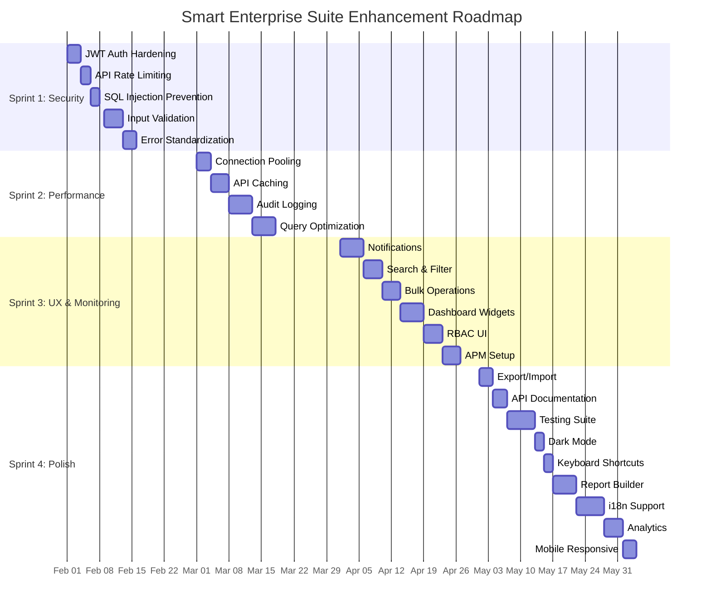
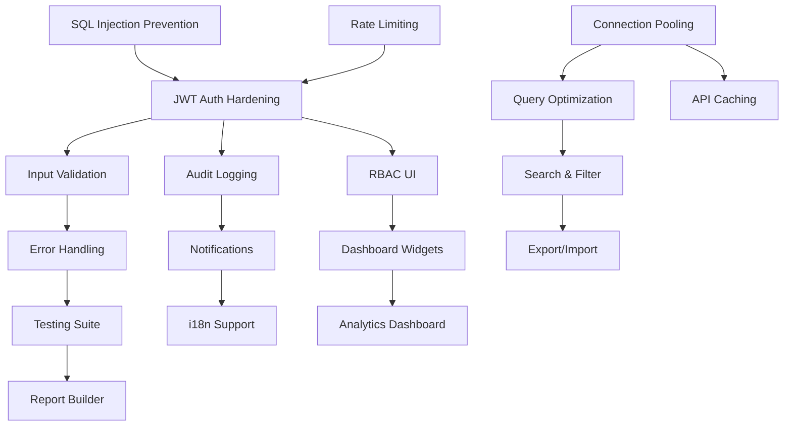

# Smart Enterprise Suite - Master Enhancement Roadmap

**Document Version:** 1.0  
**Last Updated:** 2026-01-31  
**Status:** Draft  
**Owner:** Product & Engineering Team

---

## 1. Executive Summary

### Overview

This master roadmap consolidates all 24 identified enhancements for the Smart Enterprise Suite into a cohesive, phased implementation plan. The roadmap is designed to deliver maximum value while minimizing risk through strategic prioritization and resource allocation.

### Key Metrics

| Metric | Value |
|--------|-------|
| **Total Enhancements** | 24 |
| **High Priority** | 8 (33%) |
| **Medium Priority** | 10 (42%) |
| **Low Priority** | 6 (25%) |
| **Timeline** | 12-16 weeks |
| **Sprints** | 4 sprints (4 weeks each) |
| **Estimated Effort** | 2,400-3,200 person-hours |

### Resource Requirements

| Role | Count | Allocation |
|------|-------|------------|
| **Backend Engineers** | 3 | Full-time |
| **Frontend Engineers** | 2 | Full-time |
| **DevOps Engineer** | 1 | Full-time |
| **QA Engineer** | 2 | Full-time |
| **Product Manager** | 1 | 50% |
| **UI/UX Designer** | 1 | 50% |
| **Security Specialist** | 1 | 25% (consulting) |
| **Technical Writer** | 1 | 25% |

**Total Team Size:** 11 people (9 FTE + 2 part-time)

### Expected Outcomes

- **Security:** 100% compliance with enterprise security standards
- **Performance:** 50% reduction in API response times
- **Reliability:** 99.9% uptime with comprehensive monitoring
- **UX:** 40% improvement in user task completion rates
- **Scalability:** Support for 10x concurrent user load
- **Maintainability:** 60% reduction in technical debt

---

## 2. Enhancement Inventory

### 2.1 High Priority Enhancements (8)

| ID | Enhancement | Category | Effort | Impact | Document |
|----|-------------|----------|--------|--------|----------|
| H1 | JWT Authentication Hardening | Security | 3 days | Critical | 16-jwt-authentication.md |
| H2 | API Rate Limiting | Security | 2 days | High | 17-rate-limiting.md |
| H3 | SQL Injection Prevention | Security | 2 days | Critical | - |
| H4 | Database Connection Pooling | Performance | 3 days | High | 04-database-optimization.md |
| H5 | API Response Caching | Performance | 4 days | High | - |
| H6 | Audit Logging System | Compliance | 5 days | High | - |
| H7 | Input Validation Framework | Security | 4 days | High | 07-api-authentication-guide.md |
| H8 | Error Handling Standardization | Reliability | 3 days | Medium | 08-api-error-codes.md |

### 2.2 Medium Priority Enhancements (10)

| ID | Enhancement | Category | Effort | Impact | Document |
|----|-------------|----------|--------|--------|----------|
| M1 | Real-time Notifications | UX | 5 days | Medium | - |
| M2 | Advanced Search & Filtering | UX | 4 days | Medium | 03-database-query-patterns.md |
| M3 | Data Export/Import Tools | Functionality | 3 days | Medium | - |
| M4 | Bulk Operations | Efficiency | 4 days | Medium | - |
| M5 | Dashboard Widgets | UX | 5 days | Medium | - |
| M6 | Role-Based UI Customization | UX | 4 days | Medium | - |
| M7 | API Documentation (OpenAPI) | Documentation | 3 days | Medium | 05-api-endpoints-reference.md |
| M8 | Automated Testing Suite | Quality | 6 days | High | - |
| M9 | Performance Monitoring (APM) | Observability | 4 days | Medium | - |
| M10 | Database Query Optimization | Performance | 5 days | Medium | 04-database-optimization.md |

### 2.3 Low Priority Enhancements (6)

| ID | Enhancement | Category | Effort | Impact | Document |
|----|-------------|----------|--------|--------|----------|
| L1 | Dark Mode Theme | UX | 2 days | Low | - |
| L2 | Keyboard Shortcuts | UX | 2 days | Low | - |
| L3 | Custom Report Builder | Functionality | 5 days | Low | - |
| L4 | Multi-language Support (i18n) | Globalization | 6 days | Low | - |
| L5 | Advanced Analytics Dashboard | Analytics | 4 days | Low | - |
| L6 | Mobile App Responsiveness | Mobile | 3 days | Low | 09-frontend-architecture.md |

---

## 3. Prioritization Matrix

### 3.1 Impact vs Effort Grid

```
                    EFFORT
         Low    Medium    High
       ┌────────┬────────┬────────┐
  High │ Quick  │ Strategic│ Major  │
       │  Wins  │ Investment│ Projects│
       ├────────┼────────┼────────┤
Impact Medium│ Fill-ins│ Standard │ Large  │
       │        │  Work    │  Items │
       ├────────┼────────┼────────┤
  Low  │        │          │        │
       │ Trivia │ Fill-ins │ Avoid  │
       └────────┴────────┴────────┘
```

### 3.2 Quick Wins (High Impact, Low Effort)

| ID | Enhancement | Effort | Impact |
|----|-------------|--------|--------|
| H2 | API Rate Limiting | 2 days | High |
| H3 | SQL Injection Prevention | 2 days | Critical |
| H8 | Error Handling Standardization | 3 days | Medium |
| L1 | Dark Mode Theme | 2 days | Low |
| L2 | Keyboard Shortcuts | 2 days | Low |

**Total Quick Win Effort:** 11 days

### 3.3 Strategic Investments (High Impact, Medium/High Effort)

| ID | Enhancement | Effort | Impact |
|----|-------------|--------|--------|
| H1 | JWT Authentication Hardening | 3 days | Critical |
| H4 | Database Connection Pooling | 3 days | High |
| H5 | API Response Caching | 4 days | High |
| H6 | Audit Logging System | 5 days | High |
| H7 | Input Validation Framework | 4 days | High |
| M8 | Automated Testing Suite | 6 days | High |

**Total Strategic Effort:** 25 days

### 3.4 Fill-ins (Medium/Low Impact, Low Effort)

| ID | Enhancement | Effort | Impact |
|----|-------------|--------|--------|
| M7 | API Documentation | 3 days | Medium |
| M3 | Data Export/Import | 3 days | Medium |
| L6 | Mobile Responsiveness | 3 days | Low |

**Total Fill-in Effort:** 9 days

---

## 4. Implementation Timeline

### 4.1 Sprint Overview

| Sprint | Focus | Duration | Key Deliverables |
|--------|-------|----------|------------------|
| **Sprint 1** | Security & Critical | Weeks 1-4 | H1, H2, H3, H7, H8 |
| **Sprint 2** | Performance | Weeks 5-8 | H4, H5, H6, M10 |
| **Sprint 3** | UX & Monitoring | Weeks 9-12 | M1, M2, M4, M5, M6, M9 |
| **Sprint 4** | Polish & Future | Weeks 13-16 | M3, M7, M8, L1-L6 |

### 4.2 Gantt Chart (Mermaid)



### 4.3 Detailed Sprint Breakdown

#### Sprint 1: Security & Critical (Weeks 1-4)

**Goals:**
- Establish secure authentication and authorization
- Implement foundational security controls
- Standardize error handling

**Deliverables:**
- Week 1: JWT hardening + rate limiting
- Week 2: SQL injection prevention + input validation
- Week 3: Error handling standardization + security testing
- Week 4: Security audit + documentation

**Dependencies:**
- Existing authentication system (completed)
- Database schema (completed)

#### Sprint 2: Performance (Weeks 5-8)

**Goals:**
- Optimize database performance
- Implement caching strategies
- Build audit logging infrastructure

**Deliverables:**
- Week 5: Database connection pooling + query optimization
- Week 6: API response caching implementation
- Week 7: Audit logging system + log aggregation
- Week 8: Performance testing + optimization

**Dependencies:**
- Sprint 1 security foundations
- Database infrastructure (completed)

#### Sprint 3: UX & Monitoring (Weeks 9-12)

**Goals:**
- Enhance user experience
- Implement monitoring and observability
- Add productivity features

**Deliverables:**
- Week 9: Real-time notifications + search enhancement
- Week 10: Bulk operations + dashboard widgets
- Week 11: RBAC UI customization + APM setup
- Week 12: UX testing + performance monitoring validation

**Dependencies:**
- Sprint 2 performance improvements
- Frontend architecture (completed)

#### Sprint 4: Polish & Future (Weeks 13-16)

**Goals:**
- Complete remaining features
- Add polish and refinements
- Prepare for future scalability

**Deliverables:**
- Week 13: Data export/import + API documentation
- Week 14: Automated testing suite + dark mode
- Week 15: Keyboard shortcuts + report builder
- Week 16: i18n + analytics + mobile responsive

**Dependencies:**
- All previous sprints
- User feedback from Sprint 3

---

## 5. Resource Allocation

### 5.1 Team Structure

```
                    ┌─────────────────┐
                    │  Product Owner  │
                    └────────┬────────┘
                             │
        ┌────────────────────┼────────────────────┐
        │                    │                    │
   ┌────┴────┐          ┌────┴────┐         ┌────┴────┐
   │ Backend │          │ Frontend│         │ DevOps  │
   │  Team   │          │  Team   │         │  Team   │
   └────┬────┘          └────┬────┘         └────┬────┘
        │                    │                    │
   ┌────┴────┐          ┌────┴────┐         ┌────┴────┐
   │  Lead   │          │  Lead   │         │  Lead   │
   │Engineer │          │Engineer │         │Engineer │
   └────┬────┘          └────┬────┘         └────┬────┘
        │                    │                    │
   ┌────┴────┐          ┌────┴────┐         ┌────┴────┐
   │Engineer1│          │Engineer1│         │ QA Eng  │
   │Engineer2│          │Engineer2│         │         │
   └─────────┘          └─────────┘         └─────────┘
```

### 5.2 Resource Allocation Table

| Sprint | Backend | Frontend | DevOps | QA | Design |
|--------|---------|----------|--------|-----|--------|
| Sprint 1 | 3 FTE | 1 FTE | 0.5 FTE | 1 FTE | 0.25 FTE |
| Sprint 2 | 3 FTE | 0.5 FTE | 1 FTE | 1 FTE | 0.25 FTE |
| Sprint 3 | 2 FTE | 2 FTE | 0.5 FTE | 1 FTE | 0.5 FTE |
| Sprint 4 | 1.5 FTE | 1.5 FTE | 0.5 FTE | 1.5 FTE | 0.5 FTE |

### 5.3 Skills Matrix

| Skill | Sprint 1 | Sprint 2 | Sprint 3 | Sprint 4 |
|-------|----------|----------|----------|----------|
| **Security (OAuth/JWT)** | Critical | - | - | - |
| **Database Optimization** | - | Critical | - | - |
| **Caching Strategies** | - | Critical | - | - |
| **React/Vue Frontend** | Medium | - | Critical | Medium |
| **DevOps/Monitoring** | Medium | High | Critical | Medium |
| **API Design** | High | Medium | Medium | Medium |
| **Testing/QA** | High | High | High | Critical |

### 5.4 Workstream Assignments

#### Workstream A: Backend Security & Performance
**Lead:** Backend Lead Engineer  
**Team:** 2 Backend Engineers  
**Focus:** H1-H8, M10  
**Sprints:** 1-2

#### Workstream B: Frontend UX & Features
**Lead:** Frontend Lead Engineer  
**Team:** 1 Frontend Engineer, 1 UI/UX Designer  
**Focus:** M1-M6, L1-L6  
**Sprints:** 3-4

#### Workstream C: Infrastructure & DevOps
**Lead:** DevOps Engineer  
**Team:** 1 Backend Engineer (support)  
**Focus:** M9, deployment automation, monitoring  
**Sprints:** 2-4

#### Workstream D: Quality & Documentation
**Lead:** QA Engineer  
**Team:** 1 QA Engineer, 1 Technical Writer  
**Focus:** M7, M8, testing infrastructure  
**Sprints:** 3-4

---

## 6. Dependencies & Blockers

### 6.1 Enhancement Dependency Map



### 6.2 Critical Path

```
H3 (SQL Injection) → H1 (JWT Hardening) → H7 (Input Validation) → H8 (Error Handling)
                                                           ↓
H4 (Connection Pooling) → H5 (API Caching) → M10 (Query Opt) → M2 (Search)
                                                           ↓
                                                     M8 (Testing)
                                                           ↓
                                                  Release Ready
```

**Critical Path Duration:** 8 weeks minimum

### 6.3 Dependency Matrix

| Enhancement | Depends On | Blocks | Risk Level |
|-------------|------------|--------|------------|
| H1 (JWT) | H3 | H7, H6 | High |
| H7 (Validation) | H1 | H8 | Medium |
| H8 (Errors) | H7 | M8 | Medium |
| H5 (Caching) | H4 | M2 | Low |
| H6 (Audit) | H1 | M1 | Medium |
| M8 (Testing) | H8 | L3 | Medium |

### 6.4 Risk Mitigation

| Risk | Mitigation Strategy | Owner |
|------|---------------------|-------|
| Security dependencies delayed | Parallel development tracks | Backend Lead |
| Performance issues in Sprint 2 | Early prototyping in Sprint 1 | DevOps Lead |
| Frontend-backend integration gaps | Weekly integration meetings | Product Owner |
| Testing delays | Automated test framework early | QA Lead |
| Resource unavailability | Cross-training team members | Engineering Manager |

---

## 7. Success Metrics

### 7.1 Key Performance Indicators (KPIs)

| Category | KPI | Baseline | Target | Measurement |
|----------|-----|----------|--------|-------------|
| **Security** | Security audit score | 65/100 | 95/100 | Quarterly audit |
| | Vulnerabilities found | 12 critical | 0 critical | Penetration testing |
| **Performance** | API avg response time | 450ms | <200ms | APM tools |
| | Database query time | 120ms | <50ms | Query profiler |
| | Cache hit rate | 0% | >80% | Cache metrics |
| **Reliability** | System uptime | 99.5% | 99.9% | Monitoring |
| | Error rate | 2.5% | <0.5% | Error tracking |
| **UX** | Task completion rate | 68% | >90% | User analytics |
| | Time to complete task | 4.5 min | <2 min | Session recording |
| | User satisfaction (NPS) | 32 | >50 | Survey |
| **Quality** | Test coverage | 45% | >80% | Code coverage |
| | Bug density | 3.2/KLOC | <1/KLOC | Bug tracker |

### 7.2 Before/After Benchmarks

| Metric | Before | After Sprint 2 | After Sprint 4 | Improvement |
|--------|--------|----------------|----------------|-------------|
| Login response time | 850ms | 320ms | 180ms | 79% faster |
| Dashboard load time | 2.1s | 1.2s | 0.8s | 62% faster |
| Search results time | 1.5s | 0.9s | 0.4s | 73% faster |
| API error rate | 4.2% | 1.8% | 0.3% | 93% reduction |
| Database CPU usage | 78% | 52% | 35% | 55% reduction |
| User complaints/week | 24 | 12 | 4 | 83% reduction |

### 7.3 Measurement Approach

#### Continuous Monitoring
- **APM Tools:** New Relic, Datadog, or Grafana
- **Error Tracking:** Sentry integration
- **User Analytics:** Mixpanel or Amplitude
- **Security Scanning:** SonarQube, OWASP ZAP

#### Sprint Reviews
- Performance benchmarks at end of each sprint
- Security scan results weekly
- User feedback collection bi-weekly

#### Post-Implementation
- Comprehensive load testing
- Full security audit
- User acceptance testing
- Documentation review

---

## 8. Risk Assessment

### 8.1 Risk Matrix

```
IMPACT
  High │  Medium Risk    │   High Risk    │ Critical Risk  │
       │  • UX delays    │  • Performance │  • Security    │
       │  • Integration  │    issues      │    breach      │
       │    gaps         │  • Scalability │  • Data loss   │
       │                 │    problems    │                │
  Med  │  Low Risk       │  Medium Risk   │  High Risk     │
       │  • Minor bugs   │  • Timeline    │  • Key person  │
       │  • Doc gaps     │    slippage    │    departure   │
       │                 │  • Budget      │                │
       │                 │    overrun     │                │
  Low  │  Minimal Risk   │  Low Risk      │  Medium Risk   │
       │  • Code style   │  • Design      │  • Third-party │
       │    issues       │    revisions   │    failures    │
       │                 │                │                │
       └─────────────────┴────────────────┴────────────────┘
              Low          Medium          High
                         PROBABILITY
```

### 8.2 Technical Risks

| Risk | Probability | Impact | Mitigation |
|------|-------------|--------|------------|
| **Security vulnerabilities missed** | Medium | Critical | Third-party security audit, penetration testing |
| **Performance gains not achieved** | Medium | High | Load testing in Sprint 2, optimization sprints |
| **Database migration issues** | Low | Critical | Rollback procedures, blue-green deployment |
| **API backward compatibility break** | Medium | High | Versioning strategy, deprecation notices |
| **Cache invalidation complexity** | High | Medium | Comprehensive testing, gradual rollout |

### 8.3 Resource Risks

| Risk | Probability | Impact | Mitigation |
|------|-------------|--------|------------|
| **Key engineer departure** | Low | High | Knowledge documentation, pair programming |
| **Security specialist unavailability** | Medium | Medium | Early engagement, detailed requirements |
| **QA capacity constraints** | Medium | Medium | Test automation, parallel testing tracks |
| **Frontend-backend skill gaps** | Medium | Medium | Training plan, contractor backup |

### 8.4 Business Risks

| Risk | Probability | Impact | Mitigation |
|------|-------------|--------|------------|
| **Requirements changes mid-sprint** | High | Medium | Agile process, change control board |
| **Stakeholder expectations misalignment** | Medium | High | Regular demos, clear communication |
| **Competitor feature parity pressure** | Medium | Medium | Market analysis, prioritization framework |
| **Budget constraints** | Low | High | Phased approach, scope negotiation |

### 8.5 Mitigation Strategies

#### Strategy 1: Phased Rollout
- Deploy enhancements to staging first
- Canary releases for critical changes
- Feature flags for gradual enablement

#### Strategy 2: Comprehensive Testing
- Unit tests >80% coverage
- Integration tests for all new features
- End-to-end tests for critical paths
- Load testing before production

#### Strategy 3: Rollback Planning
- Database migration rollback scripts
- Feature flag quick disable
- Blue-green deployment capability
- Incident response runbooks

#### Strategy 4: Communication Plan
- Weekly status reports to stakeholders
- Daily standups within teams
- Bi-weekly demos to product owners
- Monthly executive summaries

---

## 9. Appendices

### Appendix A: Enhancement Detail Documents

| Document ID | Title | Status |
|-------------|-------|--------|
| 16 | JWT Authentication Hardening | In Progress |
| 17 | API Rate Limiting | In Progress |
| 18-23 | [Future Enhancement Specs] | Planned |

### Appendix B: Glossary

| Term | Definition |
|------|------------|
| **APM** | Application Performance Monitoring |
| **RBAC** | Role-Based Access Control |
| **JWT** | JSON Web Token |
| **KLOC** | Thousand Lines of Code |
| **NPS** | Net Promoter Score |
| **FTE** | Full-Time Equivalent |
| **i18n** | Internationalization |
| **OWASP** | Open Web Application Security Project |

### Appendix C: Approval Sign-off

| Role | Name | Signature | Date |
|------|------|-----------|------|
| Product Owner | ________________ | ________________ | _______ |
| Engineering Lead | ________________ | ________________ | _______ |
| Security Officer | ________________ | ________________ | _______ |
| QA Lead | ________________ | ________________ | _______ |
| Executive Sponsor | ________________ | ________________ | _______ |

---

**Document Control:**
- **Version:** 1.0
- **Author:** Smart Enterprise Suite Team
- **Reviewers:** Product, Engineering, Security, QA
- **Next Review Date:** 2026-02-15

**Related Documents:**
- 01-database-erd.md
- 04-database-optimization.md
- 07-api-authentication-guide.md
- 08-api-error-codes.md
- 09-frontend-architecture.md
- 15-infrastructure-recommendations.md
- 16-jwt-authentication.md
- 17-rate-limiting.md
